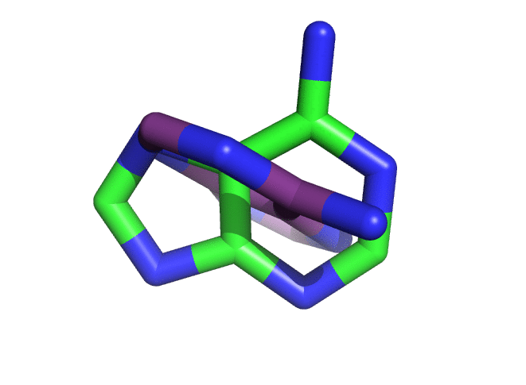

# 

KEYWORDS: NUCLEIC_ACIDS RNA ANALYSIS

# Author
Rhiju Das, rhiju@stanford.edu

## Brief Description

Rotates & translates a little example pose (here an adenosine nucleobase, around its centroid) and calculates RMSD for checking analytical formulae.

## Abstract

In our lab's efforts to compute 'from scratch' free energies of RNA helix formation and tertiary folding, we often need to compare distributions of RMSD-to-target to what we'd get with a 'random' reference state. I've derived analytical formulae for this distribution and wanted to check them through very simple, explicit simulations. Simulations can be carried with and without translations in a box with walls at +/-_xyz_size_. Rotations can be carried out for all rotations [all of the group _SO_(3), three degrees of freedom] or just rotations 'in the plane' of the base [_SO_(2), one degree of freedom]. And, in case you were wondering, this uses correct choice of uniform random rotations using quaternions.

# Running

```
$> $ROSETTA3/bin/rb_entropy.default.linuxgccrelease -xyz_size 3.0 -out:path 6D_3AngstromMax

```

Outputs are in the path specified by 6D_3AngstromMax:
 + `rmsd.txt` are RMSDs of 1 million poses  
 + `xyz.txt` are atom xyz coordinates of initial pose that were used in RMSD calculation  
 + `a_rotated.pdb` is PDB file of that initial pose. (It is "rotated" into a special frame  with its centroid at the origin, base normal pointing along z, and other base x & y vectors pointing along x and y.)  
 +  `test001.pdb`, `test002.pdb`, ... `test0010.pdb` -- 10 of the 1 million poses to help make an animated gif. 


# Other scripts
The MATLAB file `rb_entropy_analysis_script.m` includes the analytical formulae & how to take the RMSD distribution that comes out of the simulation. Example output is given in: `rb_simulated_vs_analytical.pdf`.

# More good stuff
An animated gif of poses that occur upon 3D rotations (no translations):



