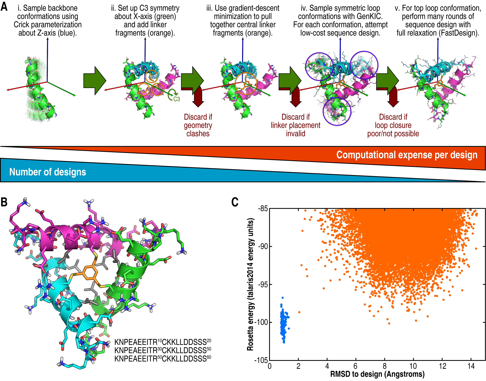

# Designing Threefold-Symmetric Meso-Sized Polypeptides With Threefold-Symmetric Cross-linkers
KEYWORDS: DESIGN PEPTIDES 
## Author
Vikram K. Mulligan, Ph.D. (vmullig@uw.edu)
Baker laboratory
Institute for Protein Design
University of Washington

## Description

This is the protocol capture for a protocol used to design large (60-residue) peptides with C3 symmetry, cross-linked with a threefold-symmetric cross-linking agent (1,3,5-tris(bromomethyl)benzene, or TBMB).  A manuscript describing this work is in preparation, a joint effort between the Baker and DeGrado laboratories.

This protocol uses RosettaScripts to design a peptide in a single script.  The steps in the design process are as follows:

1.  Sample conformations of a single helix using the BundleGridSampler, which places a helix using the Crick parameterization describing a helix following a helical path about the Z-axis.
2.  For each conformation sampled, mutate a central residue to CYX, add one-third of the TBMB cross-linker, and set up C3 symmetry about the Y-axis.  Filter out trajectories that have clashing geometry at this point.
3.  Energy-minimize the crosslinker to pull it into a closed conformation.  Filter out trajectories that do not present the crosslinker in a closable conformation at this point.
4.  Use GenKIC to close loops, filtering for similarity to 4mer fragments from the Protein Data Bank and attempting design and side-chain minimization on each loop conformation sampled.  Choose the lowest-energy loop conformation for subsequent steps of the protocol.
5.  Carry out more computationally-expensive sequence design and structure refrinement with the FastDesign protocol, allowing both side-chains and the backbone to relax.

A.  Overall design workflow.  B.  An example of a designed C3-symmetric 60-mer cross-linked with TBMB.  C. Ab initio energy landscape of the peptide shown in B.  Note that Rosetta's ab initio algorithm can neither capture the cyclic geometry nor the cross-linker, so this is a deceptively shallow folding funnel.

## Running

**TODO**

## Versions

## See also
