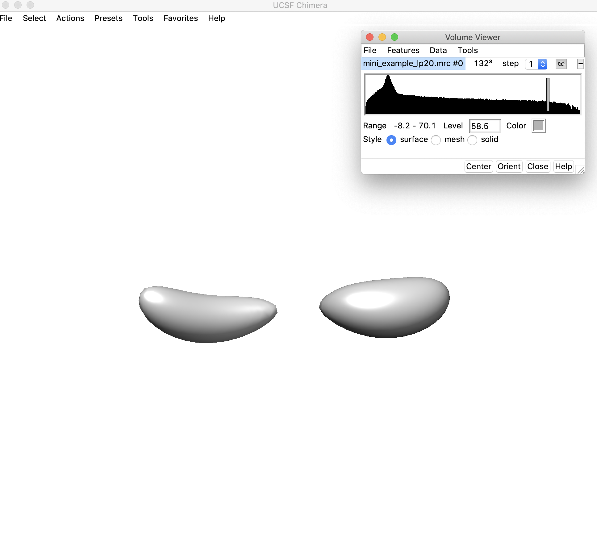
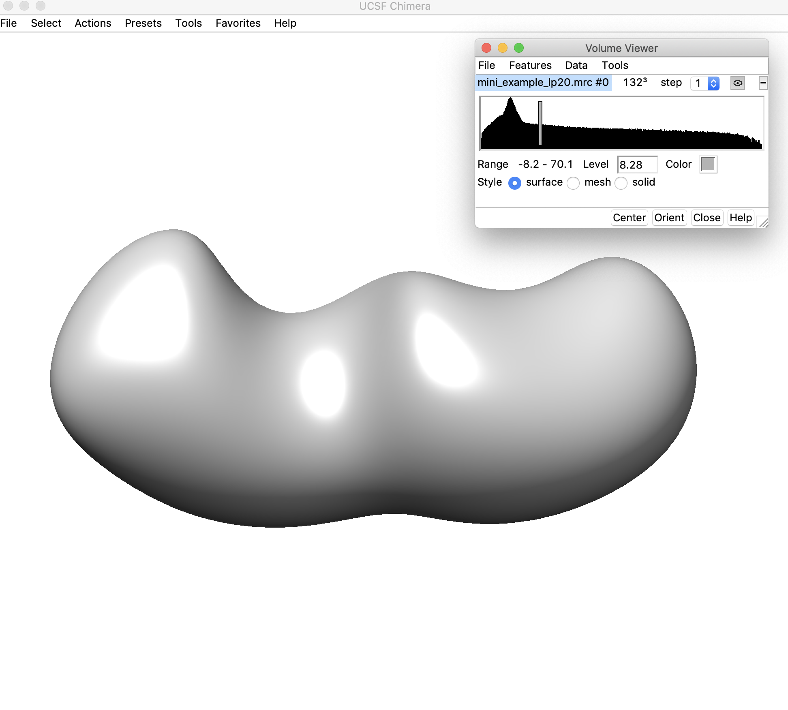
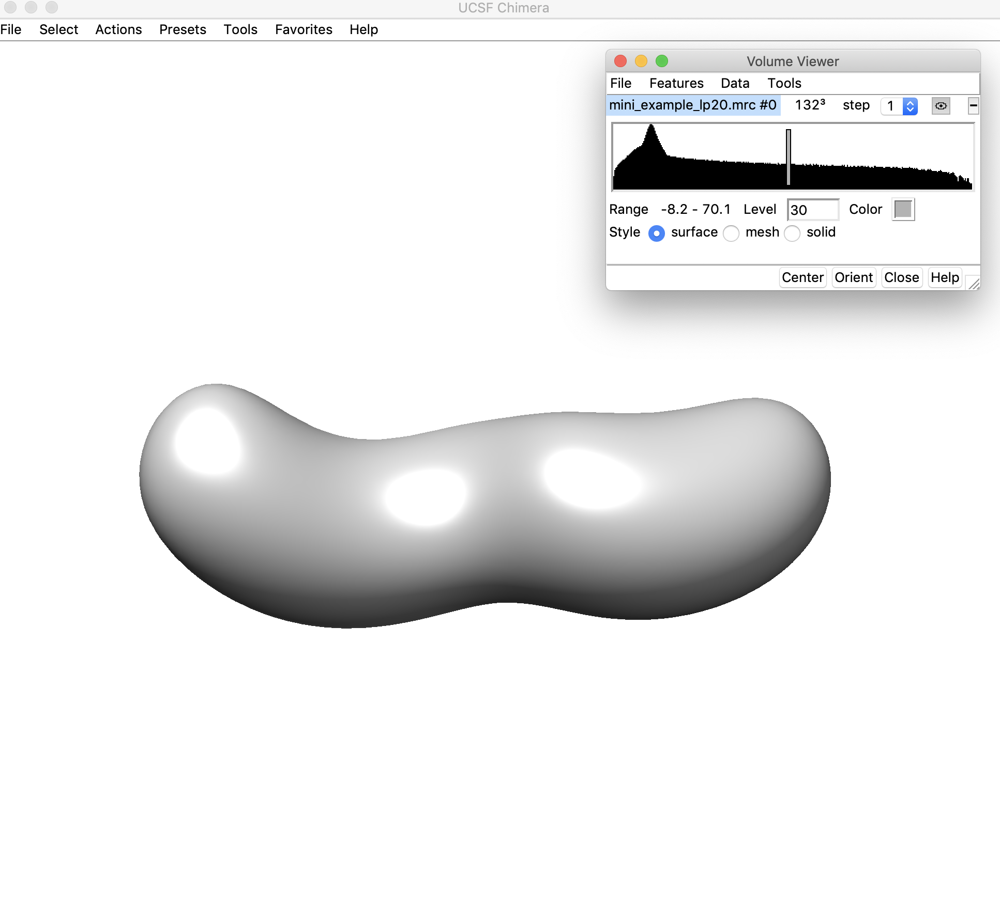
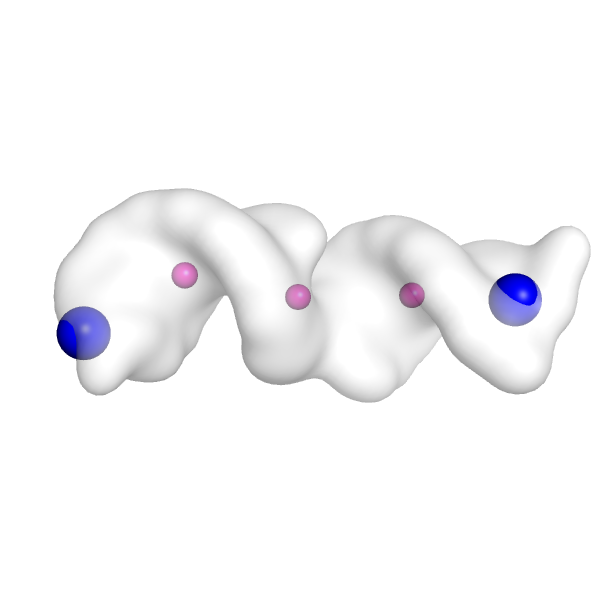
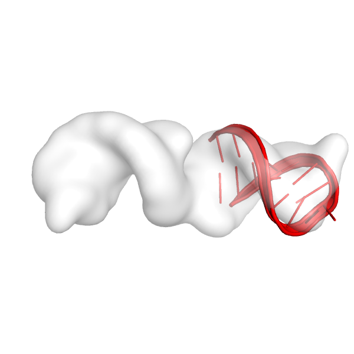
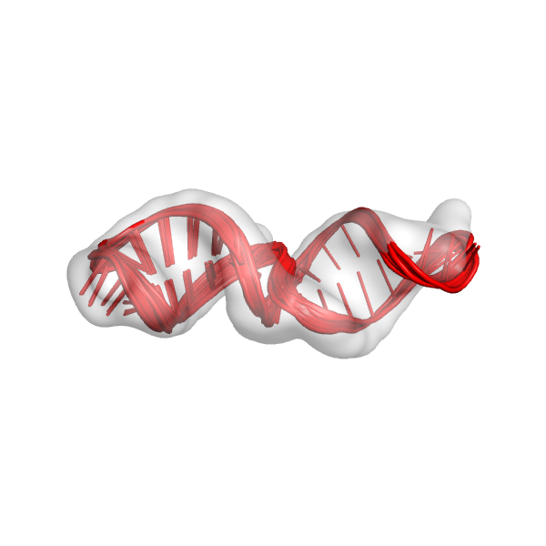
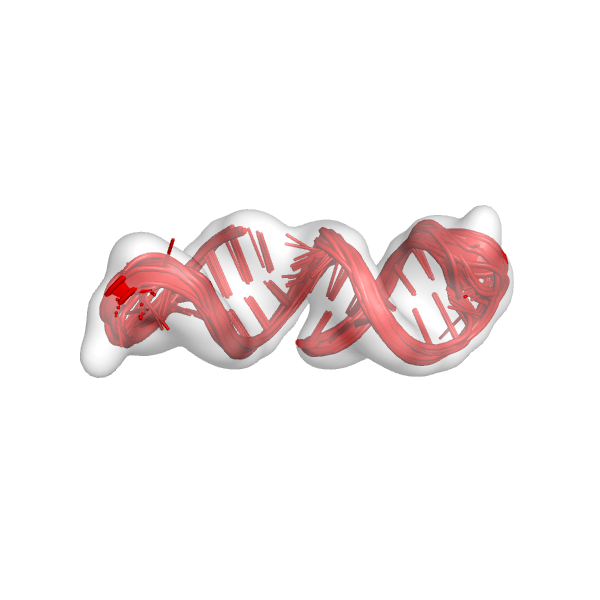
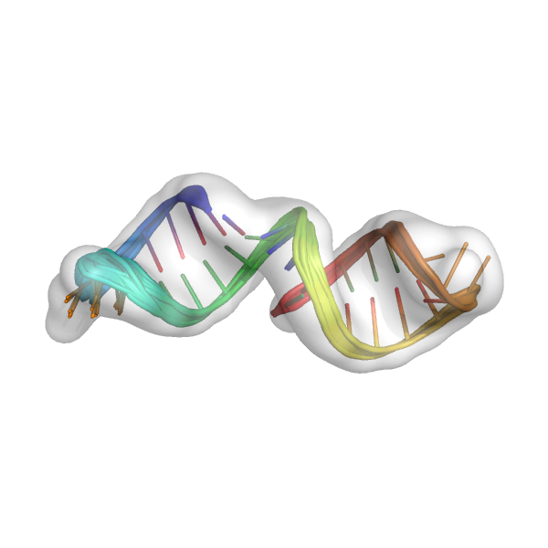

auto-DRRAFTER: automatically build RNA coordinates into cryo-EM maps
=====================================================================================

KEYWORDS: NUCLEIC_ACIDS EXPERIMENTAL_DATA RNA DENOVO STRUCTURE_PREDICTION  

Last updated January 2020 by Kalli Kappel (kkappel at alumni dot stanford dot edu).    

This demo shows how to use use auto-DRRAFTER to build RNA coordinates into a cryo-EM map. This is a small toy example designed to run relatively quickly on a laptop.   

## Setting up auto-DRRAFTER:  
1. Download Rosetta [here](https://www.rosettacommons.org/software/license-and-download). You will need to get a license before downloading Rosetta (free for academic users). auto-DRRAFTER is available in the Rosetta weekly releases after 2019.47 (it is not available in 2019.47) and files for this demo are available in releases after 2020.03. **auto-DRRAFTER is NOT available in Rosetta 3.11.** 
2. If you're not using the precompiled binaries (these are available for Mac and Linux and you can access them by downloading source+binaries in Step 1), install Rosetta following the instructions available [here](https://www.rosettacommons.org/docs/latest/build_documentation/Build-Documentation).  
3. Make sure that you have python installed and install **networkx** and **mrcfile**. For example, type: `pip install networkx mrcfile`.   
4. Install EMAN2 version 2.22 (https://blake.bcm.edu/emanwiki/EMAN2/Install). Confirm that `e2proc3d.py` and `e2segment3d.py` are installed by typing: 
```
e2proc3d.py –h
e2segment3d.py –h 
```
You should see usage instructions for each of these commands.  
5. Install Rosetta RNA tools. See instructions and documentation [here](https://www.rosettacommons.org/docs/latest/application_documentation/rna/RNA-tools).
6. Check that the ROSETTA environmental variable is set (you should have set this up during RNA tools installation). Type `echo $ROSETTA`. This should return the path to your Rosetta directory. If it does not return anything, go back to step 4 and make sure that you follow the steps for RNA tools setup.  
7. Add the path to the auto-DRRAFTER script to your $PATH (alternatively, you can type the full path to the DRRAFTER.py script each time that you use it). It is found in `main/source/src/apps/public/DRRAFTER/` in your Rosetta directory. An example for bash:
```
export PATH=$PATH:$ROSETTA/main/source/src/apps/public/DRRAFTER/
```

## Brief explanation of input files:  

All of the necessary files for this demo are available in `$ROSETTA/main/demos/public/auto-drrafter/input_files/`, where `$ROSETTA` is the path to your Rosetta installation.   

`fasta.txt`: The FASTA file listing the full sequence of your RNA molecule. It should contain one line that starts with '>' and lists the chain and residue numbers for the sequence, e.g. A:1-35. The RNA sequence should be specified with lower-case letters. Currently auto-DRRAFTER can only handle single chain RNAs.   

`secstruct.txt`: A file containing the secondary structure of the complex in dot-bracket notation. The secondary structure should be the same length as the sequence found in the fasta file. This secondary structure will be enforced during the auto-DRRAFTER modeling. We recommend verifying predicted secondary structures biochemically with [M2-seq](https://doi.org/10.1073/pnas.1619897114).   

`map.mrc`: The density map file in mrc format. For this demo, the map has been simulated from a Rosetta model (this is not a particularly realistic structure – it is meant only to demonstrate the auto-DRRAFTER workflow).   

`job_submission_template.sh`: This should be a job submission script for the cluster you’re planning to run your job on. For example, it might look something like this:   

```
#!/bin/bash
#SBATCH -J JOB_NAME
#SBATCH -o /dev/null
#SBATCH -e /dev/null
#SBATCH -p owners
#SBATCH -t 48:00:00
#SBATCH -n 1
#SBATCH -N 1
```

Alternatively, in this case `job_submission_template.sh` is actually just a blank file. This is because all the auto-DRRAFTER jobs for this demo can just be run on a laptop, so we don’t need any additional job submission commands.   

## Running auto-DRRAFTER:

**1.** Go to the auto-DRRAFTER demo directory. Type:
```
cd $ROSETTA/main/demos/public/auto-drrafter/
```

**2.** Low-pass filter the density map, and determine the threshold level. Type:    
```
python $ROSETTA/main/source/src/apps/public/DRRAFTER/auto-DRRAFTER_setup.py -map_thr 30 -full_dens_map input_files/map.mrc -full_dens_map_reso 10.0 -fasta input_files/fasta.txt -secstruct input_files/secstruct.txt -out_pref mini_example -rosetta_directory $ROSETTA/main/source/bin/ -shift_center -nstruct_per_job 10 -cycles 1000 -fit_only_one_helix -rosetta_extension .static.linuxgccrelease -just_low_pass
```

What do all of these flags do?   
`-map_thr` is the density threshold at which the detection of optimal helix placement locations will take place. This is the value that we’re trying to figure out in this step, so the actual number that we put here doesn’t matter yet.   
`-full_dens_map` is our density map.   
`-full_dens_map_res` is the resolution of the density map in Å.   
`-fasta` is the fasta file listing the sequence of our RNA molecule.   
`-secstruct` is the secondary structure of the RNA molecule in dot-bracket notation.  
`-out_pref` is the prefix for output files generated by auto-DRRAFTER.   
`-rosetta_directory` is the location of the Rosetta executables.  
`-rosetta_extension` is the extension of your Rosetta executables. **You might need to change this (look in your rosetta directory to confirm the extension for your executables)!**  
`-repeats` is the number of independent attempts to place the helices. 10 is usually a good number for this setting.   
`-shift_center` This is a setting that is required if you’re using a simulated density map that was generated with EMAN2. *It shouldn’t be necessary in other situations.*   

This will create a single file: `mini_example_lp20.mrc`. This is the low-pass filtered density map, which will be used to figure out the initial helix placements.   

**3.** Open the low-pass filtered density map (`mini_example_lp20.mrc`) in Chimera. Change the threshold of the density map (using the sliding bar on the density histogram). You want to find the highest threshold such that you can clearly discern “end nodes” in the density map, but also such that the density map is still fully connected. Note that this threshold is only used for the initial helix placement and does not have any affect on the later modeling steps. Let's look at the map in Chimera to figure out the best threshold:  


Here the density threshold (shown in the "Level" box: 58.5) is too high – the whole map is no longer connected.  


Here the density threshold is quite low (8.28) – we can still sort of see where the ends of helices might be located in this map, but we can probably go to a higher threshold where these regions will be easier to discern.   


This threshold looks pretty good (30) – the map is still completely connected and we can clearly see where the ends of the helices/hairpins would be located. We will use a threshold of 30.   

**4.** Set up the auto-DRRAFTER run by typing: 
```
python $ROSETTA/main/source/src/apps/public/DRRAFTER/auto-DRRAFTER_setup.py -map_thr 30 -full_dens_map input_files/map.mrc -full_dens_map_reso 10.0 -fasta input_files/fasta.txt -secstruct input_files/secstruct.txt -out_pref mini_example -rosetta_directory $ROSETTA/main/source/bin/ -shift_center -nstruct_per_job 10 -cycles 1000 -rosetta_extension .static.linuxgccrelease -fit_only_one_helix
```

This is the same command that we used above, except we have removed the –just_low_pass flag. We are also now confident that we want to use 30 as the value for –map_thr. (Depending on the helix placements that come out, we may need to change the threshold again.)   

This will print the following message:  

```
Low-pass filtering the map to 20A.
Converting density map to graph.
Possible end nodes in the map:
3 4
You can visualize the end nodes in mini_example_init_points.pdb
You can specify which of these end nodes you'd like to use with -use_end_node
Converting secondary structure to graph.
Mapping secondary structure to density map.
Setting up DRRAFTER runs.
Making full helix H0
Making full helix H1
```

`auto-DRRAFTER.py` first low-pass filters the map to 20 Å (as in the previous step), then places points throughout the density map. These points are then converted into a graph to identify possible end nodes. These end nodes are printed out to the screen, here nodes 3 and 4. All the points that were placed into the density map are written out in a PDB file that we can visualize in Chimera or PyMOL. Each point has a different residue number, which corresponds to the node number. So we can load the PDB with these points, here mini_example_init_points.pdb into PyMOL (or any other molecular visualization software), and look at residue 3 and 4 to see which nodes auto-DRRAFTER has identified as potential end nodes.   

Let's do that now. Here is what the points look like in PyMOL (create a surface for the density map with the PyMOL command, `isosurface map, surf, 5.0`, and then show the points as spheres with the PyMOL command `show spheres, mini_example_init_points`). Nodes 3 and 4 (the possible end nodes from the output message above) correspond to residues 3 and 4 in this PDB file. 
So we can visualize those as bigger, differently color spheres with PyMOL commands like `color blue, mini_example_init_points and resi 3+4` and `set sphere_scale 2, mini_example_init_points and resi 3+4`. Now we can see that the end nodes are placed reasonably within the density map (big blue spheres below). We want to see these points in regions of the density map that look like they could be RNA hairpins. If the placement doesn't look good, then we could choose a slightly different `map_thr` and try running the setup again.
This will sometimes result in better end node detection. Alternatively, if some of the points look good, but others do not, we can run the setup script `auto-DRRAFTER_setup.py` again, but this time explicitly select which of these end nodes to use with e.g. `-use_end_node 3`, which would explicitly force end node 3 to be used as an anchor position for RNA helix placement.    



If we don't select a specific end node to use (which we won't do here), auto-DRRAFTER will randomly select one of these end nodes to use an anchor position for placing RNA helices in the density map. 

Auto-DRRAFTER then converts the RNA secondary structure (that we specified) to a graph in which helices are represented as edges and junctions and loops are represented as nodes. This secondary structure graph is then mapped onto the graph for the density map. In this case, auto-DRRAFTER will create two possible mappings, with either hairpin 0 or hairpin 1 mapped onto the randomly selected end node in the map. Let's also make sure that we look at these helix placements in the density map and make sure they look good. In PyMOL (or some other molecular visualization software) open the density map and `all_aligned_mini_example_0.REORDER.pdb` and `all_aligned_mini_example_1.pdb`. This is approximately what it should look like here:   

Here's the first helix in the map:   
   
Here's the second helix in the map:   
   

These helices look like they fit reasonably well in the density map, and they see to be in a place in the density map where we would expect there to be an RNA helix. It is very important to visualize the fits of the helices at this point before moving on to the next steps. If these fits don't look good, the rest of the run is not going to work well.   

Auto-DRRAFTER then sets up the DRRAFTER runs for each of these mappings. This involves building ideal A-form helices for all helical regions of the secondary structure, adding placeholder coordinates for all the hairpins onto these ideal RNA helices, and creating all the specific input files that DRRAFTER requires.     

`auto-DRRFTER_setup.py` will create the following files:  

`settings_mini_example.txt`: This file lists all of the settings that were used to set up this auto-DRRAFTER run.   

`all_aligned_mini_example_0.REORDER.pdb` and `all_aligned_mini_example_1.REORDER.pdb`: These are two possible hairpin placements in the density map (visualized above). Each model will be used in a separate DRRAFTER run.   

`command_mini_example_0_R1` and `command_mini_example_1_R1`: The commands for the two DRRAFTER runs for the two possible alignments of the helices into the density map.   

`fasta_mini_example.txt`: The fasta file for the DRRAFTER runs. This is basically the same as the input fasta file, but the numbering has been changed to start at 0 – this is just an auto-DRRAFTER convention. A final step at the end of the auto-DRRAFTER modeling will map these residues numbers back to the input residue numbers.   

`flags_mini_example_0_R1` and `flags_mini_example_1_R1`: These files contain all the flags that will be used for the two DRRAFTER runs for the different helix alignments in the density map.   

`mini_example_H0.pdb` and `mini_example_H1.pdb`: Ideal A-form helices for helix 0 and helix 1.   

`mini_example_H0_full.out.1.pdb` and `mini_example_H1_full.out.1.pdb`: The same idea A-form helices from above with placeholder coordinates added for the hairpins.   

`mini_example_auto_fits.txt`: This file lists all of the different possible alignments of helices into the density map. Each alignment is numbered and listed on a separate line in this file.   

`mini_example_init_points.pdb`: This PDB file contains all of the points that were placed into the density map in order to convert the density map into a graph. This is the file that we visualized earlier in the tutorial to check the assignment of end nodes.   

`secstruct_mini_example.txt`: The secondary structure file for the DRRAFTER runs.   

**5.** Submit/run the DRRAFTER jobs. Type:

```
python $ROSETTA/main/source/src/apps/public/DRRAFTER/submit_jobs.py -out_pref mini_example -curr_round R1 -njobs 2 -template_submission_script input_files/job_submission_template.sh -queue_command source
```

`-out_pref` is the prefix used for all output files from this run, this should be the same –out_pref that was used in the setup command in steps 3 and 4.   
`-curr_round`: This is the round of modeling that is currently being performed. We haven’t done any modeling yet, so this is round 1. This should always be ‘R’ followed by a number that indicates the round number.   
`-njobs`: This is the number of jobs that will be run. Each job will build the number of models that was specified in the setup command above (-nstruct_per_job), in this case 10 structures per job. We will therefore build 20 models in total (10 structures per job x 2 jobs).   
`-template_submission_script`: This should be a job submission script for the cluster you’re planning to run your job on. Here, we’re not running this on a cluster (this demo can be run on a laptop), so the job submission script is just a blank file.  
`-queue_command`: This is the command that will be used to submit the job files to a cluster queuing system. In this case, we just want to run the commands locally, so we can use the use “source”. Alternatively, this might be something like `sbatch` or `qsub`, depending on the cluster that you’re using.   

This command will take a few minutes to run. If you were building more models and if the system was larger, then it would take much longer to run. Typically, a round of modeling will take 12-24 hours, depending on the number of models built per job (and of course, how quickly your jobs will be run on the cluster that you’re using).  

This will create the following output files:  

`job_files/`: This is a directory that contains all the job submission files.  
`out_mini_example_0_R1/`: This directory contains all the DRRAFTER models built for helix alignment 0.  
`out_mini_example_1_R1/`: This directory contains all the DRRAFTER models built for helix alignment 1.  


**6.** Set up the next round of modeling. Type:

```
python $ROSETTA/main/source/src/apps/public/DRRAFTER/auto-DRRAFTER_setup_next_round.py -out_pref mini_example -curr_round R1 -nmodels 10 -rosetta_directory $ROSETTA/main/source/bin/ -convergence_threshold 100 -rosetta_extension .static.linuxgccrelease
```

***-convergence_threshold 100 should not be used for actual modeling jobs (you should generally just use the default value (10) which is what was used for all modeling in the original Ribosolve paper). It is only used here for this demo to force the run to finish quickly!***   

This will print something like this to the screen (the exact numbers may vary):

```
Setting up next round
Overall convergence 0.373
Density threshold: 38.779
```

This step collects all of the models from the previous step and calculates the convergence of the overall top ten scoring models (across all alignments). That is the “Overall convergence” value that is printed out. Then the next round of modeling is set up based on the models that were built from the previous round. Regions of the models that are well converged will be kept fixed in the next round of modeling.   

Several files are written out at this step. The key files that you want to know about are:   

`mini_example_all_models_all_fits_R1.out.*.pdb`: These are the overall best scoring models from all of the different alignments from the first round of modeling. We should look at these models in the density map. This is only the first round of modeling, so the models don't need to look perfect, but they should at least be roughly in the density map. This is what the models might look like:    

   

`command_mini_example_FINAL_R2`: This is the command file for the next round of modeling. Note that the next round is `FINAL_R2` and not just `R2`. This means that we have entered the `final` stages of modeling. (There are always two `FINAL_` rounds: there will also be a `FINAL_R3` as well.)   

`flags_mini_example_FINAL_R2`: This file contains all the flags that will be used for the two DRRAFTER runs for the different helix alignments in the density map.  

`all_fit_mini_example_FINAL_R2.REORDER.pdb`: This PDB file contains initial helix placements for the next round of modeling.   

`convergence_mini_example_all_models_R1.txt`: This file lists the convergence for the overall top scoring models.  

Generally less important files, but good to know about for debugging:

`mini_example_0_R1_CAT_ALL_ROUNDS.out.*.pdb` and `mini_example_1_R1_CAT_ALL_ROUNDS.out.*.pdb`: These are the top scoring models from each of the two possible initial helix placements.   

**7.** Submit/run the next round of DRRAFTER jobs. Type:   
```
python $ROSETTA/main/source/src/apps/public/DRRAFTER/submit_jobs.py -out_pref mini_example -curr_round FINAL_R2 -njobs 2 -template_submission_script input_files/job_submission_template.sh -queue_command source
```

This is the same command that we used in step 5 except `–curr_round` is changed from `R1` to `FINAL_R2`. (Note: if the previous step had output a command file that was instead named `command_mini_example_R2` instead of `command_mini_example_FINAL_R2`, then we would have changed `–curr_round` to `R2`). This will take a few minutes to run for this example. Typically, for a bigger RNA it will take longer (12-24 hours).   

**8.** Set up the next round of modeling. Type:   
```
python $ROSETTA/main/source/src/apps/public/DRRAFTER/auto-DRRAFTER_setup_next_round.py -out_pref mini_example -curr_round FINAL_R2 -nmodels 10 -rosetta_directory $ROSETTA/main/source/bin/ -convergence_threshold 100 -rosetta_extension .static.linuxgccrelease
```

***`-convergence_threshold 100` should not be used for actual modeling jobs (you should generally just use the default value (10) which is what was used for all modeling in the original Ribosolve paper). It is only used here for this demo to force the run to finish quickly!***   

This is basically the same command from step 6 except `–curr_round` has changed to `FINAL_R2`. This creates files very similar to those from step 6. Notably, we can check the `command*` file that was created (`command_mini_example_FINAL_R3`), which tells us that the next round of modeling is `FINAL_R3`. Again, we should check the models that we built (`mini_example_all_models_all_fits_FINAL_R2.*pdb`). This is what the models might look like:      

    


**9.** Submit/run the next round of DRRAFTER jobs. Type:   
```
python $ROSETTA/main/source/src/apps/public/DRRAFTER/submit_jobs.py -out_pref mini_example -curr_round FINAL_R3 -njobs 2 -template_submission_script input_files/job_submission_template.sh -queue_command source
```

This is the same command that we used in steps 5 and 7 except `–curr_round` is changed to `FINAL_R3`.   

**10.** Set up the next round of modeling. Type:   
```
python $ROSETTA/main/source/src/apps/public/DRRAFTER/auto-DRRAFTER_setup_next_round.py -out_pref mini_example -curr_round FINAL_R3 -nmodels 10 -rosetta_directory $ROSETTA/main/source/bin/ -convergence_threshold 100 -rosetta_extension .static.linuxgccrelease
```

***`-convergence_threshold 100` should not be used for actual modeling jobs (you should generally just use the default value (10) which is what was used for all modeling in the original Ribosolve paper). It is only used here for this demo to force the run to finish quickly!***   

This is basically the same command from steps 6 and 8 except `–curr_round` has changed to `FINAL_R3`.   

The output of this command is:  

```
DONE building models for mini_example
```

This tells us that the modeling is complete. We can now run the final step of the modeling process.   

**11.** Finalize the models. Type:   
```
python $ROSETTA/main/source/src/apps/public/DRRAFTER/finalize_models.py -fasta input_files/fasta.txt -out_pref mini_example -final_round FINAL_R3
```

`-fasta` is the fasta that was used to set up the run in step 1.
`-out_pref` is the same `–out_pref` that was used to set up the run in step 1
`-final_round` is the round of modeling that was just completed, in this case `FINAL_R3`.

This should print `Done finalizing models` to the screen, indicating that the modeling is complete. This creates the final models: `mini_example_all_models_all_fits_FINAL_R3.out.*.pdb`. These models should be carefully inspected in the context of the density map.    

Here are the final models in the density map. The final models should be carefully visually inspected. If there are large regions of the density map that are not filled with coordinates or there are large parts of the model that are not in the density map, then there might be some problems with the models. It is also always important to perform some sort of independent validation of the models (e.g. an additional biochemical or functional experiment testing the model, comparison to an independently solved crystal structure of part of your model (that wasn't used during auto-DRRAFTER modeling), comparison to a homologous structure). The final models below look pretty good:    
   

For reference, example output is provided in the `example_output/` directory.   

## Additional information

See the auto-DRRAFTER documentation [here](https://www.rosettacommons.org/docs/latest/application_documentation/rna/auto-drrafter).
