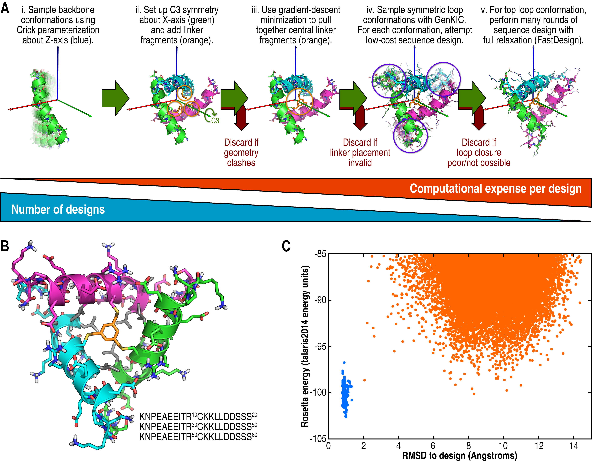

# Designing Threefold-Symmetric Meso-Sized Polypeptides With Threefold-Symmetric Cross-linkers
KEYWORDS: DESIGN PEPTIDES 
## Author
Vikram K. Mulligan, Ph.D. (vmullig@uw.edu)
Baker laboratory
Institute for Protein Design
University of Washington

## Description

This is the public demo for a protocol used to design large (60-residue) peptides with C3 symmetry, cross-linked with a threefold-symmetric cross-linking agent (1,3,5-tris(bromomethyl)benzene, or TBMB).  A manuscript describing this work is in preparation, a joint effort between the Baker and DeGrado laboratories.

This protocol uses RosettaScripts to design a peptide in a single script.  The steps in the design process are as follows:

1.  Sample conformations of a single helix using the BundleGridSampler, which places a helix using the Crick parameterization describing a helix following a helical path about the Z-axis.
2.  For each conformation sampled, mutate a central residue to CYX, add one-third of the TBMB cross-linker, and set up C3 symmetry about the Y-axis.  Filter out trajectories that have clashing geometry at this point.
3.  Energy-minimize the crosslinker to pull it into a closed conformation.  Filter out trajectories that do not present the crosslinker in a closable conformation at this point.
4.  Use GenKIC to close loops, filtering for similarity to 4mer fragments from the Protein Data Bank and attempting design and side-chain minimization on each loop conformation sampled.  Choose the lowest-energy loop conformation for subsequent steps of the protocol.
5.  Carry out more computationally-expensive sequence design and structure refrinement with the FastDesign protocol, allowing both side-chains and the backbone to relax.

The **design.xml** file included in the **xml/** sub-directory contains extensive comments describing each Rosetta module used and why it was invoked.  Note that this has been modified slightly from the original file, insofar as it samples a much smaller number of samples very close to a known designable region of Crick parameter space.  This is to allow the demo to run in a reasonable amount of time.


**(A)**  Overall design workflow.  The script included here fully describes this workflow.  **(B)**  An example of a designed C3-symmetric 60-mer cross-linked with TBMB (orange), with hydrophobic core residues shown in grey.  **(C)** _Ab initio_ energy landscape of the peptide shown in B.  Points from _ab initio_ are shown in orange and points from relaxation of the design structure are shown in blue.  Note that Rosetta's _ab initio_ algorithm can neither model the cyclic geometry nor the cross-linker, so this is a deceptively shallow folding funnel.

## Running

All commandline flags needed are included in **xml/rosetta.flags**.  To run this script, one therefore uses the following command:
```bash
$> $ROSETTA3/bin/rosetta_scripts.default.linuxgccrelease @xml/rosetta.flags
```

Note that, in the above, the string "default.linuxgccrelease" may need to be modified for your build type, operating system, and compiler.  For example, for a static build using the Clang compiler on a Mac, the executable's name would be **rosetta\_scripts.static.macosclangrelease**.

## Running with the Message Passing Interface (MPI) for parallel processing

The RosettaScripts executable may be compiled with support for parallelization using the Message Passing Interface (MPI).  This allows multiple RosettaScripts trajectories to be split over many processors, and in this case, this allows the sampling of Crick parameter space during the first step to be divided over many processors.  In order to run with MPI-based parallelization, after compiling with MPI support, one simply types:
```bash
$> mpirun -np <number_of_processes> $ROSETTA3/bin/rosetta_scripts.mpi.linuxgccrelease @xml/rosetta.flags
```

This is particularly recommended for this design protocol, since many hundreds of thousands of parameter value combinations must be sampled, which is best done in parallel.

## Versions

This script was implemented with, and has been tested with, Rosetta 3.8 on 1 March 2017.  The GIT sha was 99781a84f0b6fa3adb1bf8ecaf1abe9fb248088f.

## See also
[[Introductory RosettaScripting tutorial|scripting_with_rosettascripts]]
