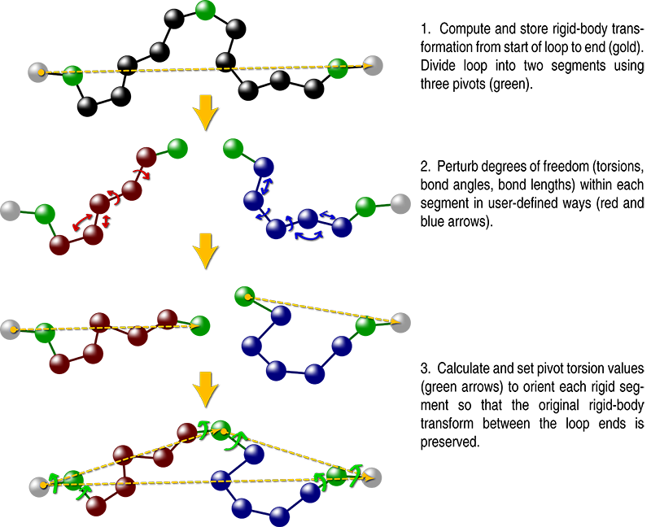
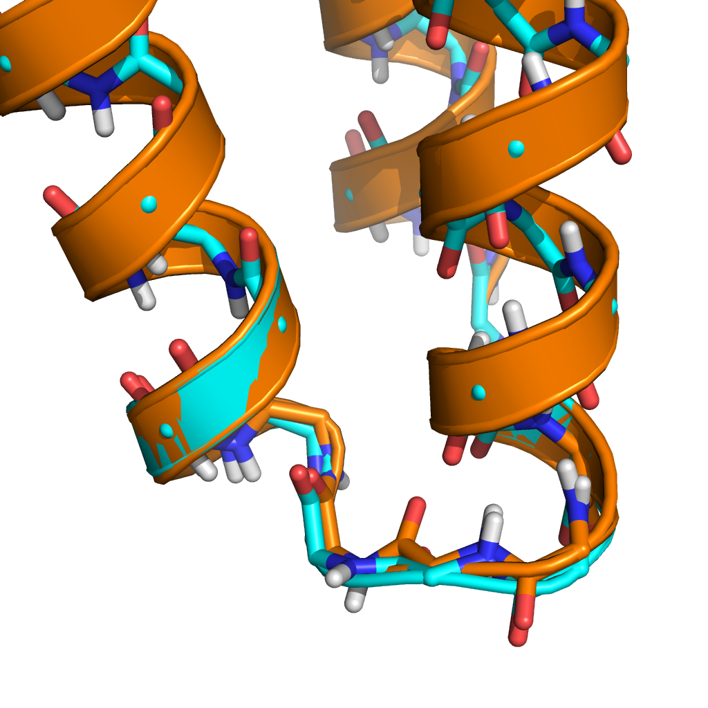

# Generalized Kinematic Closure Tutorial 1:
# Basic loop closure with GeneralizedKIC
======================================

KEYWORDS: LOOPS SCRIPTING_INTERFACES

Tutorial by Vikram K. Mulligan (vmullig@uw.edu).  Created on 28 March 2017 for the Baker lab Rosetta Tutorial Series.  Updated 29 May 2017 for the new ref2015 default scorefunction.

[[_TOC_]]

## Goals

At the end of this tutorial, you will understand:

- What the kinematic closure algorithm is, and what problem it solves
- How to use the PeptideStubMover to add loop residues to a pose lacking a loop
- How to use the DeclareBond mover to create a bond
- How to use the GeneralizedKIC mover to sample loop conformations
- How to set up GeneralizedKIC perturbers, filters, and selectors
- How to instruct GeneralizedKIC to close a peptide bond

## Introduction to Kinematic Closure (KIC)

Kinematic closure algorithms were originally developed for the robotics field to solve the problem of determining the necessary joint angles that would place a robot's hand or foot in a desired place.  We have adapted them for use within the Rosetta software suite to sample conformations of chains of atoms with well-defined start and end points.

A molecular kinematic closure problem may be described as follows: given a covalently-contiguous chain of atoms within a molecule, with covalent linkages at the ends of the chain fixing the start and end of the chain, what possible conformations maintain the integrity of bond length, bond angle, and dihedral angle restrictions within the chain?  To solve such a problem, we divide the chain of atoms into two segments, and define "pivot points" at the start of the chain (the first pivot), the end of the chain (the last pivot), and the breakpoint between the two segments (the middle pivot).

Having done this, the degrees of freedom within the two segments may be held fixed, randomized, perturbed, or otherwise altered as one sees fit.  These degrees of freedom include bond lengths, bond angles, and dihedral angles.  Whatever one does to these degrees of freedom, one ends up with two segments that still have well-defined rigid body transforms from the first pivot to the middle pivot (in the first segment), and from the middle pivot to the last pivot (in the second segment).  It is then possible to solve a system of equations for the six torsion angles adjacent to the three pivots in order to keep the system closed.  The matrix math that gives rise to the solution(s) is extremely fast as compared to alternative loop closure methods (which typically rely on iterative gradient-descent minimization); however, for a given system, this step may yield anywhere from 0 to 16 solutions.  It then becomes necessary to choose a solution for downstream molecular design or conformational refinement.

The GeneralizedKIC mover in Rosetta gives a user full control over pre-closure sampling, post-closure filtering, and selection of a closure solution.  It is fully accessible to the RosettaScripts scripting language, and interfaces nicely with other Rosetta movers and filters, allowing arbitrary protocols to be carried out on closure solutions before choosing a final solution.  It also allows closure of chains that do not consist solely of polypeptide backbones: that is, it is fully compatible with closure of atomic chains that run through disulfide bonds, arbitrary side-chain cross-links or cross-linkers, and non-canonical backbones.

**Overview of Kinematic Closure (KIC):**


## A Note on Using GeneralizedKIC

A loop that is open may be thought of as a continuous loop containing a bond that is badly stretched, and which likely has very strange bond angles and torsion angles at the cutpoint.  GeneralizedKIC can close an open loop by using perturbations that set the bond length, bond angles, and, possibly, the torsion angle of the cutpoint to reasonable values prior to solving for pivot torsion values.

## Exercise 1: Building and Closing a Polypeptide Loop Using RosettaScripts

### Inputs

For this exercise, we will be using an NMR structure of an artificial mini-protein designed by Dr. Chris Bahl (PDB ID 2ND2).  This mini-protein is a 44-residue 3-helix bundle.  For the purposes of this tutorial, the structure has been stripped of its amino acid sequence (_i.e._ it has been mutated to poly-glycine), and the loop connecting the second and third helices has been deleted.  This is meant to simulate many common design cases, in which one might arrange secondary structure elements first and build loops later (_e.g._ in the case of parametric design approaches), as well as certain structure prediction cases, in which one might wish to model loops that are missing in crystal structures.  We will rebuild this loop and sample its possible conformations.

**The input structure, an edited version of PDB structure 2ND2 (`2ND2_state1_glyonly_loop_removed.pdb`):**


Additionally, we will use the following Rosetta flags file.  Briefly, this instructs Rosetta to run the input script 10 times to produce 10 sampled loop conformations, to use the `ref2015` score function, and to include all chemical bonds in the output PDB files (which can be convenient when debugging bad geometry, since bonds are drawn even if bonded atoms are too far apart).

**File `rosetta.flags`:**
```
-nstruct 10
-in:file:s inputs/2ND2_state1_glyonly_loop_removed.pdb
-in:file:fullatom
-write_all_connect_info
-parser:protocol xml/exercise1.xml
-jd2:failed_job_exception false
-mute protocols.generalized_kinematic_closure.filter.GeneralizedKICfilter core.chemical.AtomICoor core.conformation.Residue
```

### Step 1: Building loop geometry

The GeneralizedKIC mover is only capable of sampling conformations of existing geometry.  It can neither add amino acid residues to a pose, nor create new bonds between residues.  For this reason, we must use the [PeptideStubMover](https://www.rosettacommons.org/docs/latest/PeptideStubMover) to build the new loop, and the [DeclareBond mover](https://www.rosettacommons.org/docs/latest/scripting_documentation/RosettaScripts/Movers/movers_pages/DeclareBond) to add a chemical bond across the loop cutpoint.

Run the `rosetta_scripts` application with no commandline options to create a template script, or copy and paste the example below:

```xml
<ROSETTASCRIPTS>
	<SCOREFXNS>
	</SCOREFXNS>
	<RESIDUE_SELECTORS>
	</RESIDUE_SELECTORS>
	<TASKOPERATIONS>
	</TASKOPERATIONS>
	<FILTERS>
	</FILTERS>
	<MOVERS>
	</MOVERS>
	<APPLY_TO_POSE>
	</APPLY_TO_POSE>
	<PROTOCOLS>
	</PROTOCOLS>
	<OUTPUT />
</ROSETTASCRIPTS>
```

Now let's add a [PeptideStubMover](https://www.rosettacommons.org/docs/latest/PeptideStubMover) in the `<MOVERS>` section.  We will append three residues to the end of the second helix (residue 28), and prepend two residues to the start of the third helix (which was residue 29, but which becomes residue 32 after appending three residues).  Note that the `Insert` command is used instead of the `Append` command because the added residues are in the middle of the sequence.  We'll use a poly-alanine sequence for sampling, but will cheat a little bit just for the purposes of this tutorial by keeping a glycine at the second loop position, since this is present in the original structure.

```xml
<PeptideStubMover name="add_loop_residues" >
	<Insert anchor_rsd="28" resname="ALA" />
	<Insert anchor_rsd="29" resname="GLY" />
	<Insert anchor_rsd="30" resname="ALA" />
	<Prepend anchor_rsd="32" resname="ALA" />
	<Prepend anchor_rsd="32" resname="ALA" />
</PeptideStubMover>

```

Be sure to add the above mover to the `<PROTOCOLS>` section as well (`<Add mover="add_loop_residues" />`).

We now have a five-residue loop, albeit one with several problems.  First, there is no bond between residues 30 and 31.  Second, these residues are too far apart in space to form a bond.  And third, all dihedral angles in the new loop are set to 0 degrees, including omega angles (_i.e._ all peptide bonds are _cis_ instead of _trans_).  To solve the first problem, we will add a [DeclareBond mover](https://www.rosettacommons.org/docs/latest/scripting_documentation/RosettaScripts/Movers/movers_pages/DeclareBond) to the `<MOVERS>` section of the script, telling Rosetta that there ought to be a chemical bond between the C atom of residue 30 and the N atom of residue 31.  Note that this does not move any geometry, but it does mean that the bond is present in the output PDB file if we run the script at this point.

```xml
<DeclareBond name="new_bond" atom1="C" atom2="N" res1="31" res2="32" />
```

As before, this must also be added to the `<PROTOCOLS>` section (`<Add mover="new_bond" />`);

### Step 2: Preparing for sampling

We will create a GeneralizedKIC mover for sampling in a moment.  Before we do so, though, we want to mutate two flanking residues, which will also be sampled as part of the loop, to alanine.  We do this because the sampling that we will use is biased by the Ramachandran preferences of the amino acid type.  Alanine is a good residue to use to represent the generic L-alpha amino acid, but glycine (which is currently present) is not because it has as much preference for the positive-phi region of Ramachandran space as for the negative.  (Indeed, our glycine Ramachandran tables are biased to _favour_ the positive-phi region, since glycine is disproportionately found in the positive-phi region in the PDB structures used to train our scorefunction.)  Let us add two [MutateResidue movers](https://www.rosettacommons.org/docs/latest/scripting_documentation/RosettaScripts/Movers/movers_pages/MutateResidueMover) to change the residue identities at this position.  In the `<MOVERS>` section add:

```xml
<MutateResidue name="mut1" target="28" new_res="ALA" />
<MutateResidue name="mut2" target="34" new_res="ALA" />
```

As before, add these two movers to the `<PROTOCOLS>` section after the movers already added.  At this point, the `<PROTOCOLS>` section should look like this:

```xml
<PROTOCOLS>
	<Add mover="add_loop_residues" />
	<Add mover="new_bond" />
	<Add mover="mut1" />
	<Add mover="mut2" />
</PROTOCOLS>
```

### Step 3: Initial GeneralizedKIC setup

We're now ready to add the GeneralizedKIC mover that will close the gap in the loop and sample loop conformations.  In the movers section, add the following.

```xml
<GeneralizedKIC name="genkic" />
```

Add this mover to the end of the `<PROTOCOLS`> section, too, as before.

GeneralizedKIC gives the user many, many options to control loop sampling, filtering, and solution selection.  Typically, the first option that one wants to set is the number of attempts that the mover will make to find a closed solution.  Each attempt consists of perturbing loop degrees of freedom (in a manner that we will define), solving for closed solutions, and applying GeneralizedKIC filters.  Because the KIC algorithm is so fast, one can easily attempt hundreds of solutions per second.  For our purposes, let's set the number of attempts to 5000 by modifying our GeneralizedKIC block as follows:

```xml
<GeneralizedKIC name="genkic" closure_attempts="5000" />
```

Each attempt could yield anywhere from 0 to 16 solutions.  By default, every solution found will be stored until we've made the specified number of attempts (in our case 5000).  This could be far too many solutions, though.  It makes more sense to stop looking for solutions after we've found a small number.  That number could be as low as 1 (_i.e._ GeneralizedKIC stops as soon as a solution is found), but for our purposes, let's set that number at 5:


```xml
<GeneralizedKIC name="genkic" closure_attempts="5000" stop_when_n_solutions_found="5" />
```

Even if we had set this numer at 1, a single attempt might have yielded up to 16 solutions.  We always need to tell GeneralizedKIC how to pick a single solution from among the solutions.  Here, we'll choose our solution by energy -- but there is an important caveat.  Since we are sampling backbone conformations, with no consideration of side-chains, we should use a scoring function that consists primarily of backbone-only terms to pick the best solution.  (Later we will see how we can apply an arbitrary mover -- _e.g._ a full repack and minimization -- to every solution, in which case it might make sense to use the full Rosetta scoring function to pick the best solution).  Let's set up a backbone-only scoring function using weights from the `ref2015` scoring function.  In the `<SCOREFXNS>` section of your script, add the following:

```xml
<ScoreFunction name="ref15sfxn" weights="ref2015.wts" />
<ScoreFunction name="bb_only" weights="empty.wts" >
	<Reweight scoretype="fa_rep" weight="0.1" />
	<Reweight scoretype="fa_atr" weight="0.2" />
	<Reweight scoretype="hbond_sr_bb" weight="2.0" />
	<Reweight scoretype="hbond_lr_bb" weight="2.0" />
	<Reweight scoretype="rama_prepro" weight="0.45" />
	<Reweight scoretype="omega" weight="0.4" />
	<Reweight scoretype="p_aa_pp" weight="0.6" />
</ScoreFunction>

```

The "ref15sfxn" scoring function is now the full `ref2015` scoring function, which may be useful if we later add sidechain refinement to our protocol (which we will do in the third GeneralizedKIC tutorial).  For now, we will use the "bb_only" scoring function, in which we've cherry-picked relevant backbone terms (plus weakened versions of the Lennard-Jones terms).  Let's tell GeneralizedKIC to use this scoring function to pick a solution by adding two more options to our already-declared GeneralizedKIC mover:

```xml
<GeneralizedKIC name="genkic" closure_attempts="5000" stop_when_n_solutions_found="5"
	selector="lowest_energy_selector" selector_scorefunction="bb_only"
/>
```

### Step 4:  Setting loop residues and picking pivots

It is now necessary to tell GeneralizedKIC which residues are in the loop to be closed, and to give it the pivot points to use.  You will recall that pivots define the two segments into which we are dividing the loop to be closed.  They do _not_ need to correspond to discontinuities in the loop, but they do need freely rotatable bonds adjacent to them (making N and C atoms, which are adjacent to a peptide bond with a fixed dihedral value, unsuitable for use as pivots).  The KIC solver will assign solution values to the torsions adjacent to the pivots, which is why free rotation is necessary for these torsions.  The following additions to our GeneralizedKIC mover define a loop running from residue 28 through 34, and set the alpha carbons of residues 28, 31, and 34 as pivot atoms:

```xml
<GeneralizedKIC ... >
	<AddResidue res_index="28" />
	<AddResidue res_index="29" />
	<AddResidue res_index="30" />
	<AddResidue res_index="31" />
	<AddResidue res_index="32" />
	<AddResidue res_index="33" />
	<AddResidue res_index="34" />
	<SetPivots res1="28" res2="31" res3="34" atom1="CA" atom2="CA" atom3="CA" />
</GeneralizedKIC>
```

The ellipsis above represents the options that we have already set.  Note that first and last pivot atoms must be at the start and end of the loop to be sampled.  Shifting these pivots inward prevents sampling of degrees of freedom beyond the pivots (which, as we will see in Tutorial 4, is occasionally the behaviour that one desires).

### Step 5:  Setting GeneralizedKIC perturbers

Perturbers allow a user to alter degrees of freedom in the two segments between the pivots.  They can:
- Set a degree of freedom to a fixed value
- Perturb a degree of freedom slighly from a starting value (_i.e._ add a small, random value to the value of the degree of freedom)
- Fully randomize a degree of freedom
- Draw a random value for a degree of freedom from a biased distribution (_e.g._ drawing mainchain torsion values from the Ramachandran distribution for the relevant amino acid type)

Perturbers are applied in the order in which they are defined, and can override or modify the effect of previous perturbers.  One could, for example, set a particular torsion value to 180, then allow small perturbations around that value, through successive application of a setting and a perturbing perturber.

We want to use perturbers to do several things:
1.  Set all mainchain omega values to 180 degrees.
2.  Set the bond length, bond angles, and torsion angle of the currently-broken bond between residues 30 and 31 to ideal values for a peptide bond.
3.  Randomize phi and psi values for all amino acids in the loop, biased by each amino acid's Ramachandran map.

Within the `<GeneralizedKIC> ... </GeneralizedKIC>` block, we can add a `set_dihedral` perturber to set the values of mainchain omega angles.  We use `<AddAtoms>` tags to define each omega angle that we're setting, and an `<AddValue>` tag to define the value to which we're setting them.  (Note that the same value is applied to all of these in this example.  We could also add one `<AddValue>` tag for each `<AddAtoms>` tag if we wanted to set all of them to different values.)

```xml
<GeneralizedKIC ...>
	...
	<AddPerturber effect="set_dihedral" >
		<AddAtoms res1="28" atom1="C" res2="29" atom2="N" />
		<AddAtoms res1="29" atom1="C" res2="30" atom2="N" />
		<AddAtoms res1="30" atom1="C" res2="31" atom2="N" />
		<AddAtoms res1="31" atom1="C" res2="32" atom2="N" />
		<AddAtoms res1="32" atom1="C" res2="33" atom2="N" />
		<AddAtoms res1="33" atom1="C" res2="34" atom2="N" />
		<AddValue value="180.0" />
	</AddPerturber>
</GeneralizedKIC>
```

We could similarly use a `set_bondlength` perturber, two `set_bondangle` perturbers, and a `set_dihedral` perturber to set ideal peptide bond geometry for the bond between residues 30 and 31.  However, GeneralizedKIC provides a convenient shorthand for combining these perturbers:

```xml
<GeneralizedKIC ...>
	...
	<CloseBond res1="31" res2="32" atom1="C" atom2="N" bondlength="1.328685" angle1="121.699997" angle2="116.199993" torsion="180.0" />
</GeneralizedKIC>
```

Finally, the `randomize_backbone_by_rama_prepro` perturber can be used for biased randomization of mainchain torsions of any residue that (a) has a Ramachandran map in the Rosetta database, and (b) has all of its mainchain torsions within the chain to be sampled by GeneralizedKIC.  (That is, we cannot use it for, for example, a cysteine residue involved in a disulfide bond if we are closing through the disulfide bond.)

```xml
<GeneralizedKIC ...>
	...
	<AddPerturber effect="randomize_backbone_by_rama_prepro" >
		<AddResidue index="28" />
		<AddResidue index="29" />
		<AddResidue index="30" />
		<AddResidue index="31" />
		<AddResidue index="32" />
		<AddResidue index="33" />
		<AddResidue index="34" />
	</AddPerturber>
<GeneralizedKIC>
```

At this point, your GeneralizedKIC mover should look like this:

```xml
<GeneralizedKIC name="genkic"	closure_attempts="5000" stop_when_n_solutions_found="5"
	selector="lowest_energy_selector" selector_scorefunction="bb_only"
>
	<AddResidue res_index="28" />
	<AddResidue res_index="29" />
	<AddResidue res_index="30" />
	<AddResidue res_index="31" />
	<AddResidue res_index="32" />
	<AddResidue res_index="33" />
	<AddResidue res_index="34" />
	<SetPivots res1="28" res2="31" res3="34" atom1="CA" atom2="CA" atom3="CA" />
	<AddPerturber effect="set_dihedral" >
		<AddAtoms res1="28" atom1="C" res2="29" atom2="N" />
		<AddAtoms res1="29" atom1="C" res2="30" atom2="N" />
		<AddAtoms res1="30" atom1="C" res2="31" atom2="N" />
		<AddAtoms res1="31" atom1="C" res2="32" atom2="N" />
		<AddAtoms res1="32" atom1="C" res2="33" atom2="N" />
		<AddAtoms res1="33" atom1="C" res2="34" atom2="N" />
		<AddValue value="180.0" />
	</AddPerturber>
	<CloseBond res1="31" res2="32" atom1="C" atom2="N" bondlength="1.328685" angle1="121.699997" angle2="116.199993" torsion="180.0" />
	<AddPerturber effect="randomize_backbone_by_rama_prepro" >
		<AddResidue index="28" />
		<AddResidue index="29" />
		<AddResidue index="30" />
		<AddResidue index="31" />
		<AddResidue index="32" />
		<AddResidue index="33" />
		<AddResidue index="34" />
	</AddPerturber>
</GeneralizedKIC>
```

### Step 6: Filtering solutions to discard bad geometry

If you run the script at this point, it should produce closed loop solutions.  There are a number of possible problems with the solutions produced, however.  First, although the residues within each segment are being sampled in a biased manner based on their respective Ramachandran maps, the pivot residues have values assigned to them by the solver, which may put them in awkward regions of Ramachandran space.  We want to filter out solutions with poor pivot Ramachandran energies.  Second, we don't want loop solutions with clashing geometry, so we want some sort of bump check to be applied before accepting a solution.  And third, we may want to impose some prior knowledge insofar as we expect the first and last residues of the loop, which are coming off of helices, to be in the alpha-helical bin ("A") of Ramachandran space.

GeneralizedKIC filters are applied rapidly to all solutions produced by the KIC solver _before_ the solutions are used to build computationally-expensive Pose geometry.  They are therefore a good way to cheaply and efficiently discard bad solutions.  Note that, unlike Rosetta's filters, the GeneralizedKIC filters operate on a set of loop degree-of-freedom values, not on a full Pose.

Let us first require that solutions have residues 28 ad 34 in the alpha-helical region of Ramachandran space.  For this, we use a `backbone_bin` GeneralizedKIC filter:

```xml
<GeneralizedKIC ...>
	...
	<AddFilter type="backbone_bin" residue="28" bin_params_file="ABBA" bin="A" />
	<AddFilter type="backbone_bin" residue="34" bin_params_file="ABBA" bin="A" />
</GeneralizedKIC>
```

In the above, the "ABBA" bin parameters file, located in the Rosetta database, defines Ramachandran bins for the alpha-helical region ("A"), the beta-sheet region ("B"), and the mirror-image regions that can be accessed by D-amino acids ("Aprime" and "Bprime", respectively).

Next, we'll add a simple bump check filter (`loop_bump_check`) to discard solutions with clashing mainchain geometry.  Note that this does _not_ check sidechain geometry; it only operates on the heavyatoms of the loop to be closed:

```xml
<GeneralizedKIC ...>
	...
	<AddFilter type="loop_bump_check" />
</GeneralizedKIC>
```

And finally, we'll add a `rama_prepro_check` filter to discard solutions in which pivot atoms are in energetically-unfavourable regions of Ramachandran space:

```xml
	<AddFilter type="rama_prepro_check" residue="28" rama_cutoff_energy="0.5" />
	<AddFilter type="rama_prepro_check" residue="31" rama_cutoff_energy="0.5" />
	<AddFilter type="rama_prepro_check" residue="34" rama_cutoff_energy="0.5" />
```

And that's it!  The finished script should look like this:

```xml
<ROSETTASCRIPTS>
	<SCOREFXNS>
		<ScoreFunction name="ref15sfxn" weights="ref2015.wts" />
		<ScoreFunction name="bb_only" weights="empty.wts" >
			<Reweight scoretype="fa_rep" weight="0.1" />
			<Reweight scoretype="fa_atr" weight="0.2" />
			<Reweight scoretype="hbond_sr_bb" weight="2.0" />
			<Reweight scoretype="hbond_lr_bb" weight="2.0" />
			<Reweight scoretype="rama_prepro" weight="0.45" />
			<Reweight scoretype="omega" weight="0.4" />
			<Reweight scoretype="p_aa_pp" weight="0.6" />
		</ScoreFunction>
	</SCOREFXNS>
	<RESIDUE_SELECTORS>
	</RESIDUE_SELECTORS>
	<TASKOPERATIONS>
	</TASKOPERATIONS>
	<FILTERS>
	</FILTERS>
	<MOVERS>	
		<PeptideStubMover name="add_loop_residues" >
			<Insert anchor_rsd="28" resname="ALA" />
			<Insert anchor_rsd="29" resname="GLY" />
			<Insert anchor_rsd="30" resname="ALA" />
			<Prepend anchor_rsd="32" resname="ALA" />
			<Prepend anchor_rsd="32" resname="ALA" />
		</PeptideStubMover>
	
		<DeclareBond name="new_bond" atom1="C" atom2="N" res1="31" res2="32" />

		<MutateResidue name="mut1" target="28" new_res="ALA" />
		<MutateResidue name="mut2" target="34" new_res="ALA" />

		<GeneralizedKIC name="genkic" selector="lowest_energy_selector" selector_scorefunction="bb_only"
			closure_attempts="5000" stop_when_n_solutions_found="5" >
			<AddResidue res_index="28" />
			<AddResidue res_index="29" />
			<AddResidue res_index="30" />
			<AddResidue res_index="31" />
			<AddResidue res_index="32" />
			<AddResidue res_index="33" />
			<AddResidue res_index="34" />
			<SetPivots res1="28" res2="31" res3="34" atom1="CA" atom2="CA" atom3="CA" />
			<AddPerturber effect="set_dihedral" >
				<AddAtoms res1="28" atom1="C" res2="29" atom2="N" />
				<AddAtoms res1="29" atom1="C" res2="30" atom2="N" />
				<AddAtoms res1="30" atom1="C" res2="31" atom2="N" />
				<AddAtoms res1="31" atom1="C" res2="32" atom2="N" />
				<AddAtoms res1="32" atom1="C" res2="33" atom2="N" />
				<AddAtoms res1="33" atom1="C" res2="34" atom2="N" />
				<AddValue value="180.0" />
			</AddPerturber>
			<CloseBond res1="31" res2="32" atom1="C" atom2="N" bondlength="1.328685" angle1="121.699997" angle2="116.199993" torsion="180.0" />
			<AddPerturber effect="randomize_backbone_by_rama_prepro" >
				<AddResidue index="28" />
				<AddResidue index="29" />
				<AddResidue index="30" />
				<AddResidue index="31" />
				<AddResidue index="32" />
				<AddResidue index="33" />
				<AddResidue index="34" />
			</AddPerturber>
			<AddFilter type="backbone_bin" residue="28" bin_params_file="ABBA" bin="A" />
			<AddFilter type="backbone_bin" residue="34" bin_params_file="ABBA" bin="A" />
			<AddFilter type="loop_bump_check" />
			<AddFilter type="rama_prepro_check" residue="28" rama_cutoff_energy="0.5" />
			<AddFilter type="rama_prepro_check" residue="31" rama_cutoff_energy="0.5" />
			<AddFilter type="rama_prepro_check" residue="34" rama_cutoff_energy="0.5" />
		</GeneralizedKIC>
	
	</MOVERS>
	<APPLY_TO_POSE>
	</APPLY_TO_POSE>
	<PROTOCOLS>
		<Add mover="add_loop_residues" />
		<Add mover="new_bond" />
		<Add mover="mut1" />
		<Add mover="mut2" />
		<Add mover="genkic" />
	</PROTOCOLS>
	<OUTPUT />
</ROSETTASCRIPTS>
```

## Running the example script

The above script is provided in the `demos/tutorials/GeneralizedKIC/exercise1/xml/` directory.  To run this, navigate to the `demos/tutorials/GeneralizedKIC` directory and type the following:

```bash
$> cd exercise1
$> $ROSETTA3/bin/rosetta_scripts.default.linuxgccrelease @inputs/rosetta.flags
$> cd ..
```

In the above, `$ROSETTA3` is the path to your Rosetta directory.  You may need to replace `linuxgccrelease` for your operating system and compilation (_e.g._ `macosclangrelease` on a Mac).

## Expected output

When tested with Rosetta 3.8 SHA 3cad483ccac973741499159e12989a7143bf79de (nightly build from Tuesday, March 28th, 2017), the script produced many loop conformations, including some closely resembling the native conformation:

**A solution closely matching the native conformation (cyan -- native, orange -- GeneralizedKIC solution)**


**A solution more distinct from the native conformation (cyan -- native, orange -- GeneralizedKIC solution)**


## Conclusion

In this tutorial, we have covered basic loop building and closure with GeneralizedKIC.  The use of perturbers for sampling and filters for pruning solutions was also covered.  The reader would be well-advised to play with the various settings, and to explore the different GeneralizedKIC perturbers, filters, and selectors that are available, all of which are documented in detail in the [GeneralizedKIC documentation](https://www.rosettacommons.org/docs/latest/scripting_documentation/RosettaScripts/composite_protocols/generalized_kic/GeneralizedKIC) pages on the Rosetta help wiki.

## Further Reading

Bhardwaj G, Mulligan VK, Bahl CD, Gilmore JM, Harvey PJ, Cheneval O, Buchko GW, Pulavarti SV, Kaas Q, Eletsky A, Huang PS, Johnsen WA, Greisen PJ, Rocklin GJ, Song Y, Linsky TW, Watkins A, Rettie SA, Xu X, Carter LP, Bonneau R, Olson JM, Coutsias E, Correnti CE, Szyperski T, Craik DJ, Baker D.  (2016).  Accurate de novo design of hyperstable constrained peptides.  _Nature_ 538(7625):329-335.

Mandell DJ, Coutsias EA, Kortemme T. (2009).  Sub-angstrom accuracy in protein loop reconstruction by robotics-inspired conformational sampling.  _Nat. Methods_ 6(8):551-2.

Coutsias EA, Seok C, Jacobson MP, Dill KA.  (2004).  A kinematic view of loop closure.  _J. Comput. Chem._ 25(4):510-28.

[GeneralizedKIC documentation](https://www.rosettacommons.org/docs/latest/scripting_documentation/RosettaScripts/composite_protocols/generalized_kic/GeneralizedKIC)

[[GeneralizedKIC Tutorial 2|generalized_kinematic_closure_2]]

[[GeneralizedKIC Tutorial 3|generalized_kinematic_closure_3]]

[[GeneralizedKIC Tutorial 4|generalized_kinematic_closure_4]]
