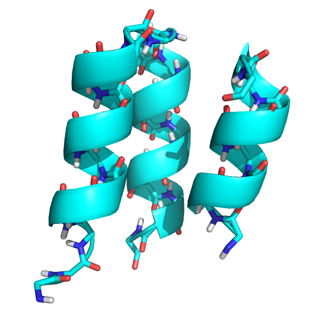

# Generalized Kinematic Closure Tutorial 1:
# Basic loop closure with GeneralizedKIC
======================================

KEYWORDS: LOOPS SCRIPTING_INTERFACES

Tutorial by Vikram K. Mulligan (vmullig@uw.edu).  Created on 28 March 2017 for the Baker lab Rosetta Tutorial Series.

[[_TOC_]]

## Goals

At the end of this tutorial, you will understand:

- What the kinematic closure algorithm is, and what problem it solves
- How to use the PeptideStubMover to add loop residues to a pose lacking a loop
- How to use the DeclareBond mover to create a bond
- How to use the GeneralizedKIC mover to sample loop conformations
- How to set up GeneralizedKIC perturbers, filters, and selectors
- How to instruct GeneralizedKIC to close a peptide bond

## Introduction to Kinematic Closure

Kinematic closure algorithms were originally developed for the robotics field to solve the problem of determining the necessary joint angles that would place a robot's hand or foot in a desired place.  We have adapted them for use within the Rosetta software suite to sample conformations of chains of atoms with well-defined start and end points.

A molecular kinematic closure problem may be described as follows: given a covalently-contiguous chain of atoms within a molecule, with covalent linkages at the ends of the chain fixing the start and end of the chain, what possible conformations maintain the integrity of bond length, bond angle, and dihedral angle restrictions within the chain?  To solve such a problem, we divide the chain of atoms into two segments, and define "pivot points" at the start of the chain (the first pivot), the end of the chain (the last pivot), and the breakpoint between the two segments (the middle pivot).

Having done this, the degrees of freedom within the two segments may be held fixed, randomized, perturbed, or otherwise altered as one sees fit.  These degrees of freedom include bond lengths, bond angles, and dihedral angles.  Whatever one does to these degrees of freedom, one ends up with two segments that still have well-defined rigid body transforms from the first pivot to the middle pivot (in the first segment), and from the middle pivot to the last pivot (in the second segment).  It is then possible to solve a system of equations for the six torsion angles adjacent to the three pivots in order to keep the system closed.  The matrix math that gives rise to the solution(s) is extremely fast as compared to alternative loop closure methods (which typically rely on iterative gradient-descent minimization); however, for a given system, this step may yield anywhere from 0 to 16 solutions.  It then becomes necessary to choose a solution for downstream molecular design or conformational refinement.

The GeneralizedKIC mover in Rosetta gives a user full control over pre-closure sampling, post-closure filtering, and selection of a closure solution.  It is fully accessible to the RosettaScripts scripting language, and interfaces nicely with other Rosetta movers and filters, allowing arbitrary protocols to be carried out on closure solutions before choosing a final solution.  It also allows closure of chains that do not consist solely of polypeptide backbones: that is, it is fully compatible with closure of atomic chains that run through disulfide bonds, arbitrary side-chain cross-links or cross-linkers, and non-canonical backbones.

## A Note on Using GeneralizedKIC

A loop that is open may be thought of as a continuous loop containing a bond that is badly stretched, and which likely has very strange bond angles and torsion angles at the cutpoint.  GeneralizedKIC can close an open loop by using perturbations that set the bond length, bond angles, and, possibly, the torsion angle of the cutpoint to reasonable values prior to solving for pivot torsion values.

## Exercise 1: Building and Closing a Polypeptide Loop Using RosettaScripts

### Inputs

For this exercise, we will be using an NMR structure of an artificial mini-protein designed by Dr. Chris Bahl (PDB ID 2ND2).  This mini-protein is a 44-residue 3-helix bundle.  For the purposes of this tutorial, the structure has been stripped of its amino acid sequence (_i.e._ it has been mutated to poly-glycine), and the loop connecting the second and third helices has been deleted.  This is meant to simulate many common design cases, in which one might arrange secondary structure elements first and build loops later (_e.g._ in the case of parametric design approaches), as well as certain structure prediction cases, in which one might wish to model loops that are missing in crystal structures.  We will rebuild this loop and sample its possible conformations.

**The input structure, an edited version of PDB structure 2ND2 (`2ND2_state1_glyonly_loop_removed.pdb`):**


Additionally, we will use the following Rosetta flags file.  Briefly, this instructs Rosetta to run the input script 10 times to produce 10 sampled loop conformations, to use the `beta_nov15` score function, and to include all chemical bonds in the output PDB files (which can be convenient when debugging bad geometry, since bonds are drawn even if bonded atoms are too far apart).

**File `rosetta.flags`:**
```
-nstruct 10
-beta_nov15
-in:file:s inputs/2ND2_state1_glyonly_loop_removed.pdb
-in:file:fullatom
-write_all_connect_info
-parser:protocol xml/exercise1.xml
-jd2:failed_job_exception false
-mute protocols.generalized_kinematic_closure.filter.GeneralizedKICfilter core.chemical.AtomICoor core.conformation.Residue
```

### Step 1: Building loop geometry

The GeneralizedKIC mover is only capable of sampling conformations of existing geometry.  It can neither add amino acid residues to a pose, nor create new bonds between residues.  For this reason, we must use the [[PeptideStubMover|https://www.rosettacommons.org/docs/latest/PeptideStubMover]] to build the new loop, and the [[DeclareBond mover|https://www.rosettacommons.org/docs/latest/scripting_documentation/RosettaScripts/Movers/movers_pages/DeclareBond]] to add a chemical bond across the loop cutpoint.

Run the `rosetta_scripts` application with no commandline options to create a template script, or copy and paste the example below:

```xml
<ROSETTASCRIPTS>
	<SCOREFXNS>
	</SCOREFXNS>
	<RESIDUE_SELECTORS>
	</RESIDUE_SELECTORS>
	<TASKOPERATIONS>
	</TASKOPERATIONS>
	<FILTERS>
	</FILTERS>
	<MOVERS>
	</MOVERS>
	<APPLY_TO_POSE>
	</APPLY_TO_POSE>
	<PROTOCOLS>
	</PROTOCOLS>
	<OUTPUT />
</ROSETTASCRIPTS>
```

Now let's add a [[PeptideStubMover|https://www.rosettacommons.org/docs/latest/PeptideStubMover]] in the ```<MOVERS``` section.  We will append three residues to the end of the second helix (residue 28), and prepend two residues to the start of the third helix (which was residue 29, but which becomes residue 32 after appending three residues).  Note that the `Insert` command is used instead of the `Append` command because the added residues are in the middle of the sequence.  We'll use a poly-alanine sequence for sampling, but will cheat a little bit just for the purposes of this tutorial by keeping a glycine at the second loop position, since this is present in the original structure.

```xml
<PeptideStubMover name="add_loop_residues" >
	<Insert anchor_rsd="28" resname="ALA" />
	<Insert anchor_rsd="29" resname="GLY" />
	<Insert anchor_rsd="30" resname="ALA" />
	<Prepend anchor_rsd="32" resname="ALA" />
	<Prepend anchor_rsd="32" resname="ALA" />
</PeptideStubMover>

```


## Conclusion

**TODO**

## Further Reading

Bhardwaj G, Mulligan VK, Bahl CD, Gilmore JM, Harvey PJ, Cheneval O, Buchko GW, Pulavarti SV, Kaas Q, Eletsky A, Huang PS, Johnsen WA, Greisen PJ, Rocklin GJ, Song Y, Linsky TW, Watkins A, Rettie SA, Xu X, Carter LP, Bonneau R, Olson JM, Coutsias E, Correnti CE, Szyperski T, Craik DJ, Baker D.  (2016).  Accurate de novo design of hyperstable constrained peptides.  _Nature_ 538(7625):329-335.

Mandell DJ, Coutsias EA, Kortemme T. (2009).  Sub-angstrom accuracy in protein loop reconstruction by robotics-inspired conformational sampling.  _Nat. Methods_ 6(8):551-2.

Coutsias EA, Seok C, Jacobson MP, Dill KA.  (2004).  A kinematic view of loop closure.  _J. Comput. Chem._ 25(4):510-28.

