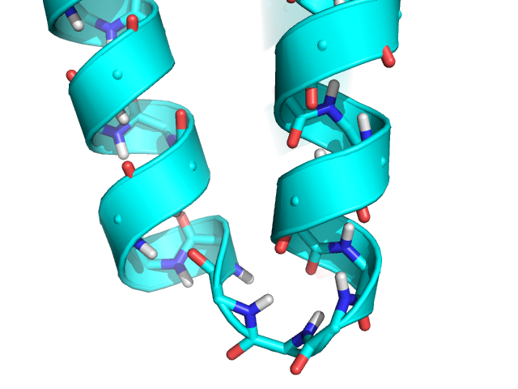
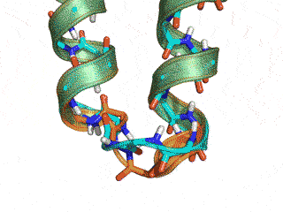

# Generalized Kinematic Closure Tutorial 2:
# Perturbing loops from a starting conformation with GeneralizedKIC
======================================

KEYWORDS: LOOPS SCRIPTING_INTERFACES

Tutorial by Vikram K. Mulligan (vmullig@uw.edu).  Created on 28 March 2017 for the Baker lab Rosetta Tutorial Series.  Updated 29 May 2017 for the new ref2015 default scorefunction.

[[_TOC_]]

## Goals

At the end of this tutorial, you will understand:

- How to use the GeneralizedKIC mover to sample small perturbations of an existing loop.
- How to use the GeneralizedKIC mover with the GenericMonteCarlo mover to perform a Monte Carlo search of loop conformations.

It is highly recommended that you complete the [[first tutorial|generalized_kinematic_closure_1]] before proceeding.

## Perturbing loops with GeneralizedKIC

In the [[first tutorial|generalized_kinematic_closure_1]], we saw how one can construct an entirely new loop using the [PeptideStubMover](https://www.rosettacommons.org/docs/latest/PeptideStubMover), the [DeclareBond mover](https://www.rosettacommons.org/docs/latest/scripting_documentation/RosettaScripts/Movers/movers_pages/DeclareBond), and GeneralizedKIC.  The GeneralizedKIC mover was used to sample entirely new conformations of the loop.  However, there are many situations in which one may wish to perturb a loop slightly from a starting conformation without randomizing its conformation completely.  This is particularly true when using GeneralizedKIC to explore variant conformations of a starting structure, or when one has used fragment insertion to build a loop crudely and wishes to refine the starting model.  In this tutorial, we will learn how to perturb loops with GeneralizedKIC.  We will do this in the context of a Monte Carlo search of loop conformational space, in which the moves are small perturbations of the loop conformation (using GeneralizedKIC), and the acceptance criterion is the effect on a backbone-only score function.

## Exercise 2:  A RosettaScripts-Scripted Monte Carlo Search of Loop Conformational Space

### Inputs

For this exercise, we will be using one of the imperfect loop conformations from the first tutorial.  This simulates the design case, in which one may have built an initial, imperfect loop using a fragment-based or other method, and one wishes to improve one's initial model.

**The starting model for this tutorial:**


The following `rosetta.flags` file will be used for this tutorial:

```
-nstruct 1
-in:file:s inputs/2ND2_exercise1_solution4.pdb
-in:file:fullatom
-write_all_connect_info
-parser:protocol xml/exercise2.xml
-jd2:failed_job_exception false
-mute all
-unmute protocols.simple_moves.GenericMonteCarloMover
```

We will also start with the script from the previous tutorial, and modify it to our needs.  Here it is for reference:

```xml
<ROSETTASCRIPTS>
	<SCOREFXNS>
		<ScoreFunction name="ref15sfxn" weights="ref2015.wts" />
		<ScoreFunction name="bb_only" weights="empty.wts" >
			<Reweight scoretype="fa_rep" weight="0.1" />
			<Reweight scoretype="fa_atr" weight="0.2" />
			<Reweight scoretype="hbond_sr_bb" weight="2.0" />
			<Reweight scoretype="hbond_lr_bb" weight="2.0" />
			<Reweight scoretype="rama_prepro" weight="0.45" />
			<Reweight scoretype="omega" weight="0.4" />
			<Reweight scoretype="p_aa_pp" weight="0.6" />
		</ScoreFunction>
	</SCOREFXNS>
	<RESIDUE_SELECTORS>
	</RESIDUE_SELECTORS>
	<TASKOPERATIONS>
	</TASKOPERATIONS>
	<FILTERS>
	</FILTERS>
	<MOVERS>	
		<PeptideStubMover name="add_loop_residues" >
			<Insert anchor_rsd="28" resname="ALA" />
			<Insert anchor_rsd="29" resname="GLY" />
			<Insert anchor_rsd="30" resname="ALA" />
			<Prepend anchor_rsd="32" resname="ALA" />
			<Prepend anchor_rsd="32" resname="ALA" />
		</PeptideStubMover>
		
		<DeclareBond name="new_bond" atom1="C" atom2="N" res1="31" res2="32" />

		<MutateResidue name="mut1" target="28" new_res="ALA" />
		<MutateResidue name="mut2" target="34" new_res="ALA" />

		<GeneralizedKIC name="genkic" selector="lowest_energy_selector" selector_scorefunction="bb_only"
			closure_attempts="5000" stop_when_n_solutions_found="5" >
			<AddResidue res_index="28" />
			<AddResidue res_index="29" />
			<AddResidue res_index="30" />
			<AddResidue res_index="31" />
			<AddResidue res_index="32" />
			<AddResidue res_index="33" />
			<AddResidue res_index="34" />
			<SetPivots res1="28" res2="31" res3="34" atom1="CA" atom2="CA" atom3="CA" />
			<AddPerturber effect="set_dihedral" >
				<AddAtoms res1="28" atom1="C" res2="29" atom2="N" />
				<AddAtoms res1="29" atom1="C" res2="30" atom2="N" />
				<AddAtoms res1="30" atom1="C" res2="31" atom2="N" />
				<AddAtoms res1="31" atom1="C" res2="32" atom2="N" />
				<AddAtoms res1="32" atom1="C" res2="33" atom2="N" />
				<AddAtoms res1="33" atom1="C" res2="34" atom2="N" />
				<AddValue value="180.0" />
			</AddPerturber>
			<CloseBond res1="31" res2="32" atom1="C" atom2="N" bondlength="1.328685" angle1="121.699997" angle2="116.199993" torsion="180.0" />
			<AddPerturber effect="randomize_backbone_by_rama_prepro" >
				<AddResidue index="28" />
				<AddResidue index="29" />
				<AddResidue index="30" />
				<AddResidue index="31" />
				<AddResidue index="32" />
				<AddResidue index="33" />
				<AddResidue index="34" />
			</AddPerturber>
			<AddFilter type="backbone_bin" residue="28" bin_params_file="ABBA" bin="A" />
			<AddFilter type="backbone_bin" residue="34" bin_params_file="ABBA" bin="A" />
			<AddFilter type="loop_bump_check" />
			<AddFilter type="rama_prepro_check" residue="28" rama_cutoff_energy="0.5" />
			<AddFilter type="rama_prepro_check" residue="31" rama_cutoff_energy="0.5" />
			<AddFilter type="rama_prepro_check" residue="34" rama_cutoff_energy="0.5" />
		</GeneralizedKIC>
		
	</MOVERS>
	<APPLY_TO_POSE>
	</APPLY_TO_POSE>
	<PROTOCOLS>
		<Add mover="add_loop_residues" />
		<Add mover="new_bond" />
		<Add mover="mut1" />
		<Add mover="mut2" />
		<Add mover="genkic" />
	</PROTOCOLS>
	<OUTPUT />
</ROSETTASCRIPTS>

```

### Step 1: Deleting unnecessary parts of the starting script

Because we are starting with an input structure that already has a loop, we do not need to build one from scratch.  We can therefore delete the PeptideStubMover, DeclareBond mover, and the MutateResidue movers from the `<MOVERS>` and `<PROTOCOLS>` sections of the starting script.

### Step 2: Modifying the GeneralizedKIC mover

We now want to modify the GeneralizedKIC mover so that, rather than completely randomizing the conformation of the loop, it merely perturbs it slightly from its starting conformation.  Let's start at the top and work our way down.  The first thing to change is the GeneralizedKIC selector.  Rather than selecting the lowest-energy conformation that we find, if there are multiple KIC solutions, we want to be sure that we're not picking one that drastically alters the loop conformation (which some of the many solutions to the system of equations that KIC solves might do).  For this reason, we will use a `lowest_delta_torsion_selector`, which chooses the solution that has the smallest RMSD, in torsion space, to the input structure.  We will also set `stop_when_n_solutions_found` to `"1"`, since we have no interest in finding large numbers of solutions and discarding most of them.  Because it is easier to find KIC solutions when one starts from a viable solution, we will set `closure_attempts` to `"100"`.  The GeneralizedKIC tag should now look like this:

```xml
<GeneralizedKIC name="genkic" selector="lowest_delta_torsion_selector" selector_scorefunction="bb_only"
	closure_attempts="100" stop_when_n_solutions_found="1" >
	...
</GeneralizedKIC>
```

We can remove all of the `<AddPerturber>` and `<CloseBond>` tags, since we no longer want to perturb in this way.  Instead, we will add a `perturb_dihedral` GeneralizedKIC perturber.  This perturber takes the input dihedral value, adds a small, random value to it, and returns the slighly perturbed dihedral.  We want to perturb both phi and psi of all loop residues:

```xml
<GeneralizedKIC ...>
	...
	<AddPerturber effect="perturb_dihedral" >
		<AddAtoms res1="28" atom1="N" res2="28" atom2="CA" />
		<AddAtoms res1="29" atom1="N" res2="29" atom2="CA" />
		<AddAtoms res1="30" atom1="N" res2="30" atom2="CA" />
		<AddAtoms res1="31" atom1="N" res2="31" atom2="CA" />
		<AddAtoms res1="32" atom1="N" res2="32" atom2="CA" />
		<AddAtoms res1="33" atom1="N" res2="33" atom2="CA" />
		<AddAtoms res1="34" atom1="N" res2="34" atom2="CA" />
		<AddAtoms res1="28" atom1="CA" res2="28" atom2="C" />
		<AddAtoms res1="29" atom1="CA" res2="29" atom2="C" />
		<AddAtoms res1="30" atom1="CA" res2="30" atom2="C" />
		<AddAtoms res1="31" atom1="CA" res2="31" atom2="C" />
		<AddAtoms res1="32" atom1="CA" res2="32" atom2="C" />
		<AddAtoms res1="33" atom1="CA" res2="33" atom2="C" />
		<AddAtoms res1="34" atom1="CA" res2="34" atom2="C" />
		<AddValue value="10.0" />
	</AddPerturber>
</GeneralizedKIC>
```

The `<AddValue>` tag, above, in this case sets the bredth of the Gaussian for the randomly-chosen value added to each dihedral value; this may roughly be thought of as the maximum size of the perturbation (though it is more accurately its standard deviation).

Next, we should review the filters that we have in place.  We can delete all of these except the `loop_bump_check` filter.

The GeneralizedKIC mover setup should now look like this:

```xml
<GeneralizedKIC name="genkic" selector="lowest_delta_torsion_selector" selector_scorefunction="bb_only"
	closure_attempts="100" stop_when_n_solutions_found="1" >
	<AddResidue res_index="28" />
	<AddResidue res_index="29" />
	<AddResidue res_index="30" />
	<AddResidue res_index="31" />
	<AddResidue res_index="32" />
	<AddResidue res_index="33" />
	<AddResidue res_index="34" />
	<SetPivots res1="28" res2="31" res3="34" atom1="CA" atom2="CA" atom3="CA" />
	<AddPerturber effect="perturb_dihedral" >
		<AddAtoms res1="28" atom1="N" res2="28" atom2="CA" />
		<AddAtoms res1="29" atom1="N" res2="29" atom2="CA" />
		<AddAtoms res1="30" atom1="N" res2="30" atom2="CA" />
		<AddAtoms res1="31" atom1="N" res2="31" atom2="CA" />
		<AddAtoms res1="32" atom1="N" res2="32" atom2="CA" />
		<AddAtoms res1="33" atom1="N" res2="33" atom2="CA" />
		<AddAtoms res1="34" atom1="N" res2="34" atom2="CA" />
		<AddAtoms res1="28" atom1="CA" res2="28" atom2="C" />
		<AddAtoms res1="29" atom1="CA" res2="29" atom2="C" />
		<AddAtoms res1="30" atom1="CA" res2="30" atom2="C" />
		<AddAtoms res1="31" atom1="CA" res2="31" atom2="C" />
		<AddAtoms res1="32" atom1="CA" res2="32" atom2="C" />
		<AddAtoms res1="33" atom1="CA" res2="33" atom2="C" />
		<AddAtoms res1="34" atom1="CA" res2="34" atom2="C" />
		<AddValue value="10.0" />
	</AddPerturber>
	<AddFilter type="loop_bump_check" />
</GeneralizedKIC>

```

### Step 3: Setting up a Monte Carlo search

We will now script a Monte Carlo search, using the GeneralizedKIC mover configured above as our move in the search.  Create a [GenericMonteCarlo mover](https://www.rosettacommons.org/docs/latest/scripting_documentation/RosettaScripts/Movers/movers_pages/GenericMonteCarloMover), setting the number of trials to 1000, the temperature to 1.0, the pre-apply option to "false", and the scorefunction to the "bb_only" scorefunction defined previously.  The mover will use the scorefunction to evaluate the effect of the move.  It still needs a mover that it will use as its move.  Rather than passing GeneralizedKIC directly, we will couple it with some other movers -- so let's give the GenericMonteCarlo mover a mover called "mc_moves" as the mover that it will use.  We will define "mc_moves" momentarily.

```xml
<GenericMonteCarlo name="mc_mover" mover_name="mc_moves" trials="10000" temperature="1.0" preapply="false" scorefxn_name="bb_only" />
```

Let's create a [ParsedProtocol mover](https://www.rosettacommons.org/docs/latest/scripting_documentation/RosettaScripts/Movers/movers_pages/ParsedProtocolMover) above the GeneralizedKIC mover to encapsulate the GeneralizedKIC mover and a few additional reporter movers that we will use to monitor the trajectory.  Call it "mc_moves", and add three movers to it, called "last_accepted", "genkic", and "current_attempt".  We have already defined "genkic".  The other two will be [PDBTrajectoryRecorder](https://www.rosettacommons.org/docs/latest/scripting_documentation/RosettaScripts/Movers/movers_pages/PDBTrajectoryRecorderMover) movers that will allow us to visualize the progress of our Monte Carlo search.  We will create these in a moment:

```xml
<ParsedProtocol name="mc_moves" >
	<Add mover="last_accepted" />
	<Add mover="genkic" />
	<Add mover="current_attempt" />
</ParsedProtocol>
```

Thus, the move made by the GenericMonteCarlo mover at each step in its trajectory is: (1) record a snapshot of the pose before doing anything to it (corresponding to the last accepted state), (2) perturb the loop with GeneralizedKIC, and (3) record a snapshot of the current, perturbed state (prior to accepting or rejecting it).  The last two ingredients are the two [PDBTrajectoryRecorder](https://www.rosettacommons.org/docs/latest/scripting_documentation/RosettaScripts/Movers/movers_pages/PDBTrajectoryRecorderMover) movers that will record the last accepted state and the current attempted move.  These must be defined above the ParsedProtocol mover:

```xml
<PDBTrajectoryRecorder name="last_accepted" filename="last_accepted.pdb" stride="20" />
<PDBTrajectoryRecorder name="current_attempt" filename="current_attempt.pdb" stride="20" />
```

### Step 4: Updating the `<PROTOCOLS>` section

As a final step, we must update the `<PROTOCOLS>` section of our script.  Since the GenericMonteCarlo mover calls the ParsedProtcol mover, which calls the PDBTrajectoryRecorders and GeneralizedKIC, all we need to include here is the GenericMonteCarlo mover:

```xml
<PROTOCOLS>
	<Add mover="mc_mover" />
</PROTOCOLS>
```

So the final script should look like this:

```xml
<ROSETTASCRIPTS>
	<SCOREFXNS>
		<ScoreFunction name="ref15sfxn" weights="ref2015.wts" />
		<ScoreFunction name="bb_only" weights="empty.wts" >
			<Reweight scoretype="fa_rep" weight="0.1" />
			<Reweight scoretype="fa_atr" weight="0.2" />
			<Reweight scoretype="hbond_sr_bb" weight="2.0" />
			<Reweight scoretype="hbond_lr_bb" weight="2.0" />
			<Reweight scoretype="rama_prepro" weight="0.45" />
			<Reweight scoretype="omega" weight="0.4" />
			<Reweight scoretype="p_aa_pp" weight="0.6" />
		</ScoreFunction>
	</SCOREFXNS>
	<RESIDUE_SELECTORS>
	</RESIDUE_SELECTORS>
	<TASKOPERATIONS>
	</TASKOPERATIONS>
	<FILTERS>
	</FILTERS>
	<MOVERS>

		<GeneralizedKIC name="genkic" selector="lowest_delta_torsion_selector" selector_scorefunction="bb_only"
			closure_attempts="100" stop_when_n_solutions_found="1" >
			<AddResidue res_index="28" />
			<AddResidue res_index="29" />
			<AddResidue res_index="30" />
			<AddResidue res_index="31" />
			<AddResidue res_index="32" />
			<AddResidue res_index="33" />
			<AddResidue res_index="34" />
			<SetPivots res1="28" res2="31" res3="34" atom1="CA" atom2="CA" atom3="CA" />
			<AddPerturber effect="perturb_dihedral" >
				<AddAtoms res1="28" atom1="N" res2="28" atom2="CA" />
				<AddAtoms res1="29" atom1="N" res2="29" atom2="CA" />
				<AddAtoms res1="30" atom1="N" res2="30" atom2="CA" />
				<AddAtoms res1="31" atom1="N" res2="31" atom2="CA" />
				<AddAtoms res1="32" atom1="N" res2="32" atom2="CA" />
				<AddAtoms res1="33" atom1="N" res2="33" atom2="CA" />
				<AddAtoms res1="34" atom1="N" res2="34" atom2="CA" />
				<AddAtoms res1="28" atom1="CA" res2="28" atom2="C" />
				<AddAtoms res1="29" atom1="CA" res2="29" atom2="C" />
				<AddAtoms res1="30" atom1="CA" res2="30" atom2="C" />
				<AddAtoms res1="31" atom1="CA" res2="31" atom2="C" />
				<AddAtoms res1="32" atom1="CA" res2="32" atom2="C" />
				<AddAtoms res1="33" atom1="CA" res2="33" atom2="C" />
				<AddAtoms res1="34" atom1="CA" res2="34" atom2="C" />
				<AddValue value="10.0" />
			</AddPerturber>
			<AddFilter type="loop_bump_check" />
		</GeneralizedKIC>
		
		<PDBTrajectoryRecorder name="last_accepted" filename="last_accepted.pdb" stride="20" />
		<PDBTrajectoryRecorder name="current_attempt" filename="current_attempt.pdb" stride="20" />
		
		<ParsedProtocol name="mc_moves" >
			<Add mover="last_accepted" />
			<Add mover="genkic" />
			<Add mover="current_attempt" />
		</ParsedProtocol>
		
		<GenericMonteCarlo name="mc_mover" mover_name="mc_moves" trials="10000" temperature="1.0" preapply="false" scorefxn_name="bb_only" />
		
	</MOVERS>
	<APPLY_TO_POSE>
	</APPLY_TO_POSE>
	<PROTOCOLS>
		<Add mover="mc_mover" />
	</PROTOCOLS>
	<OUTPUT />
</ROSETTASCRIPTS>
```

## Running the example script

The above script is provided in the `demos/tutorials/GeneralizedKIC/exercise2/xml/` directory.  To run this, navigate to the `demos/tutorials/GeneralizedKIC` directory and type the following:

```bash
$> cd exercise2
$> $ROSETTA3/bin/rosetta_scripts.default.linuxgccrelease @inputs/rosetta.flags
$> cd ..
```

In the above, `$ROSETTA3` is the path to your Rosetta directory.  You may need to replace `linuxgccrelease` for your operating system and compilation (_e.g._ `macosclangrelease` on a Mac).

## Expected output

When tested with Rosetta 3.8 SHA 3cad483ccac973741499159e12989a7143bf79de (nightly build from Tuesday, March 28th, 2017), the script produced a `last_accepted.pdb` file containing a trajectory that properly sampled the native conformation.  The problem of selecting the native conformation as the lowest-energy conformation is a scoring problem, not a sampling problem.  It is not surprising that we do not pick it out in the absence of any sequence.

**The Monte Carlo trajectory samples the native conformation (cyan -- native, orange -- GeneralizedKIC solution)**


## Conclusion

In this tutorial, we have covered loop conformational perturbation and Monte Carlo searches using GeneralizedKIC.  The reader should experiment with settings to learn how different perturbation magnitudes and Monte Carlo temperatures affect the trajectory.

## Further Reading

Bhardwaj G, Mulligan VK, Bahl CD, Gilmore JM, Harvey PJ, Cheneval O, Buchko GW, Pulavarti SV, Kaas Q, Eletsky A, Huang PS, Johnsen WA, Greisen PJ, Rocklin GJ, Song Y, Linsky TW, Watkins A, Rettie SA, Xu X, Carter LP, Bonneau R, Olson JM, Coutsias E, Correnti CE, Szyperski T, Craik DJ, Baker D.  (2016).  Accurate de novo design of hyperstable constrained peptides.  _Nature_ 538(7625):329-335.

Mandell DJ, Coutsias EA, Kortemme T. (2009).  Sub-angstrom accuracy in protein loop reconstruction by robotics-inspired conformational sampling.  _Nat. Methods_ 6(8):551-2.

Coutsias EA, Seok C, Jacobson MP, Dill KA.  (2004).  A kinematic view of loop closure.  _J. Comput. Chem._ 25(4):510-28.

[GeneralizedKIC documentation](https://www.rosettacommons.org/docs/latest/scripting_documentation/RosettaScripts/composite_protocols/generalized_kic/GeneralizedKIC)

[[GeneralizedKIC Tutorial 1|generalized_kinematic_closure_1]]

[[GeneralizedKIC Tutorial 3|generalized_kinematic_closure_3]]

[[GeneralizedKIC Tutorial 4|generalized_kinematic_closure_4]]
