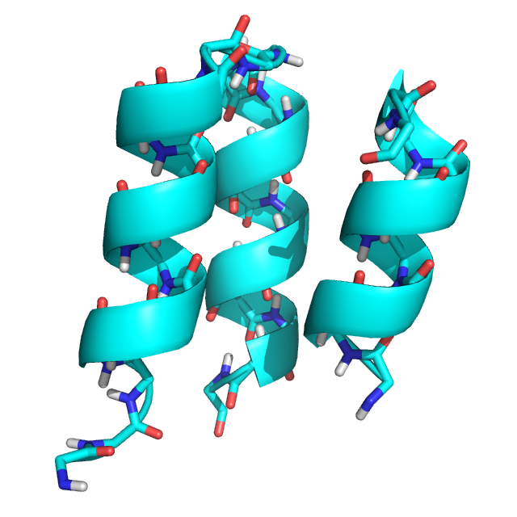
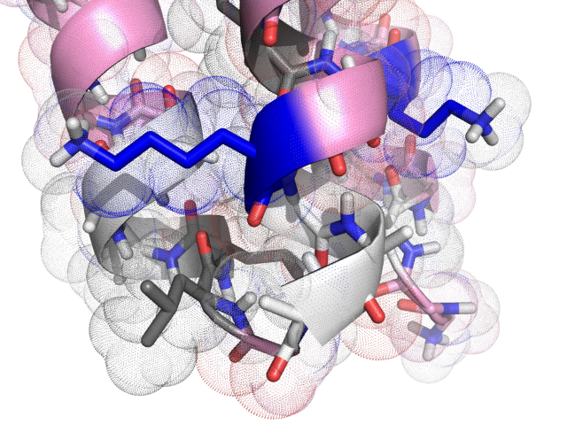

# Generalized Kinematic Closure Tutorial 3:
# Using pre-selection movers within GeneralizedKIC
======================================

KEYWORDS: LOOPS SCRIPTING_INTERFACES

Tutorial by Vikram K. Mulligan (vmullig@uw.edu).  Created on 28 March 2017 for the Baker lab Rosetta Tutorial Series.  Updated 29 may 2017 for the new ref2015 default scorefunction.

[[_TOC_]]

## Goals

At the end of this tutorial, you will understand:

- What a GeneralizedKIC pre-selection mover is
- How to apply an arbitrary protocol to every solution found by GeneralizedKIC before choosing a solution
- How to use GeneralizedKIC with flexible-backbone minimization
- How to use GeneralizedKIC with design

It is highly recommended that you complete the [[first|generalized_kinematic_closure_1]] and [[second|generalized_kinematic_closure_2]] tutorials before proceeding.

## Using pre-selection movers within GeneralizedKIC

In the first two tutorials, we build, randomized, and perturbed loops, but did little with the many solutions that GeneralizedKIC might return.  A major limitation of the way in which we have been using GeneralizedKIC so far is the fact that our selection of a "best" closure solution has been limited to criteria that only consider backbone geometry.  In this tutorial, we will learn how to carry out arbitrary protocols on every closure solution _prior_ to picking a "best" solution, so that the selection may be based on less arbitrary criteria.

## Exercise 3: Designing each GeneralizedKIC solution before selecting the "best" solution

### Inputs

For this exercise, we will be using the same starting point as in the first exercise.  We will also be starting with the same script, which we will modify to allow us to design and relax every solution before picking one to return.

**The input structure, an edited version of PDB structure 2ND2 (`2ND2_state1_glyonly_loop_removed.pdb`):**


The following `rosetta.flags` file will be used for this tutorial:

```
-nstruct 10
-in:file:s inputs/2ND2_state1_glyonly_loop_removed.pdb
-in:file:fullatom
-write_all_connect_info
-parser:protocol xml/exercise3.xml
-jd2:failed_job_exception false
-mute protocols.generalized_kinematic_closure.filter.GeneralizedKICfilter core.chemical.AtomICoor core.conformation.Residue core.kinematics.AtomTree
```

Here is the script from the first tutorial for reference.  We will modify it to fit our needs:

```xml
<ROSETTASCRIPTS>
	<SCOREFXNS>
		<ScoreFunction name="ref15sfxn" weights="ref2015.wts" />
		<ScoreFunction name="bb_only" weights="empty.wts" >
			<Reweight scoretype="fa_rep" weight="0.1" />
			<Reweight scoretype="fa_atr" weight="0.2" />
			<Reweight scoretype="hbond_sr_bb" weight="2.0" />
			<Reweight scoretype="hbond_lr_bb" weight="2.0" />
			<Reweight scoretype="rama_prepro" weight="0.45" />
			<Reweight scoretype="omega" weight="0.4" />
			<Reweight scoretype="p_aa_pp" weight="0.6" />
		</ScoreFunction>
	</SCOREFXNS>
	<RESIDUE_SELECTORS>
	</RESIDUE_SELECTORS>
	<TASKOPERATIONS>
	</TASKOPERATIONS>
	<FILTERS>
	</FILTERS>
	<MOVERS>	
		<PeptideStubMover name="add_loop_residues" >
			<Insert anchor_rsd="28" resname="ALA" />
			<Insert anchor_rsd="29" resname="GLY" />
			<Insert anchor_rsd="30" resname="ALA" />
			<Prepend anchor_rsd="32" resname="ALA" />
			<Prepend anchor_rsd="32" resname="ALA" />
		</PeptideStubMover>
		
		<DeclareBond name="new_bond" atom1="C" atom2="N" res1="31" res2="32" />

		<MutateResidue name="mut1" target="28" new_res="ALA" />
		<MutateResidue name="mut2" target="34" new_res="ALA" />

		<GeneralizedKIC name="genkic" selector="lowest_energy_selector" selector_scorefunction="bb_only"
			closure_attempts="5000" stop_when_n_solutions_found="5" >
			<AddResidue res_index="28" />
			<AddResidue res_index="29" />
			<AddResidue res_index="30" />
			<AddResidue res_index="31" />
			<AddResidue res_index="32" />
			<AddResidue res_index="33" />
			<AddResidue res_index="34" />
			<SetPivots res1="28" res2="31" res3="34" atom1="CA" atom2="CA" atom3="CA" />
			<AddPerturber effect="set_dihedral" >
				<AddAtoms res1="28" atom1="C" res2="29" atom2="N" />
				<AddAtoms res1="29" atom1="C" res2="30" atom2="N" />
				<AddAtoms res1="30" atom1="C" res2="31" atom2="N" />
				<AddAtoms res1="31" atom1="C" res2="32" atom2="N" />
				<AddAtoms res1="32" atom1="C" res2="33" atom2="N" />
				<AddAtoms res1="33" atom1="C" res2="34" atom2="N" />
				<AddValue value="180.0" />
			</AddPerturber>
			<CloseBond res1="31" res2="32" atom1="C" atom2="N" bondlength="1.328685" angle1="121.699997" angle2="116.199993" torsion="180.0" />
			<AddPerturber effect="randomize_backbone_by_rama_prepro" >
				<AddResidue index="28" />
				<AddResidue index="29" />
				<AddResidue index="30" />
				<AddResidue index="31" />
				<AddResidue index="32" />
				<AddResidue index="33" />
				<AddResidue index="34" />
			</AddPerturber>
			<AddFilter type="backbone_bin" residue="28" bin_params_file="ABBA" bin="A" />
			<AddFilter type="backbone_bin" residue="34" bin_params_file="ABBA" bin="A" />
			<AddFilter type="loop_bump_check" />
			<AddFilter type="rama_prepro_check" residue="28" rama_cutoff_energy="0.5" />
			<AddFilter type="rama_prepro_check" residue="31" rama_cutoff_energy="0.5" />
			<AddFilter type="rama_prepro_check" residue="34" rama_cutoff_energy="0.5" />
		</GeneralizedKIC>
		
	</MOVERS>
	<APPLY_TO_POSE>
	</APPLY_TO_POSE>
	<PROTOCOLS>
		<Add mover="add_loop_residues" />
		<Add mover="new_bond" />
		<Add mover="mut1" />
		<Add mover="mut2" />
		<Add mover="genkic" />
	</PROTOCOLS>
	<OUTPUT />
</ROSETTASCRIPTS>
```

Since we will be carrying out design in this tutorial, we will need a resfile defining the amino acids with which we can design.  We will not discuss the details of design here; instead, please refer to the [[Protein Design Tutorial|protein_design_tutorial]].  Here is the resfile (`inputs/resfile.txt`) that we will use, defining a limited palette of amino acids:

```
PIKAA AGPILYVEKR
start
```

Finally, we need to define a suitable FoldTree to allow loop relaxation without distorting the structure as a whole.  Again, we will not discuss the details of FoldTrees here; instead, refer to the [[FoldTree tutorial|fold_tree]].  The FoldTree file that we will use (`inputs/foldtree1.txt`) is listed here:

```
FOLD_TREE EDGE 27 1 -1 EDGE 27 31 -1 EDGE 27 35 1 EDGE 35 32 -1 EDGE 35 44 -1
```

### Step 1: Preparing the Pose for flexible-backbone design

Since we are going to allow backbone relaxation in loop residues during design, we need a suitable FoldTree defining the kinematic relationships between residues.  We will root the FoldTree in the second helix, with a jump to the third helix.  Loop residues up to 31 will be children of the second helix, while loop residues from 32 onward will be children of the third (_i.e._ there will be a break between residues 31 and 32).  The choice of placing the break here is arbitrary, and is unrelated to the fact that this is also the point at which GeneralizedKIC closed the loop.  We will define an [AtomTree mover](https://www.rosettacommons.org/docs/latest/scripting_documentation/RosettaScripts/Movers/movers_pages/AtomTreeMover) in our `<MOVERS>` section to load and apply the new FoldTree, adding it to the `<PROTOCOLS>` section prior to the GeneralizedKIC mover as well:

```xml
<AtomTree name="foldtree1" fold_tree_file="inputs/foldtree1.txt" />
```

Because of the break in the loop, we need constraints to maintain the peptide bond geometry _after_ GeneralizedKIC closure, during relaxation.  (Note that GeneralizedKIC itself has no need for constraints; it imposes ideal geometry mathematically.)  We'll use [CreateDistanceConstraint](https://www.rosettacommons.org/docs/latest/scripting_documentation/RosettaScripts/Movers/movers_pages/CreateDistanceConstraintMover), [CreateAngleConstraint](https://www.rosettacommons.org/docs/latest/scripting_documentation/RosettaScripts/Movers/movers_pages/CreateAngleConstraintMover), and [CreateTorsionConstraint](https://www.rosettacommons.org/docs/latest/scripting_documentation/RosettaScripts/Movers/movers_pages/CreateTorsionConstraintMover) movers for this purpose, again defining them in the `<MOVERS>` section and invoking them in the `<PROTOCOLS>` section prior to calling GeneralizedKIC.  (Note that there exist other movers that we could also have used for this purpose.)

```xml
<CreateDistanceConstraint name="pepdistcst" >
	<Add res1="31" atom1="C" res2="32" atom2="N" cst_func="HARMONIC 1.328685 0.01" />
</CreateDistanceConstraint>

<CreateAngleConstraint name="pepanglecst" >
	<Add res1="31" atom1="CA" res_center="31" atom_center="C" res2="32" atom2="N" cst_func="CIRCULARHARMONIC 2.124065647312 0.005" />
	<Add res1="31" atom1="C" res_center="32" atom_center="N" res2="32" atom2="CA" cst_func="CIRCULARHARMONIC 2.028072468639 0.005" />
</CreateAngleConstraint>

<CreateTorsionConstraint name="pepdihedcst" >
	<Add res1="31" atom1="CA" res2="31" atom2="C" res3="32" atom3="N" res4="32" atom4="CA" cst_func="CIRCULARHARMONIC 3.141592654 0.005" />
</CreateTorsionConstraint>
```

In our `<SCOREFXNS>` section, we will need a new scorefunction that enables the constraint terms.  We can use the already-defined `ref2015_cst.wts` file that exists in the Rosetta database for this:

```xml
<ScoreFunction name="ref15sfxn_cst" weights="ref2015_cst.wts" />
```

### Step 2: Modifying the GeneralizedKIC mover

We are now ready to modify the GeneralizedKIC mover.  First, we'll make some minor tweaks to allow the design protocol to run faster: change the number of attempts to 1000 (from 5000), and set the mover to stop when 1 solution has been found (instead of 5).  Next, because we're performing design prior to selecting a solution, let's change the selector scorefunction from "bb_only" to "ref15sfxn" (the full `ref2015` scorefunction).  Finally, we want to add a preselection mover, which we will define in the next step.  The preselection mover is the set of moves that will be carried out on each solution prior to applying the GeneralizedKIC selector to pick a final solution.  We will call our preselection mover "design\_protocol".

_**WARNING**: Although GenKIC offers guarantees that only loop residues and tail residues will move, that covalent connectivity will be unchanged, and that the FoldTree will not be altered, these guarantees no longer remain in effect if an arbitrary mover is called by GenKIC prior to selection._

```xml
<GeneralizedKIC name="genkic" selector="lowest_energy_selector" selector_scorefunction="ref15sfxn"
	closure_attempts="1000" stop_when_n_solutions_found="1"
	pre_selection_mover="design_protocol"
>
	...
</GeneralizedKIC>
```

### Step 3: Defining the preselection mover

Now we must create the "design\_protocol" mover.  Make a [ParsedProtocol mover](https://www.rosettacommons.org/docs/latest/scripting_documentation/RosettaScripts/Movers/movers_pages/ParsedProtocolMover) above the declaration of the GeneralizedKIC mover, and give it the name "design\_protocol":

```xml
<ParsedProtocol name="design_protocol" >
</ParsedProtocol>
```

We want this protocol to do three things: (1) carry out several rounds of design, designing only positions that are in the core or on the boundary and near to, or part of, the loop (2) correct the positions of the carbonyl oxygen and amide proton at the loop cutpoint (for these atoms can drift during minimization), and (3) filter designs based on energy, discarding those that are not below a certain threshold.

Let's create the design mover first.  We'll use [FastDesign](https://www.rosettacommons.org/docs/latest/scripting_documentation/RosettaScripts/Movers/movers_pages/FastDesignMover), which carries out flexible-backbone design.  Configure a FastDesign mover (prior to the ParsedProtocol that we just defined) with the following options: 1 round of design, the "ref15sfxn_cst" scorefunction that we defined earlier, two TaskOperations (called "design\_core\_near\_loop" and "no\_design\_otherwise", both of which we will define), and a movemap that allows no jumps to move, all side-chains to move, and only backbone between residues 28 and 34 to move.  The mover definition should look like this:

```xml
<FastDesign name="fdes1" repeats="1" task_operations="design_core_near_loop,no_design_otherwise" scorefxn="ref15sfxn_cst">
	<MoveMap name="fdes1_mm" >
		<Span begin="1" end="27" bb="false" chi="true" />
		<Span begin="28" end="34" bb="true" chi="true" />
		<Span begin="35" end="999" bb="false" chi="true" />
		<Jump number="1" setting="false" />
	</MoveMap>
</FastDesign>
```

We need to define the two TaskOperations next, in the `<TASKOPERATIONS>` section of the script.  The first, "design\_core\_near\_loop", should be a [ReadResfile TaskOperation](https://www.rosettacommons.org/docs/latest/scripting_documentation/RosettaScripts/TaskOperations/taskoperations_pages/ReadResfileOperation) that takes a selection (let's call it "designable\_region") and reads the `inputs/resfile.txt` resfile.  The second, "no\_design\_otherwise", should be an [OperateOnResidueSubset](https://www.rosettacommons.org/docs/latest/scripting_documentation/RosettaScripts/TaskOperations/taskoperations_pages/OperateOnResidueSubsetOperation) TaskOperation that takes a selection called "not\_designable\_region" and applies a [RestrictToRepackingRLT residue-level TaskOperation](https://www.rosettacommons.org/docs/latest/scripting_documentation/RosettaScripts/TaskOperations/taskoperations_pages/Residue-Level-TaskOperations).  We won't get into the details of these TaskOperations here, but the short summary is that they tell the FastDesign mover to design with a limited palette of amino acids in core and boundary positions near or on the loop, and to prevent design elsewhere.

```xml
<ReadResfile name="design_core_near_loop" selector="designable_region" filename="inputs/resfile.txt" />
<OperateOnResidueSubset name="no_design_otherwise" selector="not_designable_region" >
	<RestrictToRepackingRLT />
</OperateOnResidueSubset>
```

In the `<RESIDUE_SELECTORS>` section of the script, we need to define the selectors that these TaskOperations take.  We need to (1) select core and boundary positions, (2) select loop and near-loop positions, (3) select the intersection of the two sets (AND operation), and (4) select the inverse of the third set (NOT operation).  The following ResidueSelectors accomplish this:

```xml
<Layer name="select_core" select_core="true" select_boundary="true" select_surface="false" />
<Index name="select_loop" resnums="27-34" />
<Neighborhood name="select_around_loop" selector="select_loop" include_focus_in_subset="true" distance="7" />
<And name="designable_region" selectors="select_around_loop,select_core" />
<Not name="not_designable_region" selector="designable_region" />
```

The design mover should now be complete.  We can add it to the ParsedProtocol, three times, followed by the already-defined DeclareBond mover each time.  This may seem odd, but we do it this way as a kludge because the DeclareBond mover, by declaring an already-existing bond adjacent to a carbonyl oxygen and an amide proton that are likely to be distorted during minimization, corrects the positions of these atoms.  (Normally, we would just set the FastDesign repeats to 3, but this allows us to insert a correction step between each FastDesign round.)

```xml
<ParsedProtocol name="design_protocol" >
	<Add mover="fdes1" />
	<Add mover="new_bond" />
	<Add mover="fdes1" />
	<Add mover="new_bond" />
	<Add mover="fdes1" />
	<Add mover="new_bond" />
</ParsedProtocol>
```

Let's add one more tihng to the ParsedProtocol: a filter to throw away bad, high-scoring designs.  Ordinarily, we'd want to make this fairly stringent, but for the purposes of this tutorial, we'll set the filter threshold to 10 to ensure that we get a few designs in a reasonable amount of time.  In the `<FILTERS>` section of your script, add the following:

```xml
<ScoreType name="scorefilter" score_type="total_score" threshold="10.0" scorefxn="ref15sfxn_cst" />
```

And add it also to the ParsedProtocol mover:

```xml
<ParsedProtocol name="design_protocol" >
	<Add mover="fdes1" />
	<Add mover="new_bond" />
	<Add mover="fdes1" />
	<Add mover="new_bond" />
	<Add mover="fdes1" />
	<Add mover="new_bond" />
	<Add filter="scorefilter" />
</ParsedProtocol>
```

At this point, your script should be finished and ready to run.  It should look like this:

```xml
<ROSETTASCRIPTS>
	<SCOREFXNS>
		<ScoreFunction name="ref15sfxn" weights="ref2015.wts" />
		<ScoreFunction name="ref15sfxn_cst" weights="ref2015_cst.wts" />
		<ScoreFunction name="bb_only" weights="empty.wts" >
			<Reweight scoretype="fa_rep" weight="0.1" />
			<Reweight scoretype="fa_atr" weight="0.2" />
			<Reweight scoretype="hbond_sr_bb" weight="2.0" />
			<Reweight scoretype="hbond_lr_bb" weight="2.0" />
			<Reweight scoretype="rama_prepro" weight="0.45" />
			<Reweight scoretype="omega" weight="0.4" />
			<Reweight scoretype="p_aa_pp" weight="0.6" />
		</ScoreFunction>
	</SCOREFXNS>
	<RESIDUE_SELECTORS>
		<Layer name="select_core" select_core="true" select_boundary="true" select_surface="false" />
		<Index name="select_loop" resnums="27-34" />
		<Neighborhood name="select_around_loop" selector="select_loop" include_focus_in_subset="true" distance="7" />
		<And name="designable_region" selectors="select_around_loop,select_core" />
		<Not name="not_designable_region" selector="designable_region" />
	</RESIDUE_SELECTORS>
	<TASKOPERATIONS>
		<ReadResfile name="design_core_near_loop" selector="designable_region" filename="inputs/resfile.txt" />
		<OperateOnResidueSubset name="no_design_otherwise" selector="not_designable_region" >
			<RestrictToRepackingRLT />
		</OperateOnResidueSubset>
	</TASKOPERATIONS>
	<FILTERS>
		<ScoreType name="scorefilter" score_type="total_score" threshold="10.0" scorefxn="ref15sfxn_cst" />
	</FILTERS>
	<MOVERS>	
		<PeptideStubMover name="add_loop_residues" >
			<Insert anchor_rsd="28" resname="ALA" />
			<Insert anchor_rsd="29" resname="GLY" />
			<Insert anchor_rsd="30" resname="ALA" />
			<Prepend anchor_rsd="32" resname="ALA" />
			<Prepend anchor_rsd="32" resname="ALA" />
		</PeptideStubMover>
		
		<DeclareBond name="new_bond" atom1="C" atom2="N" res1="31" res2="32" />

		<MutateResidue name="mut1" target="28" new_res="ALA" />
		<MutateResidue name="mut2" target="34" new_res="ALA" />

		<AtomTree name="foldtree1" fold_tree_file="inputs/foldtree1.txt" />

		<CreateDistanceConstraint name="pepdistcst" >
			<Add res1="31" atom1="C" res2="32" atom2="N" cst_func="HARMONIC 1.328685 0.01" />
		</CreateDistanceConstraint>

		<CreateAngleConstraint name="pepanglecst" >
			<Add res1="31" atom1="CA" res_center="31" atom_center="C" res2="32" atom2="N" cst_func="CIRCULARHARMONIC 2.124065647312 0.005" />
			<Add res1="31" atom1="C" res_center="32" atom_center="N" res2="32" atom2="CA" cst_func="CIRCULARHARMONIC 2.028072468639 0.005" />
		</CreateAngleConstraint>

		<CreateTorsionConstraint name="pepdihedcst" >
			<Add res1="31" atom1="CA" res2="31" atom2="C" res3="32" atom3="N" res4="32" atom4="CA" cst_func="CIRCULARHARMONIC 3.141592654 0.005" />
		</CreateTorsionConstraint>


		<FastDesign name="fdes1" repeats="1" task_operations="design_core_near_loop,no_design_otherwise" scorefxn="ref15sfxn_cst">
			<MoveMap name="fdes1_mm" >
				<Span begin="1" end="27" bb="false" chi="true" />
				<Span begin="28" end="34" bb="true" chi="true" />
				<Span begin="35" end="999" bb="false" chi="true" />
				<Jump number="1" setting="false" />
			</MoveMap>
		</FastDesign>

		<ParsedProtocol name="design_protocol" >
			<Add mover="fdes1" />
			<Add mover="new_bond" />
			<Add mover="fdes1" />
			<Add mover="new_bond" />
			<Add mover="fdes1" />
			<Add mover="new_bond" />
			<Add filter="scorefilter" />
		</ParsedProtocol>

		<GeneralizedKIC name="genkic" selector="lowest_energy_selector" selector_scorefunction="ref15sfxn"
			closure_attempts="1000" stop_when_n_solutions_found="1"
			pre_selection_mover="design_protocol"
		>
			<AddResidue res_index="28" />
			<AddResidue res_index="29" />
			<AddResidue res_index="30" />
			<AddResidue res_index="31" />
			<AddResidue res_index="32" />
			<AddResidue res_index="33" />
			<AddResidue res_index="34" />
			<SetPivots res1="28" res2="31" res3="34" atom1="CA" atom2="CA" atom3="CA" />
			<AddPerturber effect="set_dihedral" >
				<AddAtoms res1="28" atom1="C" res2="29" atom2="N" />
				<AddAtoms res1="29" atom1="C" res2="30" atom2="N" />
				<AddAtoms res1="30" atom1="C" res2="31" atom2="N" />
				<AddAtoms res1="31" atom1="C" res2="32" atom2="N" />
				<AddAtoms res1="32" atom1="C" res2="33" atom2="N" />
				<AddAtoms res1="33" atom1="C" res2="34" atom2="N" />
				<AddValue value="180.0" />
			</AddPerturber>
			<CloseBond res1="31" res2="32" atom1="C" atom2="N" bondlength="1.328685" angle1="121.699997" angle2="116.199993" torsion="180.0" />
			<AddPerturber effect="randomize_backbone_by_rama_prepro" >
				<AddResidue index="28" />
				<AddResidue index="29" />
				<AddResidue index="30" />
				<AddResidue index="31" />
				<AddResidue index="32" />
				<AddResidue index="33" />
				<AddResidue index="34" />
			</AddPerturber>
			<AddFilter type="backbone_bin" residue="28" bin_params_file="ABBA" bin="A" />
			<AddFilter type="backbone_bin" residue="34" bin_params_file="ABBA" bin="A" />
			<AddFilter type="loop_bump_check" />
			<AddFilter type="rama_prepro_check" residue="28" rama_cutoff_energy="0.5" />
			<AddFilter type="rama_prepro_check" residue="31" rama_cutoff_energy="0.5" />
			<AddFilter type="rama_prepro_check" residue="34" rama_cutoff_energy="0.5" />
		</GeneralizedKIC>
		
	</MOVERS>
	<APPLY_TO_POSE>
	</APPLY_TO_POSE>
	<PROTOCOLS>
		<Add mover="add_loop_residues" />
		<Add mover="new_bond" />
		<Add mover="mut1" />
		<Add mover="mut2" />
		<Add mover="foldtree1" />
		<Add mover="pepdistcst" />
		<Add mover="pepanglecst" />
		<Add mover="pepdihedcst" />
		<Add mover="genkic" />
	</PROTOCOLS>
	<OUTPUT />
</ROSETTASCRIPTS>
```

## Running the example script

The above script is provided in the `demos/tutorials/GeneralizedKIC/exercise3/xml/` directory.  To run this, navigate to the `demos/tutorials/GeneralizedKIC` directory and type the following:

```bash
$> cd exercise3
$> $ROSETTA3/bin/rosetta_scripts.default.linuxgccrelease @inputs/rosetta.flags
$> cd ..
```

In the above, `$ROSETTA3` is the path to your Rosetta directory.  You may need to replace `linuxgccrelease` for your operating system and compilation (_e.g._ `macosclangrelease` on a Mac).

## Expected output

When tested with Rosetta 3.8 SHA 3cad483ccac973741499159e12989a7143bf79de (nightly build from Tuesday, March 28th, 2017), the script produced various loop conformations and sequences, some of which packed well or had favourable interactions between the loop and the rest of the protein.  Because of the stringent filtering used, some replicates failed to return a result.  Note that this tutorial has not been optimized to yield _good_ designs.  Such optimization is likely to yeild better results, but a much longer-running script.

**An example designed structure**



## Conclusion

In this tutorial, we learnt how an abitrary protocol may be applied to every KIC solution prior to selecting the "best" solution.  This greatly increases the power and versatility of GeneralizedKIC.

One final caveat regarding preselection movers: because these are applied to _every_ solution returned by KIC, they can add considerably to the computational cost of a protocol.  It is in one's best interest to structure a preselection protocol so that computationally inexpensive steps are performed first, and computationally expensive steps are preceded by filtering steps that discard most samples.

Memory can also be a consideration if one is storing a large number of candidate solutions.  By default, GeneralizedKIC stores full poses for every candidate solution.  There exists a low-memory mode (`low_memory_mode="true"` option) in which only loop degrees of freedom are stored for each solution, greatly reducing the memory per solution and allowing more solutions to be stored.  The danger, however, is that when this is used with preselection movers, the preselection mover must be _re_applied post-selection to regenerate the pose.  This can be problematic with stochastic preselection movers: there is no guarantee, for example, that the energy of the pose after the reapplication will be the same as the energy that was selected.  For this reason, stochastic preselection movers are only recommended if the default memory behaviour (`low_memory_mode="false"`) is used.

## Further Reading

Bhardwaj G, Mulligan VK, Bahl CD, Gilmore JM, Harvey PJ, Cheneval O, Buchko GW, Pulavarti SV, Kaas Q, Eletsky A, Huang PS, Johnsen WA, Greisen PJ, Rocklin GJ, Song Y, Linsky TW, Watkins A, Rettie SA, Xu X, Carter LP, Bonneau R, Olson JM, Coutsias E, Correnti CE, Szyperski T, Craik DJ, Baker D.  (2016).  Accurate de novo design of hyperstable constrained peptides.  _Nature_ 538(7625):329-335.

Mandell DJ, Coutsias EA, Kortemme T. (2009).  Sub-angstrom accuracy in protein loop reconstruction by robotics-inspired conformational sampling.  _Nat. Methods_ 6(8):551-2.

Coutsias EA, Seok C, Jacobson MP, Dill KA.  (2004).  A kinematic view of loop closure.  _J. Comput. Chem._ 25(4):510-28.

[GeneralizedKIC documentation](https://www.rosettacommons.org/docs/latest/scripting_documentation/RosettaScripts/composite_protocols/generalized_kic/GeneralizedKIC)

[[GeneralizedKIC Tutorial 1|generalized_kinematic_closure_1]]

[[GeneralizedKIC Tutorial 2|generalized_kinematic_closure_2]]

[[GeneralizedKIC Tutorial 4|generalized_kinematic_closure_4]]
