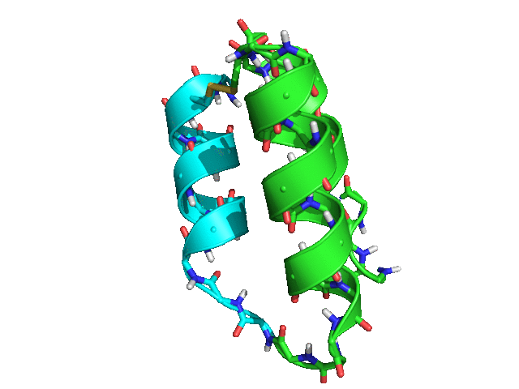

# Generalized Kinematic Closure Tutorial 4:
# Using GeneralizedKIC to close through disulfide bonds
======================================

KEYWORDS: LOOPS SCRIPTING_INTERFACES

Tutorial by Vikram K. Mulligan (vmullig@uw.edu).  Created on 28 March 2017 for the Baker lab Rosetta Tutorial Series.  Updated 29 may 2017 for the new ref2015 default scorefunction.

[[_TOC_]]

## Goals

At the end of this tutorial, you will understand:

- How broadly GeneralizedKIC defines the concept of "loop"
- What a "tail residue" is, and why it is important
- How to close a loop that passes through connections other than mainchain peptide bonds (in this case, through a sidechain disulfide linkage)
- How to keep segments rigid during GeneralizedKIC sampling

It is highly recommended that you complete the [[first|generalized_kinematic_closure_1]], [[second|generalized_kinematic_closure_2]], and [[third|generalized_kinematic_closure_3]] tutorials before proceeding.

## Using GeneralizedKIC to close through non-backbone connections

In all examples seen so far, we have used GeneralizedKIC to close a segment of alpha-amino acid backbone.  GeneralizedKIC is written to be completely general, however: it can close through arbitary chains of atoms, including segments of canonical or non-canonical backbone, side-chain connections, covalent cross-linkers, metal ions, _etc._.  The only requirements are that the chain have at least three atoms flanked by freely rotatable bonds (and separated by at least one atom), and that all residues in the chain are covalently linked.  In this exercise, we will close a loop that passes through a segment of backbone, an alpha helix, and a side-chain disulfide connection, closing gaps both in the backbone loop and in the side-chain sulphur-sulphur bond.

## Exercise 4: Using GeneralizedKIC to close through disulfide bonds

### Inputs

For this exercise, we will be using the same starting point as in the first exercise.  We will also be starting with the same script.  However, we will modify it so that it not only builds and closes a loop between helix 2 and helix 3, but also forms a disulfide between helix 3 and the helix 1-2 loop.  We will define our loop to be closed as one starting at residue 28, continuing through the alpha helix to residue 42 (which we will mutate to cysteine), and then passing through the cysteine sidechain to the CB atom of another cysteine added at position 15.  As such, the entire third alpha helix will be able to shift its position during sampling; the fixed points are now residue 27 and residue 15.

**The input structure, an edited version of PDB structure 2ND2 (`2ND2_state1_glyonly_loop_removed.pdb`):**


The following `rosetta.flags` file will be used for this tutorial:

```
-nstruct 10
-in:file:s inputs/2ND2_state1_glyonly_loop_removed.pdb
-in:file:fullatom
-write_all_connect_info
-parser:protocol xml/exercise4.xml
-jd2:failed_job_exception false
-mute protocols.generalized_kinematic_closure.filter.GeneralizedKICfilter core.chemical.AtomICoor core.conformation.Residue
```

Here is the script from the first tutorial for reference.  We will modify it to fit our needs:

```xml
<ROSETTASCRIPTS>
	<SCOREFXNS>
		<ScoreFunction name="ref15sfxn" weights="ref2015.wts" />
		<ScoreFunction name="bb_only" weights="empty.wts" >
			<Reweight scoretype="fa_rep" weight="0.1" />
			<Reweight scoretype="fa_atr" weight="0.2" />
			<Reweight scoretype="hbond_sr_bb" weight="2.0" />
			<Reweight scoretype="hbond_lr_bb" weight="2.0" />
			<Reweight scoretype="rama_prepro" weight="0.45" />
			<Reweight scoretype="omega" weight="0.4" />
			<Reweight scoretype="p_aa_pp" weight="0.6" />
		</ScoreFunction>
	</SCOREFXNS>
	<RESIDUE_SELECTORS>
	</RESIDUE_SELECTORS>
	<TASKOPERATIONS>
	</TASKOPERATIONS>
	<FILTERS>
	</FILTERS>
	<MOVERS>	
		<PeptideStubMover name="add_loop_residues" >
			<Insert anchor_rsd="28" resname="ALA" />
			<Insert anchor_rsd="29" resname="GLY" />
			<Insert anchor_rsd="30" resname="ALA" />
			<Prepend anchor_rsd="32" resname="ALA" />
			<Prepend anchor_rsd="32" resname="ALA" />
		</PeptideStubMover>
		
		<DeclareBond name="new_bond" atom1="C" atom2="N" res1="31" res2="32" />

		<MutateResidue name="mut1" target="28" new_res="ALA" />
		<MutateResidue name="mut2" target="34" new_res="ALA" />

		<GeneralizedKIC name="genkic" selector="lowest_energy_selector" selector_scorefunction="bb_only"
			closure_attempts="5000" stop_when_n_solutions_found="5" >
			<AddResidue res_index="28" />
			<AddResidue res_index="29" />
			<AddResidue res_index="30" />
			<AddResidue res_index="31" />
			<AddResidue res_index="32" />
			<AddResidue res_index="33" />
			<AddResidue res_index="34" />
			<SetPivots res1="28" res2="31" res3="34" atom1="CA" atom2="CA" atom3="CA" />
			<AddPerturber effect="set_dihedral" >
				<AddAtoms res1="28" atom1="C" res2="29" atom2="N" />
				<AddAtoms res1="29" atom1="C" res2="30" atom2="N" />
				<AddAtoms res1="30" atom1="C" res2="31" atom2="N" />
				<AddAtoms res1="31" atom1="C" res2="32" atom2="N" />
				<AddAtoms res1="32" atom1="C" res2="33" atom2="N" />
				<AddAtoms res1="33" atom1="C" res2="34" atom2="N" />
				<AddValue value="180.0" />
			</AddPerturber>
			<CloseBond res1="31" res2="32" atom1="C" atom2="N" bondlength="1.328685" angle1="121.699997" angle2="116.199993" torsion="180.0" />
			<AddPerturber effect="randomize_backbone_by_rama_prepro" >
				<AddResidue index="28" />
				<AddResidue index="29" />
				<AddResidue index="30" />
				<AddResidue index="31" />
				<AddResidue index="32" />
				<AddResidue index="33" />
				<AddResidue index="34" />
			</AddPerturber>
			<AddFilter type="backbone_bin" residue="28" bin_params_file="ABBA" bin="A" />
			<AddFilter type="backbone_bin" residue="34" bin_params_file="ABBA" bin="A" />
			<AddFilter type="loop_bump_check" />
			<AddFilter type="rama_prepro_check" residue="28" rama_cutoff_energy="0.5" />
			<AddFilter type="rama_prepro_check" residue="31" rama_cutoff_energy="0.5" />
			<AddFilter type="rama_prepro_check" residue="34" rama_cutoff_energy="0.5" />
		</GeneralizedKIC>
		
	</MOVERS>
	<APPLY_TO_POSE>
	</APPLY_TO_POSE>
	<PROTOCOLS>
		<Add mover="add_loop_residues" />
		<Add mover="new_bond" />
		<Add mover="mut1" />
		<Add mover="mut2" />
		<Add mover="genkic" />
	</PROTOCOLS>
	<OUTPUT />
</ROSETTASCRIPTS>
```

### Step 1: Altering the scorefunction

In the first tutorial, we used a backbone-only scorefunction for our GeneralizedKIC selector when picking the "best" sample to return.  We will do the same again, only this time, we must be mindful of the fact that we are closing through a disulfide bond.  As such, we should add the `fa_dun` (sidechain conformation) and `dslf_fa13` (disulfide energy) terms to our scorefunction.  Add the following lines after the existing `Reweight` lines:

```xml
<Reweight scoretype="dslf_fa13" weight="1.25" />
<Reweight scoretype="fa_dun" weight="0.7" />
```

### Step 2:  Creating the disulfide bond

GeneralizedKIC cannot alter covalent geometry, or introduce mutations.  We want to force a disulfide between residues 42 and 15, albeit one that starts out with terrible disulfide bond geometry.  We can use two [MutateResidue](https://www.rosettacommons.org/docs/latest/scripting_documentation/RosettaScripts/Movers/movers_pages/MutateResidueMover) movers and a [DeclareBond](https://www.rosettacommons.org/docs/latest/scripting_documentation/RosettaScripts/Movers/movers_pages/DeclareBond) mover for this purpose.  Add the following after the existing MutateResidue movers:

```xml
<MutateResidue name="mut3" target="15" new_res="CYS:disulfide" />
<MutateResidue name="mut4" target="42" new_res="CYS:disulfide" />
<DeclareBond name="make_disulfide" atom1="SG" atom2="SG" res1="15" res2="42" />
```

Be sure to add all of these to the `<PROTOCOLS>` section of your script, too, prior to calling GeneralizedKIC.

### Step 3:  Modifying GeneralizedKIC to close through the disulfide

The existing script already builds the helix 2-3 loop and closes through it.  We want to close additionally through the new disulfide.  Before doing this, let's set the `stop_when_n_solutions_found` option to `"1"`, just to facilitate getting results rapidly.

Now let's expand the list of residues in the loop to be closed.  Instead of stopping at residue 34, continue to residue 42, then append residue 15.  GeneralizedKIC is intelligent enough to find the covalently-connected path through these residue indices automatically; you don't need to tell it that the 42-15 connection is though sidechains and not through the backbone.

```xml
<GeneralizedKIC name="genkic" selector="lowest_energy_selector" selector_scorefunction="bb_only"
	closure_attempts="5000" stop_when_n_solutions_found="1" >
	<AddResidue res_index="28" />
	<AddResidue res_index="29" />
	<AddResidue res_index="30" />
	<AddResidue res_index="31" />
	<AddResidue res_index="32" />
	<AddResidue res_index="33" />
	<AddResidue res_index="34" />
	<AddResidue res_index="35" />
	<AddResidue res_index="36" />
	<AddResidue res_index="37" />
	<AddResidue res_index="38" />
	<AddResidue res_index="39" />
	<AddResidue res_index="40" />
	<AddResidue res_index="41" />
	<AddResidue res_index="42" />
	<AddResidue res_index="15" />
	...
</GeneralizedKIC>
```

Now, though, we have a problem.  If the loop to be closed starts at resiude 28, runs to residue 42, and then connects through the sidechain to residue 15, what happens to residues 43 and 44, which are outside of the loop to be closed and are connected to residue 42 _via_ backbone connections?  The answer is that they remain floating in space while the rest of helix 3 moves out from under them.  Clearly this is not what we want, so we need a way to tell Rosetta to move certain covalently-connected residues _with_ the loop to be closed as it moves.  We can do this by declaring these residues to be _tail residues_:

```xml
<GeneralizedKIC ... >
	...
	<AddTailResidue res_index="43" />
	<AddTailResidue res_index="44" />
	...
</GeneralizedKIC>
```

We need to update the pivot points, now, as well.  The first pivot remains residue 28's CA atom, and any of the loop residues is suitable for the second pivot (we arbitrarily select residue 33's CA atom), but the third pivot requires some thought.  Clearly it should be residue 15.  However, if we make it the CA atom of residue 15, either the phi or the psi value for this residue will be altered by the KIC solver.  This will break either the C-terminal or N-terminal connection of residue 15.  Instead, what we want is for the backbone of residue 15 to stay put, and for only the sidechain to be part of the loop to be closed.  Fortunately, we can ensure this by setting the CB atom to be the third pivot: this means that anything past the CB atom must remain immobile.  So we update our `SetPivots` line as follows:

```xml
<GeneralizedKIC ...>
	...
	<SetPivots res1="28" res2="33" res3="15" atom1="CA" atom2="CA" atom3="CB" />
	...
</GeneralizedKIC>
```

What about perturbers?  The perturbers that set the omega dihedral values can and should stay as they are.  Similarly the peturbers that sample the loop residues biased by the loop residue Ramachandran maps are still needed, as is the `CloseBond` compound perturber that closes the residue 31 - residue 32 peptide bond.  We need (1) some way to keep the helix 3 degrees of freedom fixed, so that it moves as a rigid body, (2) some way to close the SG-SG bond in the residue 42-residue 15 disulfide, and (3) some way to sample sidechain conformations for the two cysteine residues.

The first point is easily addressed: if a loop degree of freedom does not have any GeneralizedKIC perturber acting on it, it remains unperturbed.  Simply by defining nothing that targets residues 35-42, we ensure that these residues' mainchain dihedrals don't change.

The second point is addressed by an additional `CloseBond` compound perturber, this one defining ideal geometry for the SG-SG bond in a disulfide:

```xml
<GeneralizedKIC ...>
	...
	<CloseBond res1="42" res2="15" atom1="SG" atom2="SG" bondlength="1.793" angle1="105.0" angle2="105.0" />
	...
</GeneralizedKIC>
```

And the third point is solved with `randomize_dihedral` GeneralizedKIC perturbers:

```xml
<GeneralizedKIC ...>
	...
	<AddPerturber effect="randomize_dihedral" >
		<AddAtoms res1="42" res2="15" atom1="SG" atom2="SG" />
		<AddAtoms res1="42" res2="42" atom1="CB" atom2="SG" />
		<AddAtoms res1="42" res2="42" atom1="CA" atom2="CB" />
		<AddAtoms res1="15" res2="15" atom1="CB" atom2="SG" />
		<AddAtoms res1="15" res2="15" atom1="CA" atom2="CB" />
	</AddPerturber>
	...
</GeneralizedKIC>
```

Finally we omit the third pivot's `rama_prepro_check` filter, and relax the stringency of the other two to a cutoff energy of 1.5 (to make it easier to find solutions for the purposes of this teaching exercise).  The script should now look like this:

```xml
<ROSETTASCRIPTS>
	<SCOREFXNS>
		<ScoreFunction name="ref15sfxn" weights="ref2015.wts" />
		<ScoreFunction name="bb_only" weights="empty.wts" >
			<Reweight scoretype="fa_rep" weight="0.1" />
			<Reweight scoretype="fa_atr" weight="0.2" />
			<Reweight scoretype="hbond_sr_bb" weight="2.0" />
			<Reweight scoretype="hbond_lr_bb" weight="2.0" />
			<Reweight scoretype="rama_prepro" weight="0.45" />
			<Reweight scoretype="omega" weight="0.4" />
			<Reweight scoretype="p_aa_pp" weight="0.6" />
			<Reweight scoretype="dslf_fa13" weight="1.25" />
			<Reweight scoretype="fa_dun" weight="0.7" />
		</ScoreFunction>
	</SCOREFXNS>
	<RESIDUE_SELECTORS>
	</RESIDUE_SELECTORS>
	<TASKOPERATIONS>
	</TASKOPERATIONS>
	<FILTERS>
	</FILTERS>
	<MOVERS>
		<PeptideStubMover name="add_loop_residues" >
			<Insert anchor_rsd="28" resname="ALA" />
			<Insert anchor_rsd="29" resname="GLY" />
			<Insert anchor_rsd="30" resname="ALA" />
			<Prepend anchor_rsd="32" resname="ALA" />
			<Prepend anchor_rsd="32" resname="ALA" />
		</PeptideStubMover>
		
		<DeclareBond name="new_bond" atom1="C" atom2="N" res1="31" res2="32" />

		<MutateResidue name="mut1" target="28" new_res="ALA" />
		<MutateResidue name="mut2" target="34" new_res="ALA" />
	
		<MutateResidue name="mut3" target="15" new_res="CYS:disulfide" />
		<MutateResidue name="mut4" target="42" new_res="CYS:disulfide" />
		<DeclareBond name="make_disulfide" atom1="SG" atom2="SG" res1="15" res2="42" />

		<GeneralizedKIC name="genkic" selector="lowest_energy_selector" selector_scorefunction="bb_only"
			closure_attempts="5000" stop_when_n_solutions_found="1" >
			<AddResidue res_index="28" />
			<AddResidue res_index="29" />
			<AddResidue res_index="30" />
			<AddResidue res_index="31" />
			<AddResidue res_index="32" />
			<AddResidue res_index="33" />
			<AddResidue res_index="34" />
			<AddResidue res_index="35" />
			<AddResidue res_index="36" />
			<AddResidue res_index="37" />
			<AddResidue res_index="38" />
			<AddResidue res_index="39" />
			<AddResidue res_index="40" />
			<AddResidue res_index="41" />
			<AddResidue res_index="42" />
			<AddResidue res_index="15" />
			<AddTailResidue res_index="43" />
			<AddTailResidue res_index="44" />
			<SetPivots res1="28" res2="33" res3="15" atom1="CA" atom2="CA" atom3="CB" />
			<AddPerturber effect="set_dihedral" >
				<AddAtoms res1="28" atom1="C" res2="29" atom2="N" />
				<AddAtoms res1="29" atom1="C" res2="30" atom2="N" />
				<AddAtoms res1="30" atom1="C" res2="31" atom2="N" />
				<AddAtoms res1="31" atom1="C" res2="32" atom2="N" />
				<AddAtoms res1="32" atom1="C" res2="33" atom2="N" />
				<AddAtoms res1="33" atom1="C" res2="34" atom2="N" />
				<AddValue value="180.0" />
			</AddPerturber>
			<CloseBond res1="31" res2="32" atom1="C" atom2="N" bondlength="1.328685" angle1="121.699997" angle2="116.199993" torsion="180.0" />
			<CloseBond res1="42" res2="15" atom1="SG" atom2="SG" bondlength="1.793" angle1="105.0" angle2="105.0" />
			<AddPerturber effect="randomize_backbone_by_rama_prepro" >
				<AddResidue index="28" />
				<AddResidue index="29" />
				<AddResidue index="30" />
				<AddResidue index="31" />
				<AddResidue index="32" />
				<AddResidue index="33" />
				<AddResidue index="34" />
			</AddPerturber>
			<AddPerturber effect="randomize_dihedral" >
				<AddAtoms res1="42" res2="15" atom1="SG" atom2="SG" />
				<AddAtoms res1="42" res2="42" atom1="CB" atom2="SG" />
				<AddAtoms res1="42" res2="42" atom1="CA" atom2="CB" />
				<AddAtoms res1="15" res2="15" atom1="CB" atom2="SG" />
				<AddAtoms res1="15" res2="15" atom1="CA" atom2="CB" />
			</AddPerturber>
			<AddFilter type="backbone_bin" residue="28" bin_params_file="ABBA" bin="A" />
			<AddFilter type="backbone_bin" residue="34" bin_params_file="ABBA" bin="A" />
			<AddFilter type="loop_bump_check" />
			<AddFilter type="rama_prepro_check" residue="28" rama_cutoff_energy="1.5" />
			<AddFilter type="rama_prepro_check" residue="33" rama_cutoff_energy="1.5" />
		</GeneralizedKIC>
		
	</MOVERS>
	<APPLY_TO_POSE>
	</APPLY_TO_POSE>
	<PROTOCOLS>
		<Add mover="add_loop_residues" />
		<Add mover="new_bond" />
		<Add mover="mut1" />
		<Add mover="mut2" />
		<Add mover="mut3" />
		<Add mover="mut4" />
		<Add mover="make_disulfide" />
		<Add mover="genkic" />
	</PROTOCOLS>
	<OUTPUT />
</ROSETTASCRIPTS>
```

## Running the example script

The above script is provided in the `demos/tutorials/GeneralizedKIC/exercise4/xml/` directory.  To run this, navigate to the `demos/tutorials/GeneralizedKIC` directory and type the following:

```bash
$> cd exercise4
$> $ROSETTA3/bin/rosetta_scripts.default.linuxgccrelease @inputs/rosetta.flags
$> cd ..
```

In the above, `$ROSETTA3` is the path to your Rosetta directory.  You may need to replace `linuxgccrelease` for your operating system and compilation (_e.g._ `macosclangrelease` on a Mac).

## Expected output

When tested with Rosetta 3.8 SHA 3cad483ccac973741499159e12989a7143bf79de (nightly build from Tuesday, March 28th, 2017), the script rapidly produced many possible placements for helix 3 relative to helices 1 and 2, with ideal geometry both for the loop between helices 2 and 3 and for the disulfide bond between residues 42 and 15.

**Some of the sampled conformations (green -- helices 1 and 2; cyan -- helix 3)**



## Conclusion

The example here shows how one can close through arbitrary connections, canonical or noncanonical.  This can be applied to many complicated situations in protein and peptide design.  Additionally, by combining multiple successive GenKIC movers, one can close complicated triangular intersections of loops.  The user is advised to experiment!

## Further Reading

Bhardwaj G, Mulligan VK, Bahl CD, Gilmore JM, Harvey PJ, Cheneval O, Buchko GW, Pulavarti SV, Kaas Q, Eletsky A, Huang PS, Johnsen WA, Greisen PJ, Rocklin GJ, Song Y, Linsky TW, Watkins A, Rettie SA, Xu X, Carter LP, Bonneau R, Olson JM, Coutsias E, Correnti CE, Szyperski T, Craik DJ, Baker D.  (2016).  Accurate de novo design of hyperstable constrained peptides.  _Nature_ 538(7625):329-335.

Mandell DJ, Coutsias EA, Kortemme T. (2009).  Sub-angstrom accuracy in protein loop reconstruction by robotics-inspired conformational sampling.  _Nat. Methods_ 6(8):551-2.

Coutsias EA, Seok C, Jacobson MP, Dill KA.  (2004).  A kinematic view of loop closure.  _J. Comput. Chem._ 25(4):510-28.

[GeneralizedKIC documentation](https://www.rosettacommons.org/docs/latest/scripting_documentation/RosettaScripts/composite_protocols/generalized_kic/GeneralizedKIC)

[[GeneralizedKIC Tutorial 1|generalized_kinematic_closure_1]]

[[GeneralizedKIC Tutorial 2|generalized_kinematic_closure_2]]

[[GeneralizedKIC Tutorial 4|generalized_kinematic_closure_4]]
