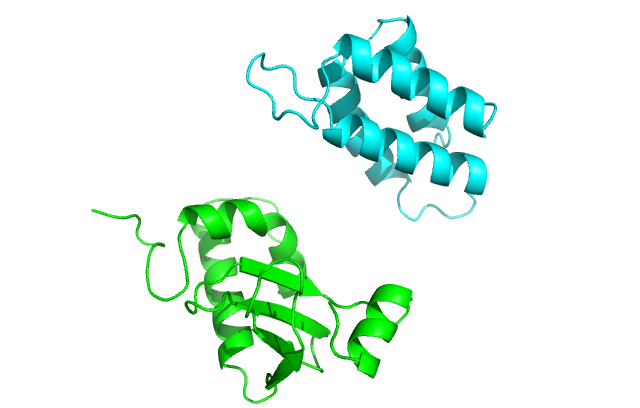

Protein-Protein Docking
=======================
KEYWORDS: DOCKING GENERAL STRUCTURE_PREDICTION    
Written by by Sebastian Rämisch (raemisch@scripps.edu). Edited by Shourya S. Roy Burman (ssrb@jhu.edu)   
Edited Jun 24 2016   

[[_TOC_]]

Summary
-------
Rosetta can be used to predict the bound structure of two proteins starting from unbound structures. By the end of this tutorial, you should be able to understand:

* How to prepare structures for docking
* How to locally dock two proteins
* Hoe to refine an already docked structure
* How to dock two proteins whose interface region is unknown
* How to dock flexible proteins
* How to dock a flexible peptide to a protein
* How to dock symmetric proteins
* How to analyse the best docked model

Docking in Rosetta
------------------
Docking in Rosetta in a two stage protocol - the first stage, where aggresive sampling is done, is done in the [[centroid mode|fullatom_centroid]] and the second stage where smaller movements take place is done in the full atom mode. It will internally connect the centers of the two chains with a so-called jump (see [[Fold Tree|fold_tree]]). Along this jump the chains are being pulled together (slide into contact). The [[Monte Carlo|Core_Concepts#monte-carlo-sampling]] moves, which are selected randomly, are:   
 
 * Translations (in x,y or z direction)
 * Rotations (around x,y, z axis) 
 
By default, the docking protocol assumes a fixed backbone and only does, translation, rotation and sidechain packing. A detailed algorithm can be found [here](https://www.rosettacommons.org/docs/latest/application_documentation/docking/docking-protocol).

Navigating to the Demos
-----------------------
The demos are available at `$ROSETTA3/demos/tutorials/Protein-Protein-Docking`. All demo commands listed in this tutorial should be executed when in this directory. All the demos here use the `linuxgccrelease` binary. You may be required to change it to whatever is appropriate given your operating system and compiler.

Compare your output files to the ones present in `output_files/expected_output`.

Preparing Structures for Docking
--------------------------------
This tutorial will introduce you the main steps required for predicting the bound structure of two interacting proteins starting from the unbound structures. For this example, we will dock Colicin-D with its inhibitor, IMM. You are provided with the two refined input files `COL_D.pdb` and `IMM_D.pdb`, and a native file `1v74.pdb` in the folder `input_files`.

To prepare structures for docking, be sure to refine them as described in [[preparing inputs tutorial|input_and_output#controlling-input_preparing-a-structure-by-refinement]].

Local Docking
-------------
Rosetta is most accurate when docking locally. **In local docking, we assume that we have some information about the binding pockets of the two proteins.** First, we must manually place the two proteins (within ~10 Å) with the binding pockets roughly facing each other as shown in this figure:


We will pass the following options to indicate that i) chain B is being docked to chain A, and ii) we want to randomly perturb the ligand of the input strucure (chain B) by 3 Å translation and 8° rotation before the start of every individual simulation.

```
-partners A_B
-dock_pert 3 8
```

If you are docking two multi-chain proteins (say one with chains A & B, and the other with chains L & H), the option becomes `-partners LH_AB`. Make sure that the input PDB has all the chains of each protein listed together.

We will also compare the input with the bound structure 1v74.pdb by passing it as native.

>Ensure that the native has the same number of residues, same chain ordering and same chain IDs as the input structure. You may be required to use `-ignore_unrecognized_res` option if the native contains unusual ligands.

Now to start docking, run:

    $>$ROSETTA3/main/source/bin/docking_protocol.linuxgccrelease @flag_local_docking
    
This should take ~1 minute to run and produce a structure file and a score file in `output_files`. Make sure you use `-nstruct 500` or more in production runs.

Local Refinement of Docked Structures
-------------------------------------
Sometimes docked proteins score very high in Rosetta owing to small clashes. Before refining with [[`relax`|Relax]], we need to fix the interface. Since the protein is already docked, we want to avoid large movements of the protein, so we skip the first, centroid mode stage completely and only run the high-resolution full atom mode which does not move the backbone of the docked proteins. We also want to add the rotamers of the input sidechains to our library of rotamers. We replace the flags used for [local docking](#local-docking) by:

```
-docking_local_refine
-use_input_sc
```

We will use the new set of flags to refine the bound structure `1v74.pdb` by running:

    $>$ROSETTA3/main/source/bin/docking_protocol.linuxgccrelease @flag_local_refine

This should take ~45 seconds to run and produce a structure file and a score file in `output_files`. Verify that the input structure and the output structure have the same backbone. Now you can refine further with `relax` as described in [[preparing inputs tutorial|input_and_output#controlling-input_preparing-a-structure-by-refinement]].

Global Docking
--------------
Only run global docking if absolutely no information is available about the binding sites in the protein. Global docking assumes a spherical general structure of the proteins and rotates the smaller protein (ligand) around the larger protein (receptor). It also randomizes the starting position of the unbound proteins in every run, so their position in the input structure does not matter as much.

>Global docking works best for small complexes (<450 residues).

To do global docking, we add the following three options to the options already present in global docking.

```
-spin
-randomize1
-randomize2
```
We will use the same input PDB as in [local docking](#local-docking) to demostrate the differences in the output. Run:

    $>$ROSETTA3/main/source/bin/docking_protocol.linuxgccrelease @flag_global_docking

This should take ~1 minute to run and produce a structure file and a score file in `output_files`. You will notice that unlike the local docking case, global docking produces a docked structure, which is significantly different from the native. Compare this to the local docking instance, which should be much similar to the native.

Due to the large space sampled, global docking requires a large number of runs to converge on a structure, typically 10,000-100,000.

>An alternative to running global docking is to find the likely binding pockets by using an FFT-based global docking programs like [ClusPro](https://cluspro.bu.edu/login.php) and then run multiple local docking runs.

Docking Flexible Proteins
-------------------------
As mentioned in the introduction, the docking protocol in Rosetta assumes a fixed backbone. If the backbone changes a lot between the unbound and the bound conformations, we dock conformational ensembles of the proteins. Instead of docking one ligand conformation to one receptor conformation, we constantly switch between the conformations in the respective ensembles while sampling in the first stage (in centroid mode). This enables the sampling of multiple backbones with Rosetta's fixed backbone architecture.

These ensembles can be generated using unconstrained [[`relax`|Relax]]. For this tutorial, we will use small ensembles - 3 COL_D and 3 IMM_D conformations. Make sure that the number of residues and the chain naming (and order) in every conformation in the ensemble is the same as that of the corresponding partner in the input file. To pass the locations of the conformational ensemble of COL_D, we will pass an ensemble list which looks like:
```
input_files/COL_D_ensemble/COL_D_0001.pdb
input_files/COL_D_ensemble/COL_D_0002.pdb
input_files/COL_D_ensemble/COL_D_0003.pdb
```

A similar file is made for IMM_D ensembles. These files are then passed on to docking by adding the following options to the [local docking](#local-docking):

```
-ensemble1 COL_D_ensemblelist
-ensemble2 IMM_D_ensemblelist
```

`-ensemble1` must contain the list of conformations to the protein listed first in the input PDB. Even while ensemble docking one conformation against many conformations, you must make ensemble lists for both partners.

However, before we can dock the ensembles, we need to perform an additional step calling _prepacking_. Prepacking prepares the conformers in the ensemble for docking and scores them to inform the docking protocol to remove any energy contribution arising out of the inherantly different energies of the conformers. It uses the same flags except `-dock_pert` as the ensemble docking protocol. Run:

    $>$ROSETTA3/main/source/bin/docking_prepack_protocol.linuxgccrelease @flag_ensemble_prepack
    
This should run in ~30 seconds and produce prepacked PDBs in the same location as the original ensemble. It will also write out new ensemble list files (with an added `.ensemble` extension) with the location of the prepacked PDBs, normalized centroid scores and full atom scores.

```
input_files/COL_D_ensemble/COL_D_0001.pdb.ppk
input_files/COL_D_ensemble/COL_D_0002.pdb.ppk
input_files/COL_D_ensemble/COL_D_0003.pdb.ppk
0.77058
0
1.00377
-93.3588
-94.2715
-93.9065
```

The docking protocol expects these prepacked conformations. This will also produce a score file and an output, but you can ignore both. Now run the docking protocol.

    $>$ROSETTA3/main/source/bin/docking_protocol.linuxgccrelease @flag_ensemble_docking

While it is running, you will see the following in your log file:

```
...
protocols.docking.DockingLowRes: /// Ensemble 1: on                                                           ///
protocols.docking.DockingLowRes: /// Ensemble 2: on                                                           ///
...
protocols.docking.ConformerSwitchMover: Switching partner with conformer: 3
...

```
This indicates that your ensembles have been loaded and your backbones are being switched.

This should take about 3 minutes to run and produce a score file and an output. 

You will typically use larger ensembles (25 to 100) formations. This does significantly slow the protocol down. Also, due to a dilution of the sampling per backbone, you will have to increase the number of structures. `-nstruc 5000` or more is suggested.


Symmetric Docking
----------------- 
Homomeric protein complexes are often symmetric. Rosetta provides the a means to use symmetry information during docking (and many other applications). Check out the [symmetry documentation](https://www.rosettacommons.org/docs/latest/rosetta_basics/structural_concepts/symmetry) and [[tutorials|Symmetry]] to know more.

Analyzing Docked Structures
---------------------------
Analyzing docked structures can be tricky. Let's look at a score file generated from ensemble docking:
```
SEQUENCE: 
SCORE: total_score         rms        Fnat        I_sc        Irms cen_dock_ens_conf           cen_rms conf_num1 conf_num2 conf_score dock_ens_conf1 dock_ens_conf2 dslf_ca_dih dslf_cs_ang dslf_ss_dih dslf_ss_dst      fa_atr      fa_dun     fa_elec     fa_pair      fa_rep      fa_sol hbond_bb_sc hbond_lr_bb    hbond_sc hbond_sr_bb interchain_contact interchain_env interchain_pair interchain_vdw        st_rmsd description 
SCORE:    -202.141      13.143       0.061      -3.086       5.015            -1.004            14.583     1.000     1.000    -25.732        -93.359        -83.050       0.000       0.000       0.000       0.000    -326.487      12.899      -3.158      -8.467       8.982     139.078      -3.968      -4.390      -2.692     -13.937            -20.000        -23.791          -2.002          0.357          7.729 col_complex_ensemble_dock_0001

```
The `total_score` may not indicate the best docked model as the primary contribution comes from the folding energies of the monomers. You should rely more on the interface score `I_sc` which represents the energy of the interactions across the interface. `I_sc` scores are typically much smaller than total scores (typically in the range of -2 to -10 REU). Of course they depend on the size and geometry of the interface; so they are difficult to compare across different proteins.

If you provide a native structure, you get comparative data like the fraction of native contacts (`Fnat`), the C<sup>α</sup> RMSD of the ligand (`rms`) and the RMSD of the interface atoms (`Irms`). If you run ensemble docking, you will also get to know which of the conformers was finally selected for protein 1(`conf1`) and protein 2(`conf2`).

You can repeat the run with  *-nstruct 20000* and outputting silent files. Then you could extract the best model and create a score vs. rmsd plot.

Look at [[Analysis|Analysis]] for further information on how to analyze your results.


