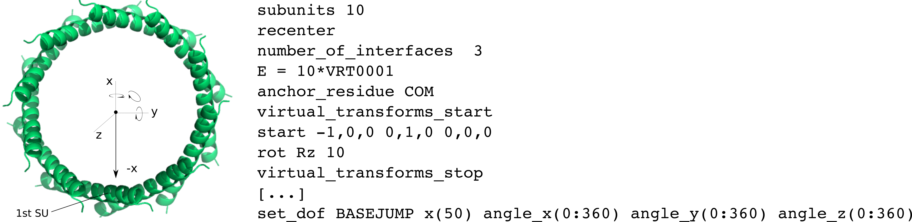
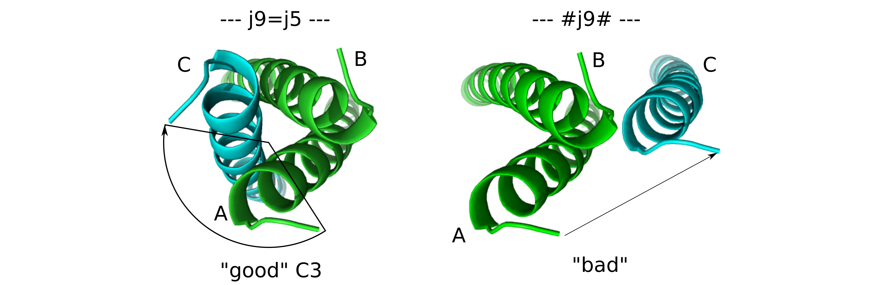
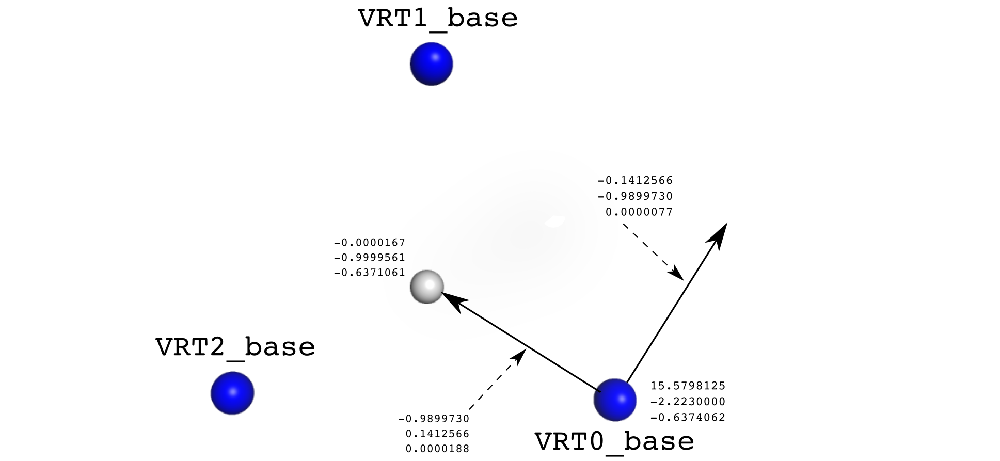
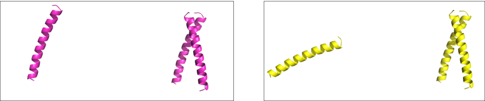

# Symmetry Tutorial

KEYWORDS: SYMMETRY GENERAL   

Complaints and suggestions can be send to:   
Sebastian Rämisch (raemisch@scripps.edu)

Updated 29 May 2017 by Vikram K. Mulligan (vmullig@uw.edu) for new ref2015 scorefunction.

[[_TOC_]]

## Symmetry in Rosetta
There is a very comprehensive documentation of how symmetry is dealt with in Rosetta: The  
[Symmetry User Guide](https://www.rosettacommons.org/docs/latest/rosetta_basics/structural_concepts/symmetry#symmetry-definitions).  
It explains the underlying concepts and how to run simulations using symmetry.

This tutorial will be a hands-on exercise. It is focussed on how get the correct symmetry definitions because starting a Rosetta protocol once a symmetry definition is available, is relatively simple. 

## What is a symmetry definition?
In order for a protocol to use symmetry, the information on how many subunits are related by what symmetry. The way to pass that information is by providing a **symmetry definition file**. The [Symmetry User Guide](https://www.rosettacommons.org/docs/latest/rosetta_basics/structural_concepts/symmetry#symmetry-definitions) covers this topic as well. You may want to take a look at it, if you have not already done so.

### Simple geometries
The Symmetry User Guide lists what type of symmetries can be represented using basic symmetry operations. For those, there is a script to generate those simple symmetry definition files. Try it yourself! Generate a sym def file for 10-fold cyclic symmetry:

```  
$> $ROSETTA3/src/apps/public/symmetry/make_symmdef_file_denovo.py -symm_type cn -nsub 10 > C10_denovo.sym
```

Most information in the C10_denovo.sym will be covered within this tutorial. For now, just focus on the part that actually contains symmetry information:

```
start -1,0,0 0,1,0 0,0,0
rot Rz 10
``` 

"start" represents the *internal coordinate system* for the first subunit: x-axis=-1,0,0, yaxis=0,1,0 and the origin=0,0,0. The z-axis is simply the vector that is orthogonal to *x* and *y*. By default, the *z* axis is the rotation axis and the *x* axis is the connection from the subunit to (0,0,0). The symmetry relation is encoded by `rot Rz 10` . That means: divide 360 degrees by *10* and rotate this much around *z* for placing the next subunit.

You can use this to dock a simple helix into a 10-meric ring:

```
$> $ROSETTA3/bin/SymDock.deault.linuxgccrelease @input_files/options -symmetry:symmetry_definition C10_denovo.sym
```

> **NOTE: The input structure for a symmetric protocol has to be the monomeric unit of whatever you want to simulate. If you give Rosetta a 10mer and then run SymDock, it will produce a 100-mer from it (which will take quite a while).**

This may take up to a few minutes. If you look at the output, you will see some kind of ring, where subunits properly packed against each other.



Unfortunately, the use of simple symmetry operations in Rosetta is rather limited. If you, for instance, try to dock trimers and pentamers into some symmetric array, there is no single symmetry axis that relates every single subunit to each other. 

Fortunately, there is another way to make Rosetta aware of more complicated arrangements. For the sake of simplicity, you will learn about the components you need with a simple trimer as an example.

## Basic symmetry definition for complex systems

### The use of virtual residues
For Rosetta to move multiple proteins around, they have to be connected in some way all the time. Converting internal coordinates (torsion angle-based) to 3D-coordinates works by 'walking' along the connection and calculating the 3D-coordinates of residue 2 relative to residue 1. Analogously, the coordinate of chain B is calculated by walking from chain A to chain B (see the [[Fold Tree Tutorial|fold_tree]]).

In symmetry mode, related chains have to perform equivalent moves relative to something, e.g. the coordinate system origin (0,0,0) or the midpoint between three subunits. For that to work, all subunits have to be connected to that point. The only way to achieve that is by placing a **Virtual Residue** (VRT) - a *connecting hub* - somewhere in space. All subunits are then connected to that virtual residue by Rosetta's imaginary bonds (i.e. **jumps**, see the [[Fold Tree Tutorial|fold_tree]]). The trick when running Rosetta with symmetry is to apply all changes to one jump (VRT --> SU\_1) to the other subunits (VRT --> SU\_2 and VRT --> SU\_3). The more complex your symmetry is, the more VRTs you will need.   

### VRTs and JUMPs - Symmetric Fold Trees

To illustrate what the effect of connected VRTs is, run the scoring application to just make the monomeric 2akf_INPUT.pdb into a trimer using the provided C3_good.symdef:  

 ```
 $> $ROSETTA3/bin/score.default.linuxgccrelease @input_files/options -symmetry:symmetry_definition input_files/C3_good.symdef -output -out:suffix _good
 ```

Ignore all output, except for the part that displays the fold tree. The first one is basically (some fantasy required here) *star-shaped*:


```
VRT(103)
|----=j4=---->VRT0(97)----#j5#---->VRT0_base(98)----#j1#----->18:Sub1A(1-32)
|----=j6=---->VRT1(99)----j7=5---->VRT1_base(100)----j2=1----->50:Sub2A(33-64)
\----=j8=---->VRT2(101)----j9=5---->VRT2_base(102)----j3=1----->82:Sub3A(65-96)
```

The connection:  
 **VRT0 --> (jump4) --> VRT0 --> (jump5) --> VRT0_base --> (jump1) --> Subunit 1**  
 ... is mirrored for the connections to subunits 2 and 3. Jumps 4,6 and 8 are exactly equivalent.  
> VRT, VRT0 and are located at the same (central) 3D-coordinates. They are important for moving chains around (rotations and translation of the connecting jumps). Those one named _base are the connection points for the actual protein subunits.

**NOTE:**   

* The **#jumpX#** notation marks *movable* jumps.   
* The "**=**" sign indicates a symmetric copy. E.g. jumps 7 and 9 are symmetric copies of jump 5.  

-

Now run the same command, but with a different (provided) sym def file:

```
$> $ROSETTA3/bin/score.default.linuxgccrelease @input_files/options -symmetry:symmetry_definition input_files/C3_bad.symdef -output -out:suffix _bad
```
The fold tree output looks very similar: 

```
VRT(103)
|----=j4=---->VRT0(97)----#j5#---->VRT0_base(98)----#j1#----->18:Sub1A(1-32)
|----=j6=---->VRT1(99)----j7=5---->VRT1_base(100)----j2=1----->50:Sub2A(33-64)
\----=j8=---->VRT2(101)----#j9#---->VRT2_base(102)----*j3*----->82:Sub3A(65-96)
```

Upon careful inspection, you will note that jump 9 is not anymore a symmetric copy of jump, but is an independent jump.

> You will see later, how this behaviour is controlled in a sym def file.

Now, take a look at the two produced output files:  
* `2akf_INPUT_good_0001.pdb`  
* `2akf_INPUT_bad_0001.pdb`

If opened in e.g. Pymol, you see that the "good" structure has chain B and C C3-symmetrically related to chain A. In the "bad" structure, however, chain C has been moved independently (only translated). It should look similar to this: 



It obvious that chain C is now moving completely independently.

> The reason for the translation is that in the `C3_bad.symdef` a translation is specified (for demonstration purposes).

-
## Symmetry Definition Files
Let's have a closer look at how to encode the subunit connectivity. Again, explanations of what the lines in a sym def mean can be found in the [Symmetry User Guide](https://www.rosettacommons.org/docs/latest/rosetta_basics/structural_concepts/symmetry#symmetry-definitions). If you open `input_files/C3_good.symdef`, beside other information, you will find all the components of fold tree from above. It starts with VRTs:

```
xyz VRT0  -0.9899730,0.1412566,0.0000188  -0.1412566,-0.9899730,0.0000077  -0.0000167,0.0000439,-0.6371111
xyz VRT0_base  -0.9899730,0.1412566,0.0000188  -0.1412566,-0.9899730,0.0000077  15.5798125,-2.2230000,-0.6374062
xyz VRT1  0.3726547,-0.9279701,-0.0000027  0.9279701,0.3726547,-0.0000201  -0.0000167,0.0000439,-0.6371111
xyz VRT1_base  0.3726547,-0.9279701,-0.0000027  0.9279701,0.3726547,-0.0000201  -5.8647187,14.6040938,-0.6370690
xyz VRT2  0.6173183,0.7867135,-0.0000161  -0.7867135,0.6173183,0.0000124  -0.0000167,0.0000439,-0.6371111
xyz VRT2_base  0.6173183,0.7867135,-0.0000161  -0.7867135,0.6173183,0.0000124  -9.7151438,-12.3809620,-0.6368580
xyz VRT  0.0000000,-1.0000000,0.0000050  1.0000000,-0.0000000,-0.0000197  -0.0000167,-0.9999561,-0.6371061
```
These lines describe the position of all **VRTs** like:  
`xyz \<some name\> (x,y,z) (x,y,z) (x,y,z)`  
The three (x,y,z) are two vectors (*x-vector* & *y-vector*) and the 3D position. The vectors are used as an internal coordinate system for rotations and translations. Note, that **VRTs can be given any name** (e.g. "anchor0" or "orgin" or "COM\_0" ...) The figure below illustrates only the VRTx_base lines:



Further down in the sym def file you see how that VRTs are connected:  

```
connect_virtual JUMP0_to_com VRT0 VRT0_base
connect_virtual JUMP0_to_subunit VRT0_base SUBUNIT
[...]
connect_virtual JUMP0 VRT VRT0
```
... says: "*make a jump (named JUMP0\_to\_com), which goes from VRT0 --> VRT0_base"*. The next lines tell Rosetta where to connect a subunit to: "*jump (named JUMP0\_to\_subunit) from VRT0_base --> subunit*". The third line shown here connects VRT0 the central VRT that connects to all others. These three lines correspond directly to the first line from the fold trees above:

```
VRT(103)
|----=j4=---->VRT0(97)----#j5#---->VRT0_base(98)----#j1#----->18:Sub1A(1-32)
```

* "JUMP0" = j4  
* "JUMP0\_to\_com" = j5
* "JUMP0\_to\_subunit" = j1  

> * \_to\_com is a freely chosen name. However it does have a meaning: VRT0_base lies in the **center of mass** (COM) of a subunit. Hence,  *JUMP0\_to\_com* connects subunit 0 to the central VRT.  
> * **jumps can be given any name** ("ori\_2\_su0", "jump\_into\_water", ...)

-
Ok ... now everything is connected. How do thing move around? What is moved around is **NOT** the VRTs. Rosetta changes *translations* and *rotations* of **jumps**! Here, you want to slide SUs away from (or towards) the center. Hence, translations of `jump5` (JUMP0\_to\_com) will accomplish just that and `jump1` can be used to rotate *SubunitA* around it's COM (=VRT0_base). For trimer, these are all *rigid body degress of freedom* needed to describe a C3-symmetric molecule.

> The center (=VRT) is the center of mass of the complex and does not need to be the origin (0,0,0)   

Which jumps can be changed and how is defined in lines starting with: `set_dof` (see [Symmetry User Guide](https://www.rosettacommons.org/docs/latest/rosetta_basics/structural_concepts/symmetry#symmetry-definitions)). As mentioned above, to e.g. perform symmetric docking, we want to translate JUMP0\_to\_com along it's *x-vector* (see Figure above) and rotate JUMP0\_to\_subunit: 

```
set_dof JUMP0_to_com x
set_dof JUMP0_to_subunit angle_x angle_y angle_z
```


-
#### Why so many VRTs?????
You may have wondered, why the fold tree is not much simpler, like:

```
VRT(100)
|----#j4#---->VRT0_base(97)----#j1#----->18:Sub1A(1-32)
|----j5=4---->VRT1_base(98)----j2=1----->50:Sub2A(33-64)
\----j6=4---->VRT2_base(99)----j3=1----->82:Sub3A(65-96)
```

Here, jump4 (5,6) would serve for sliding SUs away from the center and j1 (2,3) can be used to rotate the SU around it's center of mass (COM). So, why having VRT0, VRT1 and VRT2 there. You are going to find out soon. For that, do 

```
$> cp input_files/C3_good.symdef C3_simple.symdef
``` 

Now modify the `C3_simple.symdef` file, so that the VRT0 e.t.c are gone:

1. Remove the three lines starting with `xyz VRT0`, `xyz VRT1`, and `xyz VRT2`
2. Remove the tree lines starting with `connect_virtual JUMP?_to_com`
3. Change the connection from VRT by replacing:  
 `connect_virtual JUMP0 VRT VRT0`
  
 with   
  
 `connect_virtual JUMP0 VRT VRT0_base`

 Do the same the `JUMP1` and `JUMP2`

4. Change 
 
Now use *score* again for making a trimer, but with this much simpler sym def file:

```
$> $ROSETTA3/bin/score.default.linuxgccrelease @input_files/options -symmetry:symmetry_definition C3_simple.symdef -output -out:suffix _simple
``` 
Open the 2akf\_INPUT\_simple.pdb in e.g. Pymol. You may think "**Hey! This is not a trimer!**". But it actually is. 

--> Look at the sequence or open the file in a text editor. Chains A, B and C. The problem is, that VRT has its own coordinate system. If all subunits move relative to this one coordinate system, they will all end up at exactly the same place. The VRT0, VRT1 and VRT2 pointed into different directions (120 degrees apart). So, sliding along *VRT1 --> VRT1\_base* was different from sliding along *VRT0 --> VRT1\_base*.

-
### Symmetry related jumps
As you have seen inthe beginning, which jumps are symmetry related and which ones are not can be controlled, too. All jumps that should experience the same DOF-perturbation are lumped together in so-called **JUMPGROUP**s. The fist jump in a group is the one used for `set dof` definitions. Each group gets a freely chosen name. In our example, it looks like this:

```
set_dof JUMP0_to_com x
set_dof JUMP0_to_subunit angle_x angle_y angle_z
#
set_jump_group JUMPGROUP2 JUMP0_to_com JUMP1_to_com JUMP2_to_com
set_jump_group JUMPGROUP3 JUMP0_to_subunit JUMP2_to_subunit JUMP1_to_subunit
```

If you like, make a backup copy `input_files/C3_bad.symdef`. Then, open the `input_files/C3_bad.symdef` in a text editor. You can see the JUMP2\_to\_com and JUMP2\_to\_subunit are removed from the JUMPGROUPs and a new `set dof` instruction was added. 

Change `set_dof JUMP2_to_com x(30)` to `[...] x(100)`! Then run:

```
$> $ROSETTA3/bin/score.default.linuxgccrelease @input_files/options -symmetry:symmetry_definition input_files/C3_bad.symdef -output -out:suffix _worse
```

Then add to the same line (`set_dof JUMP2_to_com x(30)`) a specific angle: `angle_y(45)`, and run:

```
$> $ROSETTA3/bin/score.default.linuxgccrelease @input_files/options -symmetry:symmetry_definition input_files/C3_bad.symdef -output -out:suffix _worse_rot
```
You have two new files. Open them as well. You can see that chain C is placed completely independently and translation and rotation can be controlled by the `set dof` instructions.



-

### Symmetric Energy
The primary reason for running a simulation while enforcing symmetry is to speed up the calculation by reducing the number of DOFs. If Rosetta would calculate the energies for all three subunits, it would take longer than when exploiting the symmetry relation. This speed-up is even more drastic, when you perform docking or *de novo* structure prediction. So, is it enough to compute the energy for one SU and multiply it by 3?

The answer in NO. It is not, because the interaction energies between SUs must be included, too. Here, we consider the interface between A and C, which is the same as between A and B as well as between B and C. What to include, is specified in the beginning of a sym def file:

```
E = 3*VRT0_base + 3*(VRT0_base:VRT2_base)
```
3x energy of SU 0 + 3 x the interaction energy bet3ween SU 0 and SU 2. This can get quite complicated for larger systems.

### Default Rosetta Symmetry Definition Files
* The default Rosetta symmetry definition files can be found in: database/symmetry/Cyclic/C*_Z.sym

Default formula:

E = 2\*VRT0_base + 1\*VRT0_base:VRT1_base + 1\*VRT0_base:VRT2_base + ... + 1\*1\*VRT0_base:VRT\*_base

* When using the default Rosetta symmetry definition files, the calculated energies will be twice the asymmetric unit energies ( 2/n_subunits the energies calculated in this tutorial) 

### Final Remarks
* In order to get the coordinates and axis directions (as unit vectors!), it can be helpful to write a python script (or whatever you prefer) that generates those numbers. It probably should also output the appropriate connections.

-
## Time Reduction using Symmetry
This tutorial finishes with a short demonstration of the time reduction that can be accomplished. For that, you can 

First, you will repack a single helix using a simple Rosetta Scripts xml script (input_files/packing.xml):

```
$> $ROSETTA3/bin/rosetta_scripts.default.linuxgccrelease -parser:protocol input_files/packing.xml -s input_files/2akf_INPUT.pdb -overwrite
```
Note the time it took (at the very end of the output).  
Now, run an equivalent xml script that will generate and repack a 10-meric assembly of the helix:

```
$> $ROSETTA3/bin/rosetta_scripts.default.linuxgccrelease -parser:protocol input_files/packing_sym.xml -s input_files/2akf_INPUT.pdb -overwrite
```
Again, note the time it took (should be *slightly* longer).  
Finally, take that 10-meric structure you just created, and repack it without using symmetry:

```
$> $ROSETTA3/bin/rosetta_scripts.default.linuxgccrelease -parser:protocol input_files/packing.xml -s input_files/2akf_INPUT.pdb -overwrite
```
Look at how much longer it takes, when all 10 subunits have to be repacked individually.

The key difference is visible from the Rosetta output:

`core.pack.pack_rotamers: built 3618 rotamers at 320 positions.`  
 as opposed to only:  
`core.pack.pack_rotamers: built 32 rotamers at 32 positions`  
when running the same task with symmetry.


  

