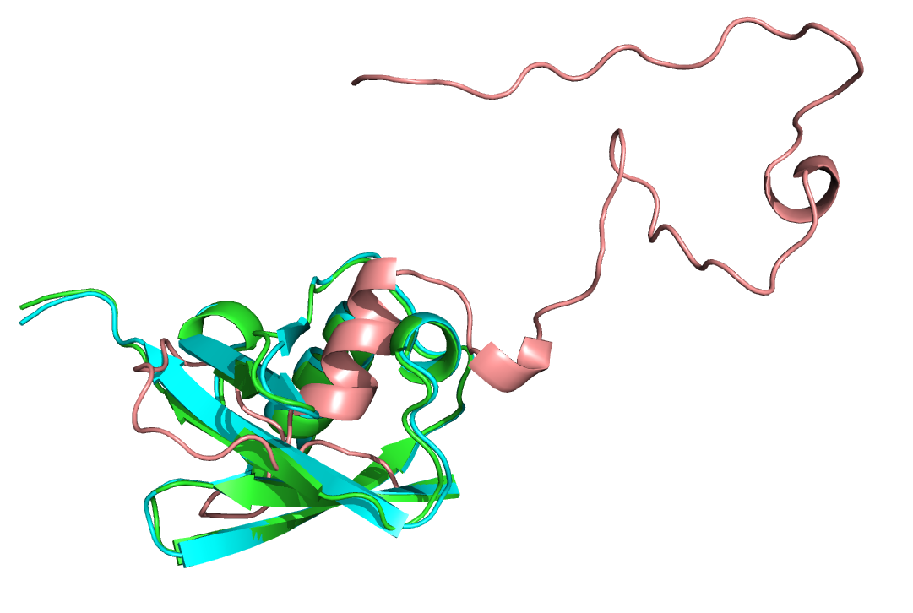

#Constraints
KEYWORDS: DESIGN GENERAL   
Tutorial by Frank David Teets (frankdt@email.unc.edu). Edited by Sebastian Rämisch (raemisch@scripps.edu) and Kristin Blacklock (kristin.blacklock@rutgers.edu).  File created 21 June 2016 as part of the 2016 Documentation eXtreme Rosetta Workshop (XRW).

Many of the biological problems users wish to solve with Rosetta involve some biological or functional considerations that may not be reflected within a PDB file or evaluated by normal score functions. Constraints are a general way of scoring how well a structure adheres to these additional considerations; for example, one might wish to relax a structure with constraints in place to ensure that suspected disulfides are maintained.

Constraints work in the following way:   

1. Some measure is calculated in a given conformation (e.g. 3.2 A)  
2. There is a suitable function that describes which values are good and which ones are bad, e.g. the ideal bond length could be the minimum of a parabolic function (harmonic potential). By evaluating the function for the measured value, a penalty is calculated. For the harmonic potential, the penalty increases the further away the measured bond length is from the ideal length. 
3. This penalty is multiplied by a weighting factor and added to the energy.

For example, a simple constraint might measure the distance between two atoms, subtract the ideal distance, and subtract the difference from the score. That constraint might look like this:
	
	AtomPair CA 20 CA 6 LINEAR_PENALTY 9.0 0 0 1.0 1.0 

The constraint begins with the definition of some geometrical ideal.  In this case, since we want to constrain two atoms to be a specific distance away from each other, we want an AtomPair constraint. In the next four fields, we define the two atoms that are to be constrained as the alpha-carbons of residues 20 and 6. The sixth field defines a type of function for computing the penalty if the atoms move out of their specified geometry. The seventh field indicates that in ideality they would be 9.0 Angstroms apart. This, then, is the geometrical function: if this structure were perfect, the alpha-carbons of residues 6 and 20 would be 9A apart.

A bit more on the sixth field: This and the remaining fields (8 to 11) dictate how the score of the structure should be penalized according to that ideal. LINEAR_PENALTY indicates that the actual result is to be compared linearly to the ideal result; the following fields indicate some parameters of that function. LINEAR_PENALTY includes the ability to add a flat zone in which the function returns a constant value for a number of distances. Here, that value is 0, and the width of the flat zone is also 0, so any deviation from ideality will be reflected in the score, but perfect ideality will not impact the score at all. LINEAR_PENALTY also allows for varying the slope of the line. 

To demonstrate this, begin by relaxing ubiquitin via the following command:

	$> ../../../main/source/bin/relax.default.linuxclangrelease -s 1ubq.pdb -out:suffix _unconstrained @general_relax_flags

as in Tutorial 4 and compare the output to that of 

	$> ../../../main/source/bin/relax.default.linuxclangrelease -s 1ubq.pdb @general_relax_flags -out:suffix _unreasonably_constrained @unreasonable_constraint_flags
	

The native PDB 1UBQ (cyan), unconstrained refined version (green) and unreasonably constrained refined version (salmon)

In the `unreasonable_constraint_flags` file, try changing the weight of the constraint using the `-constraint:cst_fa_weight` flag and analyzing how this changes the final structure. High (>1000) weights should produce demonstrably aphysical structures, unless you set the constraint ideal to something close to its native value. It is important to select a weight in proportion to the expected score value and how much you want your results to fit the constraint; a preparatory Relax run should give you an idea of the expected score range. It is also important that the constraint function chosen reflect any uncertainty about the biological system, for which reason there exist "flat" versions of several constraint functions (LINEAR_PENALTY and HARMONIC among them) which allow for any value within a range to count equivalently.

##Commonly Used Constraints

AtomPair and AtomAngle constraints are parameterized as described above, although AtomAngle constraints require three atoms (with the vertex atom listed second.) AtomPairs and AtomAngles are *not robust to changes in Rosetta numbering*; if the length of the structure is expected to change, NamedAtomPair and NamedAtomAngle constraints exist which will preserve the specific atoms identified, rather than the positions of those atoms in primary sequence space. AtomPair values are returned in Angstroms, while AtomAngle results are returned in radians.

CoordinateConstraints work like AtomPair constraints, except the second "atom" is a point in 3D space rather than an actual atom. Since Rosetta uses relative coordinates, CoordinateConstraints require a second atom to define the coordinate frame; this second atom should not be one expected to move in concert with the first, but need not be any particular distance away from it. The related LocalCoordinateConstraint uses three more atoms to define the coordinate frame. These may be used straightforwardly in Relax runs via constrain_to_native_coords.

## Commonly Used Constraint Functions

HARMONIC constraints square the distance between the ideal and actual value, and are commonly used for various types of distance constraints. CIRCULARHARMONIC is the angular equivalent.

### Other constraints that Rosetta can handle:
  
* Distance constraints
* Torsional constraints
* Other angle constraints
* Ambigous constraints
* Density constraints

To learn more about the other constraint types and function types that Rosetta can impose, click [here]().

## How to Use Constraints

As mentioned above, constraints are a way to make Rosetta's scores reflect some experimental data about the system being scored (or designed) and disfavor structures that would conflict with that data. As an example, suppose we wish to relax one half of a protein-protein interaction but we know, perhaps from mutational studies, that certain residues on each subunit interact. It may make sense to include that information via constraints, which might look like this:

	AtomPair CA 356A CA 423B HARMONIC 4.3 0.25 1
	AtomPair CA 432A CA 356B HARMONIC 4.3 0.25 1

To demonstrate this, run

	$>../../../main/source/bin/relax.default.linuxclangrelease -s 4eq1.pdb -out:suffix _unconstrained @general_relax_flags

and 

	$>../../../main/source/bin/relax.default.linuxclangrelease -s 4eq1.pdb -out:suffix _constrained @general_relax_flags @constraint_flags

You should see that, while the rest of each subunit moves, the N-terminus of each subunit moves very little relative to residue 423, as per the constraints we entered. (You may verify this more rigorously by measuring the distance from residue 356 to residue 423 on the other subunit.) As mentioned previously in the Relax tutorial, if we wished to prevent any of the amino acids from moving particularly far from their starting position, we could use the option
	
	-relax:constrain_to_starting_coords

