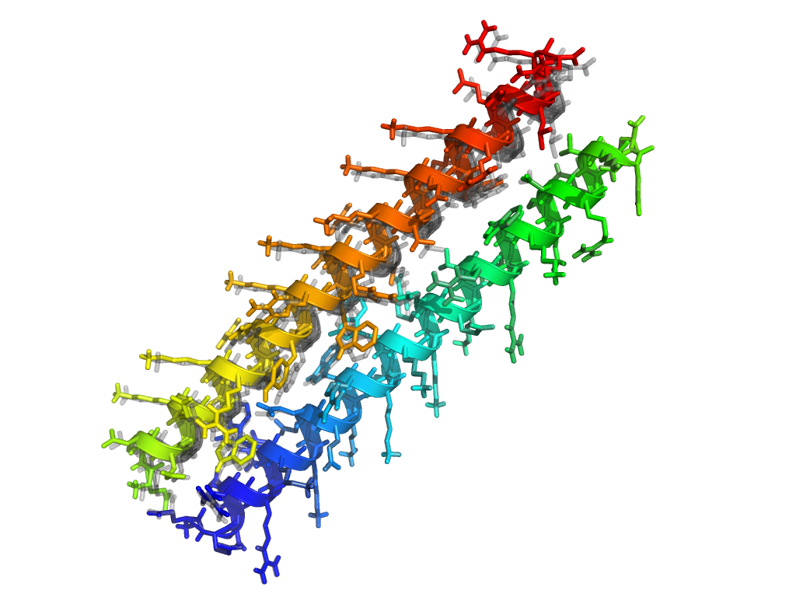

# RosettaScripts for Advanced Users
======================================
KEYWORDS: SCRIPTING_INTERFACES CORE_CONCEPTS

Tutorial by Vikram K. Mulligan (vmullig@uw.edu).  Created on 23 June 2016 as part of the 2016 Documentation XRW.

## Goals

At the end of this tutorial, you will understand:

- How to set up a FoldTree within RosettaScripts
- How to set up symmetry within RosettaScripts
- How to nest movers and how to script common loops (*e.g.* Monte Carlo trajectories)
- How to use debugging movers to observe scripted trajectories
- How to assemble more complicated protocols from simpler building-blocks
- How to use variable substitution and file inclusion in a script
- How to control large-scale sampling

## Controlling the FoldTree within RosettaScripts

In the [FoldTree tutorial](../fold_tree/fold_tree.md), we learnt how the fold tree controls what parts of a structure move when degrees of freedom change by establishing a clear hierarchy of residues.  It is often necessary to modify the FoldTree manually in order to optimize a protocol.  We're about to see how we do this in RosettaScripts.  Let's use the following example, which has two helices, which are not connected to one another, that are a bit too close together:


We'd like to minimize the structure, allowing *jumps* (rigid-body transforms between chains) to move.  Let's try this naïvely, first.  The following script simply creates and calls a MinMover for the task:

```xml
<ROSETTASCRIPTS>
	<SCOREFXNS>
		<tala weights="talaris2014.wts" />
	</SCOREFXNS>
	<RESIDUE_SELECTORS>
	</RESIDUE_SELECTORS>
	<TASKOPERATIONS>
	</TASKOPERATIONS>
	<FILTERS>
	</FILTERS>
	<MOVERS>
		<MinMover name="minimize1" bb="false" chi="true" jump="ALL" tolerance="0.0000001" type="dfpmin" />
	</MOVERS>
	<APPLY_TO_POSE>
	</APPLY_TO_POSE>
	<PROTOCOLS>
		<Add mover="minimize1" />
	</PROTOCOLS>
	<OUTPUT scorefxn="tala" />
</ROSETTASCRIPTS>
```

This script is provided as foldtree\_example/minimize1.xml, and the structure shown above is foldtree\_example/foldtree\_example.pdb.  Let's run this and see what happens:

```bash
$> cp foldtree_example/minimize1.xml .
$> cp foldtree_example/foldtree_example.pdb .
$> $ROSETTA3/bin/rosetta_scripts.default.linuxgccrelease -in:file:s foldtree_example.pdb -parser:protocol minimize1.xml -out:prefix min1_
```

You may need to change ".default.linuxgccrelease" for your build, operating system, and compiler (*e.g.* ".static.macosclangdebug", *etc.*).

Running the script above, we find that something has gone wrong.  Comparing to the original pose (in grey), the minimized pose (in colours) has the second helix rotated by nearly 180 degrees.  The overall structure has exploded:


This is an extreme case of the lever-arm effect, caused by an unsuitable fold tree.  Since the default fold tree has residue 1 as the anchor, with all of helix 1 downstream of residue 1, and a jump to the first residue of the second helix, with all of helix 2 downstream of that first residue, the repulsion between the two helices causes the second one to rotate and swing away instead of moving linearly.  This is clearly not what we want.

So let's set up a proper fold tree for this problem.  We'll create a new fold tree file (or use foldtree_example/foldtree.txt):

```
FOLD_TREE EDGE 20 1 -1 EDGE 20 40 -1 EDGE 20 60 1 EDGE 60 41 -1 EDGE 60 80 -1
```

This puts the root of the foldtree near the centre of mass of the 40-residue first helix: residue 20.  Child chains run from residue 20 back to residue 1 and forward to residue 40.  There is then a jump (rigid-body transform) from residue 40 to residue 60, which is in the middle of the second helix (which is residues 41 through 80).  Child chains then run from residue 60 back to residue 41 and forward to residue 80.

> **It is often advantageous for fold trees to have chain roots near the centre of mass of a chain (though there are exceptions to this).**

We now need to modify our script to apply this modified fold tree before calling the minimizer.  As mentioned in the [introductory RosettaScripting tutorial](../rosetta_scripting/README.md), movers are modules that alter a structure (*pose*) in some way that need not involve changing atomic coordinates.  There are special movers available to RosettaScripts that serve only to change the FoldTree.  The [AtomTree](https://www.rosettacommons.org/docs/latest/scripting_documentation/RosettaScripts/Movers/movers_pages/AtomTreeMover) mover serves this purpose.

In the script that we just ran, create a new AtomTree mover, give it a name, and set the "fold\_tree\_file" option to load foldtree_example/foldtree.txt.  Don't forget to add the new mover to the protocols section as well, so that it is actually applied to the pose.

```xml
...
	<MOVERS>
		<AtomTree name="set_foldtree" fold_tree_file="foldtree.txt" />
		<MinMover name="minimize1" bb="false" chi="true" jump="ALL" tolerance="0.0000001" type="dfpmin" />
	</MOVERS>
...
	<PROTOCOLS>
		<Add mover="set_foldtree" />
		<Add mover="minimize1" />
	</PROTOCOLS>
...
```

A mover that alters the fold tree and returns a pose with a modified fold tree has permanently changed the pose, despite the fact that the atom coordinates have not changed.  All future movers will act on the pose with the modified fold tree, until the fold tree is changed again by another mover.

> **At any given time, each pose has a single fold tree associated with it; this can be altered (permanently) by certain movers.**

Now let's run the new script (provided as foldtree_example/minimize2.xml, if you didn't modify the original script):

```bash
$> cp foldtree_example/minimize2.xml .
$> cp foldtree_example/foldtree.txt .
$> cp foldtree_example/foldtree_example.pdb .
$> $ROSETTA3/bin/rosetta_scripts.default.linuxgccrelease -in:file:s foldtree_example.pdb -parser:protocol minimize2.xml -out:prefix min2_
```

This time, the minimzation has worked as expected: the chains move apart a bit, but don't rotate much.  (The original position is shown in grey in the image below):



## Symmetry within RosettaScripts

* *Make a structure symmetric, and then carry out some common pose manipulation of the symmetric structure.*

For more information about symmetry, refer to the [symmetry user's guide](https://www.rosettacommons.org/docs/latest/rosetta_basics/structural_concepts/symmetry#How-to-adopt-your-protocol-to-use-symmetry).

Many proteins have symmetric structures.  That is, they are replicates of one primary *asymmetric* unit. Rosetta can handle symmetry using the symmetry code, and has many protocols that are adopted to symmetry.  Not all movers and filters support symmetry, however.  (For developers, there is [information here](https://www.rosettacommons.org/docs/latest/rosetta_basics/structural_concepts/symmetry#How-to-adopt-your-protocol-to-use-symmetry) about what is needed for a mover, filter, or protocol to support symmetry.)

Ordinarily, one follows these steps in order to symmetrize a pose and then work with it:

1.  Generate a symmetry definition file defining the relevant symmetry transforms for the type of symmetry (*e.g.* cyclic symmetry, dihedral symmetry, crystal symmetry, *etc.*).  In this case, this is provided for you in the symmetry\_example/inputs directory. Please refer to the [symmetry tutorial](../symmetry/symmetry.md) for a detailed description of symmetry files and how to work with them.  In this case, the C3.symm file provided in the symmetry\_example/inputs/ directory allows Rosetta to set up a pose with C3 symmetry (3-fold rotational symmetry about an axis).

2.  Set up the script for symmetry. We have provided a script for you in the scripts directory, named symmetry.xml. Let's take a look at the script.

You can see that on top in the ```<SCOREFXNS>``` part, we have added a new line:

```xml
<SCOREFXNS>
    <sfx_symm weights="talaris2014" symmetric=1 />
</SCOREFXNS>
```

This is required to tell Rosetta that the scorefunction should be symmetry-aware.  The scoring machinery can score a symmetric pose very efficiently since the intra-subunit energies are the same for each asymmetric unit, and the inter-subunit energies are also the same.  The scoring machinery need therefore only evaluate the energy of a small part of the system and multiply.

Now, let's go to the `<MOVERS>`. In the first line we added:

```
<SetupForSymmetry name=add_symm definition="C3.symm" />
```
This is probably the most important line! Here, you are telling Rosetta that it is going to be run in the C3 mode. It will replicate the assymetric unit to generate the symmetric structure based on the given symmetry file. It will also generate an appropriate fold tree based on the corresponding symmetry definition and will make sure that the movements and scoring are handled correctly. You can use `ExtractAsymmetricUnit` to do the reverse and extract the assymetric subunit from a symmetric pose.

In the next two lines we have:

```
<SymPackRotamersMover name="symm_pack" scorefxn=sfx_symm/>
<SymMinMover name="symm_min" scorefxn=sfx_symm bb=0 chi=1 jump=ALL  />
```
These are symmetry-adopted versions of PackRotamersMover and MinMover. `jump` should be set to `ALL` in order to refine the symmetric degrees of freedom. 


There are other symmetric-aware movers that can also be used. You can find them in the [Rosetta Documentation](https://www.rosettacommons.org/docs/latest/scripting_documentation/RosettaScripts/RosettaScripts). 


**Running and Outputs**

Now let's run the scripts. In this tutorial you are going to generate, design, and minimize a C3 symmetric structure made out of ubiquitin subunits. You are going to use inputs/symm_test.pdb file as an example. This is just ubiquitin structure that has been cleaned and prepared. Based on the `PROTOCOLS` section, here is the order of running:

```
<Add mover=add_symm/>
<Add mover=symm_pack/>
<Add mover=symm_min/>
```
You can run the script using this command: (`$ROSETTA3` is the path to your Rosetta/main/source)

```
$> $ROSETTA3/bin/rosettascripts.linuxgccrelease @symm.options
```

In your output, you can see that these lines are printed in the log file: (you can also find the whole tracer in outputs/symm_c3.log)

```
core.conformation.symmetry.util: =================== SYM FOLD TREE, jump notation: =symfixed= *indep* #symdof# jump[=follows] ========================
S1(229)
|----#j1#------>4:Sub1A(1-76)
|----=j4=---->S2(230)----j2=1----->80:Sub2A(77-152)
\----=j5=---->S3(231)----j3=1---->156:Sub3A(153-228)
```

This is were the symmetry is being defined and the jumps between subunits are set based on the symmetry definition file you provided.

The structure should look like something like this:


Now, based on the things you learnt from the [symmetry tutorial](../symmetry/symmetry.md), try to see if you can get other types of symmetric structures. An example of a C7 symmetric ubiquitin is provided for you in outputs/symm_test_c7.pdb. The C7.symm file is also in the input directory if you want to use. The result should look like this:


## Nesting movers and looping

### Scripting a simple loop

* *Loop over sidechain optimization until the score doesn't improve.*

One of the more powerful parts of RosettaScripts is the ability to combine individual components in flexible ways. You saw some of this in the [introductory RosettaScripts tutorial](../rosetta_scripting/README.md), where we used ResidueSelectors and TaskOperations as inputs for the PackRotamers mover. There are also certain movers which can take other movers as inputs. As one example, this can be used to implement looping.  Let's start a new, basic script to take a look at this.

```xml
<ROSETTASCRIPTS>
	<SCOREFXNS>
		<t14 weights="talaris2014" />
	</SCOREFXNS>
	<RESIDUE_SELECTORS>
	</RESIDUE_SELECTORS>
	<TASKOPERATIONS>
	</TASKOPERATIONS>
	<FILTERS>
	</FILTERS>
	<MOVERS>
	</MOVERS>
	<APPLY_TO_POSE>
	</APPLY_TO_POSE>
	<PROTOCOLS>
	</PROTOCOLS>
	<OUTPUT scorefxn="t14" />
</ROSETTASCRIPTS>

```

For our example protocol, we'll add the [RotamerTrialsMinMover](https://www.rosettacommons.org/docs/latest/scripting_documentation/RosettaScripts/Movers/movers_pages/RotamerTrialsMinMover), which iterates through each residue position, exhaustively testing each position to see whether a rotamer substitution will improve things. However, because the ideal sidechain conformation depends on the other sidechains, the results of a RotamerTrialsMinMover depends on the (random) order in which the sidechains are tested.  Let's add a RotamerTrialsMinMover to the MOVERS section of our script, but for now, let's leave it out of the PROTOCOLS section:

```xml
...
	<MOVERS>
		<RotamerTrialsMinMover name="rtmm" scorefxn="t14" task_operations="repackonly,extrachi" />
	</MOVERS>
...
```

To make sure we get the best score we possibly can, we're going to repeat the RotamerTrialsMinMover until the score function doesn't improve.  To do this, we'll use the [IteratedConvergence](https://www.rosettacommons.org/docs/latest/scripting_documentation/RosettaScripts/Movers/movers_pages/IteratedConvergenceMover) mover. This mover is a "meta mover" in the sense that it doesn't change the pose itself, but takes as a parameter a Mover which does. It also takes a filter, which is used as a metric evaluator (and *not* as a trajectory stopper). The IteratedConvergence mover repeatedly applies the given mover, and after each application will call the metric evaluation property of the filter. If the mover keeps improving the score, the IteratedConvergence mover will keep calling the mover. If not, it will stop and return the updated pose.  Let's add the IteratedConvergence mover now, and pass the RotamerTrialsMinMover that we set up above to it as an input:

```xml
...
	<MOVERS>
		<RotamerTrialsMinMover name="rtmm" scorefxn="t14" task_operations="repackonly,extrachi" />
		<IteratedConvergence name="rotopt" mover="rtmm" delta="0.1" cycles="1" />
	</MOVERS>
...
```

For the filter that the IteratedConvergence mover takes, we'll use the [ScoreType](https://www.rosettacommons.org/docs/latest/scripting_documentation/RosettaScripts/Filters/filter_pages/ScoreTypeFilter) filter to get the total score of the pose. Since the IteratedConvergence mover only uses this as a metric evaluator, we don't need to worry too much about the threshold or the confidence setting.
 
```xml
...
	<FILTERS>
		<ScoreType name="total_score" scorefxn="t14" score_type="total_score" threshold="0" />
	</FILTERS>
...
	<MOVERS>
		...
		<IteratedConvergence name="rotopt" mover="rtmm" filter="total_score" delta="0.1" cycles="1" /> #Added the filter="total_score" option.
	</MOVERS>
...
```

Note that when you nest movers or filters or whatnot, the definition of the sub-mover, sub-filter, *etc.* must come before the point of use. (Otherwise the order of definition shouldn't matter.) This might involve you making multiple MOVERS/FILTERS/*etc.* sections.

As a final step, we need to write our PROTOCOLS section.  Note that the *only* thing that we want to put there, now, is the IteratedConvergence mover, "rotopt", since it will invoke the RotmaerTrialsMinMover, "rtmm".

```xml
...
	<PROTOCOLS>
		<Add mover="rotopt" />
	</PROTOCOLS>
...
```

The final script can be viewed in loop\_example/pack\_opt.xml.  Let's try it out on the ubiquitin structure:

```bash
$> cp loop_example/pack_opt.xml .
$> cp loop_example/1ubq.pdb .
$> <path_to_Rosetta_directory>/main/source/bin/rosetta_scripts.default.linuxgccrelease -s 1ubq.pdb -parser:protocol pack_opt.xml -out:prefix packopt_
```

This script will take a bit longer to run (about three or four minutes).  If you look at the tracer output, you should be able to see the application of the IteratedConvergence, and how the RotamerTrialsMinMover is repeated multiple times.

This is a relatively trivial example, since we're applying it to an input structure that nature has already heavily optimized; if you look at the output, you'll see that Rosetta finds few new mutations, mainly finding only rotamer substitutions of the same amino acid.  However, it illustrates how a loop can be scripted using a dedicated mover.

Let's look at a more realistic example, now, and a more powerful, and commonly-used, type of loop: a Monte Carlo search.

### Scripting a Monte Carlo search of conformation and sequence space

TODO -- CONTINUE HERE.

## Variable substition: adding variables to scripts

Sometimes in a RosettaScripts protocol, you want to vary the options given to the tags. For example, if you wish to do a series of runs, with changes at different residues. The naive way of doing this is to make separate XMLs, one for each variant of the option. If you have a large number of variants, this may be less than ideal.

To accomodate this sort of protocol, RosettaScripts has [variable substition](https://www.rosettacommons.org/docs/latest/scripting_documentation/RosettaScripts/RosettaScripts#options-available-in-the-xml-protocol-file_variable-substitution). Within the script you add "%%var_name%%" instead of the option value, and then use the "-parser:script_vars" command line option to set it from the command line.

(NOTE: The variable substitution is only intended for substituting individual options in a tag. Don't try to use it to substitute entire sub-tags.)

For our sample protocol, let's run a mutational scan. There are several movers which can do mutational scanning, but for the purposes of introducing the script_vars functionality, let's use [MutateResidue](https://www.rosettacommons.org/docs/latest/scripting_documentation/RosettaScripts/Movers/movers_pages/MutateResidueMover). Also, to keep the runtime short, let's disable the rotamer optimization.

```
    <MOVERS>
        <MutateResidue name="mutate" target="%%position%%" new_res="%%res%% />  
    </MOVERS>
```

To run, we need to then pass something like "-parser:script_vars position=14A new_res=ALA" on the commandline.

	$> cp inputs/mut_scan.xml .
	$> rosetta_scripts.default.linuxgccrelease -s 1ubq.pdb -parser:protocol mut_scan.xml -out:prefix V5W_ -nstruct 1 -parser:script_vars position=5A res=TRP -jd2:ntrials 10
	$> rosetta_scripts.default.linuxgccrelease -s 1ubq.pdb -parser:protocol mut_scan.xml -out:prefix L43W_ -nstruct 1 -parser:script_vars position=43A res=TRP -jd2:ntrials 10
	$> rosetta_scripts.default.linuxgccrelease -s 1ubq.pdb -parser:protocol mut_scan.xml -out:prefix L56W_ -nstruct 1 -parser:script_vars position=56A res=TRP -jd2:ntrials 10
	$> rosetta_scripts.default.linuxgccrelease -s 1ubq.pdb -parser:protocol mut_scan.xml -out:prefix L67W_ -nstruct 1 -parser:script_vars position=67A res=TRP -jd2:ntrials 10

These commands should produce a tryptophan scan of a selection of residues in the core of the protein. (Open up the structures in PyMol or the equivalent and compare.

If you wish to do a more thorough scan, either of more positions or of more residue identities, you can easily automate running of the scan by using shell scripting.


## Conclusion

This tutorial was intended to give you a brief introduction in creating an XML protocol. The process we went through is similar to how most RosettaScripts developers write an XML file from scratch: Build up a protocol iteratively, starting with a simple protocol and progressively adding different and more complex stages. For each stage, have an idea about the effect you wish to accomplish, and then scan the documentation for existing movers/filters/task operations/etc. which will accomplish it. This may involve multiple RosettaScripts objects, due to movers which need as parameters other movers which need filters which need task operations (which need ...)

There are, of course, many more RosettaScripts objects than we have discussed, most of which should be covered in the RosettaScripts documentation. There are also additional sections of the XML, which are used for more specialized applications. (For example, ligand docking.) 

A final note - even if you can create an XML from scratch, it may be easier not to. If you already have an example XML that does something close to what you want to do, it's probably easier to start with that XML, and alter it to add in the functionality you want.

The hard part is not necessarily in putting together the XML, but in determining the optimal protocol (the logical steps) you should use to accomplish your modeling goals, and then in benchmarking that protocol to make sure it does what you hoped.
