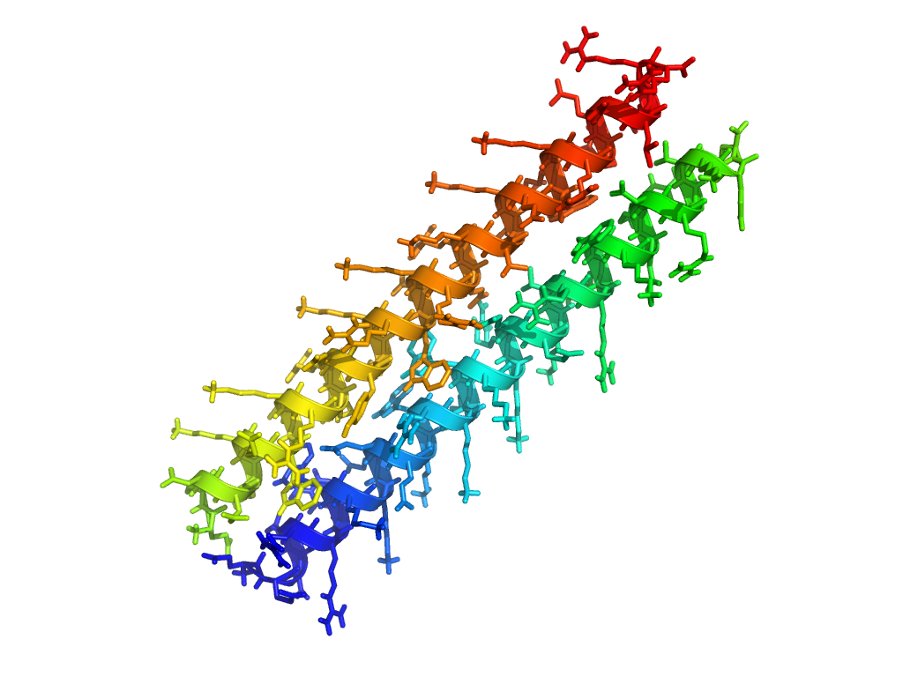
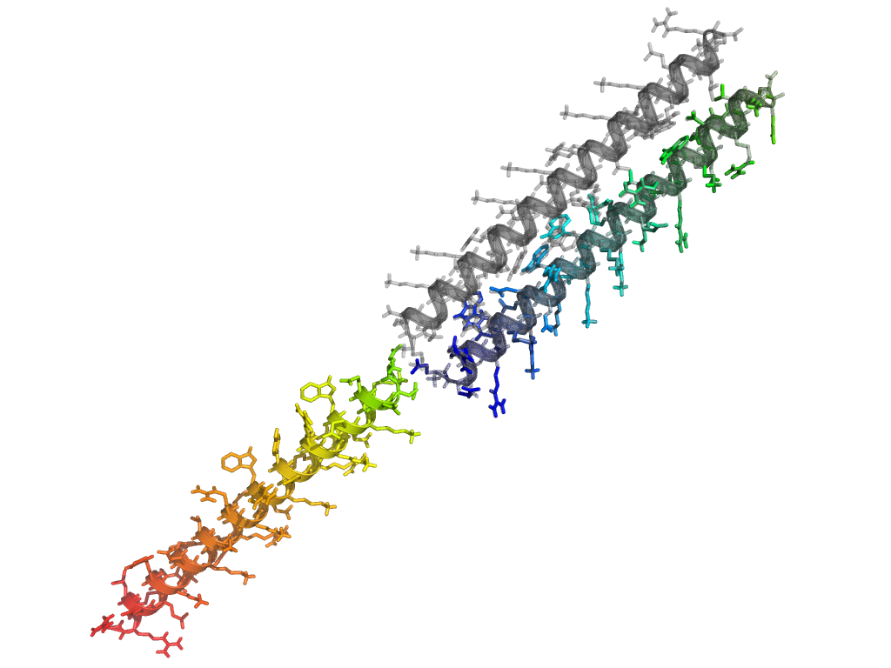
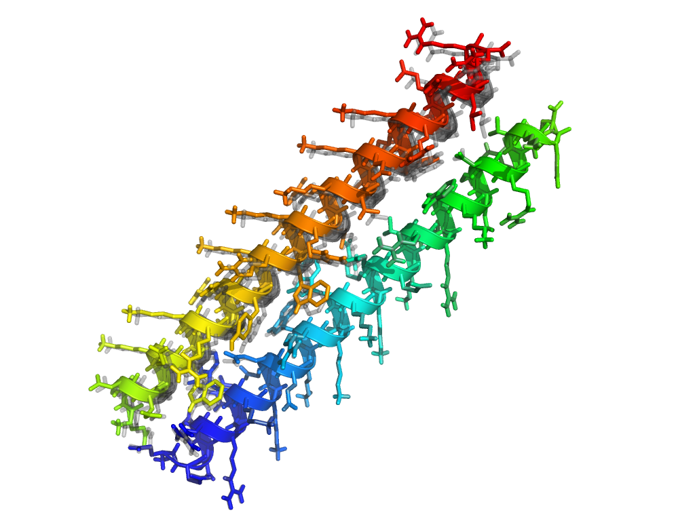
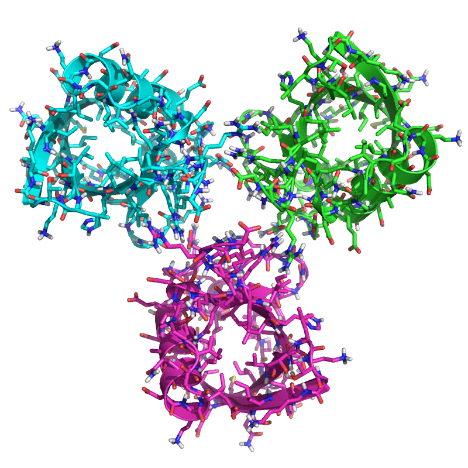
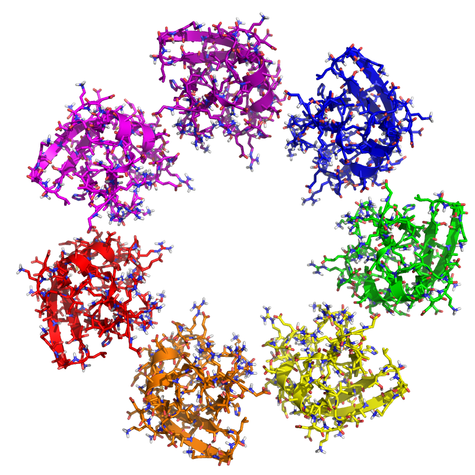
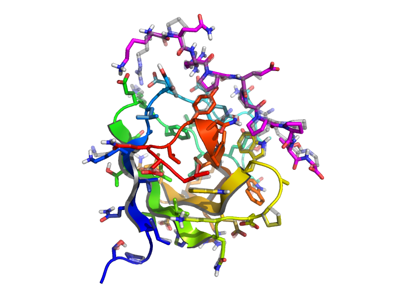
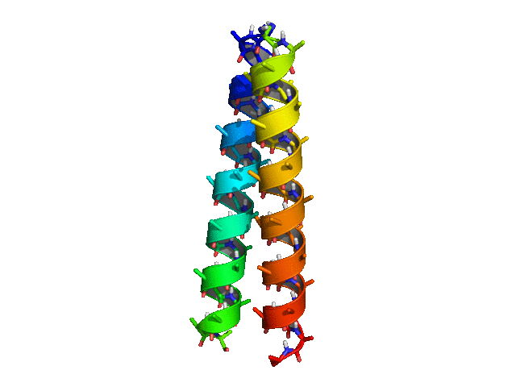
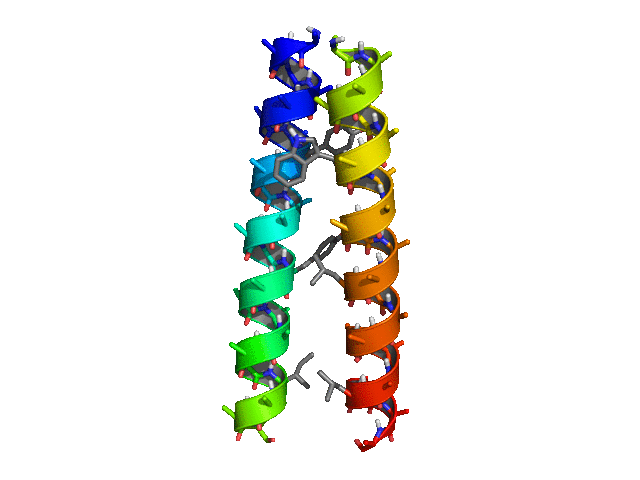

# More Advanced RosettaScripts Concepts
======================================
KEYWORDS: SCRIPTING_INTERFACES CORE_CONCEPTS

Tutorial by Vikram K. Mulligan (vmullig@uw.edu), Rocco Moretti (rmorettiase@gmail.com), Parisa Hosseinzadeh (parisah@uw.edu), and Kristen Blacklock (kristin.blacklock@rutgers.edu).  Created on 23 June 2016 as part of the 2016 Documentation XRW.

Updated 29 May 2017 by Vikram K. Mulligan (vmullig@uw.edu) for new ref2015 scorefunction.

[[_TOC_]]

## Goals

At the end of this tutorial, you will understand:

- How to set up a FoldTree within RosettaScripts
- How to set up symmetry within RosettaScripts
- How to nest movers and how to script common loops (*e.g.* Monte Carlo trajectories)
- How to use debugging movers to observe scripted trajectories
- How to assemble more complicated protocols from simpler building-blocks
- How to use variable substitution and file inclusion in a script
- How specialized grid sampling movers interact with RosettaScripts
- How RosettaScripts distributes its jobs over many processors in MPI mode

We recommend completing the [[introductory RosettaScripting tutorial|scripting_with_rosettascripts]] to familiarize yourself with general RosettaScripts concepts before moving on to this tutorial.

## Controlling the FoldTree within RosettaScripts

In the [[FoldTree tutorial|fold_tree]], we learnt how the fold tree controls what parts of a structure move when degrees of freedom change by establishing a clear hierarchy of residues.  It is often necessary to modify the FoldTree manually in order to optimize a protocol.  We're about to see how we do this in RosettaScripts.  Let's use the following example, which has two helices, which are not connected to one another, that are a bit too close together:



We'd like to minimize the structure, allowing *jumps* (rigid-body transforms between chains) to move.  Let's try this naïvely, first.  The following script simply creates and calls a MinMover for the task:

```xml
<ROSETTASCRIPTS>
	<SCOREFXNS>
		<ScoreFunction name="ref15sfxn" weights="ref2015.wts" />
	</SCOREFXNS>
	<RESIDUE_SELECTORS>
	</RESIDUE_SELECTORS>
	<TASKOPERATIONS>
	</TASKOPERATIONS>
	<FILTERS>
	</FILTERS>
	<MOVERS>
		<MinMover name="minimize1" bb="false" chi="true" jump="ALL" tolerance="0.0000001" type="dfpmin" />
	</MOVERS>
	<APPLY_TO_POSE>
	</APPLY_TO_POSE>
	<PROTOCOLS>
		<Add mover="minimize1" />
	</PROTOCOLS>
	<OUTPUT scorefxn="ref15sfxn" />
</ROSETTASCRIPTS>
```

This script is provided as foldtree\_example/minimize1.xml, and the structure shown above is foldtree\_example/foldtree\_example.pdb.  Let's run this and see what happens:

```bash
$> cp foldtree_example/minimize1.xml .
$> cp foldtree_example/foldtree_example.pdb .
$> $ROSETTA3/bin/rosetta_scripts.default.linuxgccrelease -in:file:s foldtree_example.pdb -parser:protocol minimize1.xml -out:prefix min1_
```

In the above, $ROSETTA3 is your Rosetta/main/source directory. You may need to change ".default.linuxgccrelease" for your build, operating system, and compiler (*e.g.* ".static.macosclangdebug", *etc.*).

Running the script above, we find that something has gone wrong.  Comparing to the original pose (in grey), the minimized pose (in colours) has the second helix rotated by nearly 180 degrees.  The overall structure has exploded:



This is an extreme case of the lever-arm effect, caused by an unsuitable fold tree.  Since the default fold tree has residue 1 as the anchor, with all of helix 1 downstream of residue 1, and a jump to the first residue of the second helix, with all of helix 2 downstream of that first residue, the repulsion between the two helices causes the second one to rotate and swing away instead of moving linearly.  This is clearly not what we want.

So let's set up a proper fold tree for this problem.  We'll create a new fold tree file (or use foldtree_example/foldtree.txt):

```
FOLD_TREE EDGE 20 1 -1 EDGE 20 40 -1 EDGE 20 60 1 EDGE 60 41 -1 EDGE 60 80 -1
```

This puts the root of the foldtree near the centre of mass of the 40-residue first helix: residue 20.  Child chains run from residue 20 back to residue 1 and forward to residue 40.  There is then a jump (rigid-body transform) from residue 40 to residue 60, which is in the middle of the second helix (which is residues 41 through 80).  Child chains then run from residue 60 back to residue 41 and forward to residue 80.

> **It is often advantageous for fold trees to have chain roots near the centre of mass of a chain (though there are exceptions to this).**

We now need to modify our script to apply this modified fold tree before calling the minimizer.  As mentioned in the [introductory RosettaScripting tutorial](../rosetta_scripting/README.md), movers are modules that alter a structure (*pose*) in some way that need not involve changing atomic coordinates.  There are special movers available to RosettaScripts that serve only to change the FoldTree.  The [AtomTree](https://www.rosettacommons.org/docs/latest/scripting_documentation/RosettaScripts/Movers/movers_pages/AtomTreeMover) mover serves this purpose.

In the script that we just ran, create a new AtomTree mover, give it a name, and set the "fold\_tree\_file" option to load foldtree_example/foldtree.txt.  Don't forget to add the new mover to the protocols section as well, so that it is actually applied to the pose.

```xml
...
	<MOVERS>
		<AtomTree name="set_foldtree" fold_tree_file="foldtree.txt" />
		<MinMover name="minimize1" bb="false" chi="true" jump="ALL" tolerance="0.0000001" type="dfpmin" />
	</MOVERS>
...
	<PROTOCOLS>
		<Add mover="set_foldtree" />
		<Add mover="minimize1" />
	</PROTOCOLS>
...
```

A mover that alters the fold tree and returns a pose with a modified fold tree has permanently changed the pose, despite the fact that the atom coordinates have not changed.  All future movers will act on the pose with the modified fold tree, until the fold tree is changed again by another mover.

> **At any given time, each pose has a single fold tree associated with it; this can be altered (permanently) by certain movers.**

Now let's run the new script (provided as foldtree_example/minimize2.xml, if you didn't modify the original script):

```bash
$> cp foldtree_example/minimize2.xml .
$> cp foldtree_example/foldtree.txt .
$> cp foldtree_example/foldtree_example.pdb .
$> $ROSETTA3/bin/rosetta_scripts.default.linuxgccrelease -in:file:s foldtree_example.pdb -parser:protocol minimize2.xml -out:prefix min2_
```

This time, the minimzation has worked as expected: the chains move apart a bit, but don't rotate much.  (The original position is shown in grey in the image below):



## Symmetry within RosettaScripts

* *Make a structure symmetric within RosettaScripts.*
* *Carry out some common pose manipulation of the symmetric structure, preserving symmetry.*

For more information about symmetry, refer to the [symmetry user's guide](https://www.rosettacommons.org/docs/latest/rosetta_basics/structural_concepts/symmetry#How-to-adopt-your-protocol-to-use-symmetry).

Many proteins have symmetric structures.  That is, they are replicates of one primary *asymmetric* unit. Rosetta can handle symmetry using the symmetry code, and has many protocols that are adopted to symmetry.  Not all movers and filters support symmetry, however.  (For developers, there is [information here](https://www.rosettacommons.org/docs/latest/rosetta_basics/structural_concepts/symmetry#How-to-adopt-your-protocol-to-use-symmetry) about what is needed for a mover, filter, or protocol to support symmetry.)

Ordinarily, one follows these steps in order to symmetrize a pose and then work with it:

1.  Generate a symmetry definition file defining the relevant symmetry transforms for the type of symmetry (*e.g.* cyclic symmetry, dihedral symmetry, crystal symmetry, *etc.*).  In this case, this is provided for you in the symmetry\_example/inputs directory. Please refer to the [symmetry tutorial](../symmetry/symmetry.md) for a detailed description of symmetry files and how to work with them.  In this case, the C3.symm file provided in the symmetry\_example/inputs/ directory allows Rosetta to set up a pose with C3 symmetry (3-fold rotational symmetry about an axis).

2.  Set up the script for symmetry. We have provided a script for you in the scripts directory, named symmetry.xml. Let's take a look at the script.

You can see that on top in the ```<SCOREFXNS>``` part, we have added a new line:

```xml
...
	<SCOREFXNS>
	    <sfx_symm weights="ref2015" symmetric="true" />
	</SCOREFXNS>
...
```

This is required to tell Rosetta that the scorefunction should be symmetry-aware.  The scoring machinery can score a symmetric pose very efficiently since the intra-subunit energies are the same for each asymmetric unit, and the inter-subunit energies are also the same.  The scoring machinery need therefore only evaluate the energy of a small part of the system and multiply.

Now, let's go to the ```<MOVERS>``` section. Here we added a SetupForSymmetry mover:


```xml
...
		<SetupForSymmetry name=add_symm definition="C3.symm" />
...
```

This is probably the most important line! Here, you are telling Rosetta that it should take an asymmetric pose and make it symmetric, applying the symmetry rules listed in the C3.symm file. It will replicate the asymmetric unit to generate the symmetric structure based on the given rules. It will also generate an appropriate fold tree based on the corresponding symmetry definition.  Rosetta retains an awareness of symmetry in the pose object that this mover produces, and this allows the program to make sure that movements and scoring are handled correctly. You can use the [ExtractAsymmetricUnit mover](https://www.rosettacommons.org/docs/latest/scripting_documentation/RosettaScripts/Movers/movers_pages/ExtractAsymmetricUnitMover) to do the reverse and extract the asymmetric subunit from a symmetric pose.  Note that there exist other symmetry setup movers, too, such as the [DetectSymmetry mover](https://www.rosettacommons.org/docs/latest/scripting_documentation/RosettaScripts/Movers/movers_pages/DetectSymmetryMover), which sets up internal symmetry rules from an already-symmetric input pose based on the geometry.

> **Symmetry information is retained in the pose, and used to ensure that future pose manipulations respect and preserve the symmetry.**

In the next two lines in the MOVERS section, we have:

```xml
...
		<SymPackRotamersMover name="symm_pack" scorefxn="sfx_symm" task_operations="nodesign" />
		<SymMinMover name="symm_min" scorefxn="sfx_symm" bb="false" chi="true" jump="ALL" />
...
```

These are symmetry-aware versions of PackRotamersMover and MinMover. In this case, the "jump" option is set to "ALL" in order to allow asymmetric units to move relative to one another. 

There are other symmetry-aware movers that can also be used. You can find them in the [Rosetta Documentation](https://www.rosettacommons.org/docs/latest/scripting_documentation/RosettaScripts/RosettaScripts).  These include [FastRelax](https://www.rosettacommons.org/docs/latest/scripting_documentation/RosettaScripts/Movers/movers_pages/FastRelaxMover) and [FastDesign](https://www.rosettacommons.org/docs/latest/scripting_documentation/RosettaScripts/Movers/movers_pages/FastDesignMover), which are frequently used with symmetric poses.

Finally, in the ```<PROTOCOLS>``` section, we lay out the sequence of movers.  First, we'll set up symmetry, then repack, then minimize:

```xml
...
	<PROTOCOLS>
		<Add mover="add_symm" />
		<Add mover="symm_pack" />
		<Add mover="symm_min" />
	</PROTOCOLS>
...
```

Now let's run the scripts. In this tutorial you are going to generate, repack, and minimize a C3 symmetric structure made out of ubiquitin subunits. You are going to use inputs/symm_test.pdb file as an example. This is just ubiquitin structure that has been cleaned and prepared.

You can run the script using this command:

```bash
$> cp symmetry_example/scripts/symmetry_c3.xml .
$> cp symmetry_example/inputs/C3.symm .
$> cp symmetry_example/inputs/symm_test.pdb .
$> $ROSETTA3/bin/rosetta_scripts.default.linuxgccrelease -parser:protocol symmetry_c3.xml -in:file:s symm_test.pdb -out:prefix c3_
```

In your output, you can see that these lines are printed in the log file: (you can also find the whole tracer in outputs/symm_c3.log)

```
core.conformation.symmetry.util: =================== SYM FOLD TREE, jump notation: =symfixed= *indep* #symdof# jump[=follows] ========================
S1(229)
|----#j1#------>4:Sub1A(1-76)
|----=j4=---->S2(230)----j2=1----->80:Sub2A(77-152)
\----=j5=---->S3(231)----j3=1---->156:Sub3A(153-228)
```

This is were the symmetry is being defined and the jumps between subunits are set based on the symmetry definition file you provided.

The structure should look like something like this:



Now, based on the things you learnt from the [symmetry tutorial](../symmetry/symmetry.md), try to see whether you can get other types of symmetric structures. An example of a C7 symmetric ubiquitin is provided for you in outputs/symm_test_c7.pdb. The C7.symm file is also in the input directory for you to use, as well as a slightly different input PDB file (with the ubiquitin translated away from the axis a bit), called symm_test_translated.pdb. The result should look like this:



The commands to use the preset files are:

```bash
$> cp symmetry_example/scripts/symmetry_c7.xml .
$> cp symmetry_example/inputs/C7.symm .
$> cp symmetry_example/inputs/symm_test_translated.pdb .
$> $ROSETTA3/bin/rosetta_scripts.default.linuxgccrelease -parser:protocol symmetry_c7.xml -in:file:s symm_test_translated.pdb -out:prefix c7_
```

This tutorial has not begun to explore the full complexity of the Rosetta symmetry machinery.  There are many far more interesting things that one would likely try to script, such as the design of symmetric interfaces or whatnot.  We leave as an exercise to the reader the task of putting together the pieces covered earlier (invoking the packer and minimizer from movers, controlling behaviour with task operations and residue selectors, etc.) to think about how symmetric interface design could be accomplished within RosettaScripts.  The main points to take home, here, are:

* Symmetric poses must be set up in Rosetta using an appropriate mover.  This is true even if the input geometry is symmetric: Rosetta needs to use a mover to gain an awareness of the symmetry of the input pose ([DetectSymmetry mover](https://www.rosettacommons.org/docs/latest/scripting_documentation/RosettaScripts/Movers/movers_pages/DetectSymmetryMover)), or to make an asymmetric input pose symmetric ([SetupForSymmetry mover](https://www.rosettacommons.org/docs/latest/scripting_documentation/RosettaScripts/Movers/movers_pages/SetupForSymmetryMover)).
* Once set up, a symmetric pose *remains* symmetric unless de-symmetrized with an appropriate mover.
* Symmetric poses can be manipulated by movers that alter the geometry but preserve the symmetry.  Many, but not all, movers in Rosetta are either symmetry-compatible, or have symmetry-compatible versions.
* Symmetric poses are handled much like asymmetric poses, in that series of movers and filters can be applied to them.  They just require an initial setup step.

As a final point, it's worth mentioning that the most convenient way in which to set up a fold tree for a symmetric pose is by setting up the fold tree for the asymmetric unit (as described in the previous section), *then* making the pose symmetric with the SetupForSymmetry mover.

## Nesting movers and looping

### Scripting a simple loop

* *Loop over sidechain optimization until the score doesn't improve.*

One of the more powerful parts of RosettaScripts is the ability to combine individual components in flexible ways. You saw some of this in the [introductory RosettaScripts tutorial](../rosetta_scripting/README.md), where we used ResidueSelectors and TaskOperations as inputs for the PackRotamers mover. There are also certain movers which can take other movers as inputs. As one example, this can be used to implement looping.  Let's start a new, basic script to take a look at this.

```xml
<ROSETTASCRIPTS>
	<SCOREFXNS>
		<ScoreFunction name="r15" weights="ref2015" />
	</SCOREFXNS>
	<RESIDUE_SELECTORS>
	</RESIDUE_SELECTORS>
	<TASKOPERATIONS>
	</TASKOPERATIONS>
	<FILTERS>
	</FILTERS>
	<MOVERS>
	</MOVERS>
	<APPLY_TO_POSE>
	</APPLY_TO_POSE>
	<PROTOCOLS>
	</PROTOCOLS>
	<OUTPUT scorefxn="r15" />
</ROSETTASCRIPTS>

```

For our example protocol, we'll add the [RotamerTrialsMinMover](https://www.rosettacommons.org/docs/latest/scripting_documentation/RosettaScripts/Movers/movers_pages/RotamerTrialsMinMover), which iterates through each residue position, exhaustively testing each position to see whether a rotamer substitution will improve things. However, because the ideal sidechain conformation depends on the other sidechains, the results of a RotamerTrialsMinMover depends on the (random) order in which the sidechains are tested.  Let's add a RotamerTrialsMinMover to the MOVERS section of our script, but for now, let's leave it out of the PROTOCOLS section:

```xml
...
	<MOVERS>
		<RotamerTrialsMinMover name="rtmm" scorefxn="r15" task_operations="repackonly,extrachi" />
	</MOVERS>
...
```

To make sure we get the best score we possibly can, we're going to repeat the RotamerTrialsMinMover until the score function doesn't improve.  To do this, we'll use the [IteratedConvergence](https://www.rosettacommons.org/docs/latest/scripting_documentation/RosettaScripts/Movers/movers_pages/IteratedConvergenceMover) mover. This mover is a "meta mover" in the sense that it doesn't change the pose itself, but takes as a parameter a Mover which does. It also takes a filter, which is used as a metric evaluator (and *not* as a trajectory stopper). The IteratedConvergence mover repeatedly applies the given mover, and after each application will call the metric evaluation property of the filter. If the mover keeps improving the score, the IteratedConvergence mover will keep calling the mover. If not, it will stop and return the updated pose.  Let's add the IteratedConvergence mover now, and pass the RotamerTrialsMinMover that we set up above to it as an input:

```xml
...
	<MOVERS>
		<RotamerTrialsMinMover name="rtmm" scorefxn="r15" task_operations="repackonly,extrachi" />
		<IteratedConvergence name="rotopt" mover="rtmm" delta="0.1" cycles="1" />
	</MOVERS>
...
```

For the filter that the IteratedConvergence mover takes, we'll use the [ScoreType](https://www.rosettacommons.org/docs/latest/scripting_documentation/RosettaScripts/Filters/filter_pages/ScoreTypeFilter) filter to get the total score of the pose. Since the IteratedConvergence mover only uses this as a metric evaluator, we don't need to worry too much about the threshold or the confidence setting.
 
```xml
...
	<FILTERS>
		<ScoreType name="total_score" scorefxn="r15" score_type="total_score" threshold="0" />
	</FILTERS>
...
	<MOVERS>
		...
		<IteratedConvergence name="rotopt" mover="rtmm" filter="total_score" delta="0.1" cycles="1" /> #Added the filter="total_score" option.
	</MOVERS>
...
```

Note that when you nest movers or filters or whatnot, the definition of the sub-mover, sub-filter, *etc.* must come before the point of use. (Otherwise the order of definition shouldn't matter.) This might involve you making multiple MOVERS/FILTERS/*etc.* sections.

As a final step, we need to write our PROTOCOLS section.  Note that the *only* thing that we want to put there, now, is the IteratedConvergence mover, "rotopt", since it will invoke the RotmaerTrialsMinMover, "rtmm".

```xml
...
	<PROTOCOLS>
		<Add mover="rotopt" />
	</PROTOCOLS>
...
```

The final script can be viewed in loop\_example/pack\_opt.xml.  Let's try it out on the ubiquitin structure:

```bash
$> cp loop_example/pack_opt.xml .
$> cp loop_example/1ubq.pdb .
$> $ROSETTA3/bin/rosetta_scripts.default.linuxgccrelease -s 1ubq.pdb -parser:protocol pack_opt.xml -out:prefix packopt_
```

This script will take a bit longer to run (about three or four minutes).  If you look at the tracer output, you should be able to see the application of the IteratedConvergence, and how the RotamerTrialsMinMover is repeated multiple times.

This is a relatively trivial example, since we're applying it to an input structure that nature has already heavily optimized; if you look at the output, you'll see that Rosetta finds few new mutations, mainly finding only rotamer substitutions of the same amino acid.  However, it illustrates how a loop can be scripted using a dedicated mover.

Let's look at a more realistic example, now, and a more powerful, and commonly-used, type of loop: a Monte Carlo search.

### Scripting a Monte Carlo search of conformation and sequence space

* *Perform backbone and sidechain moves in the context of a Monte Carlo search, scripted in RosettaScripts.*
* *Record the trajectory of a protocol in a multimodel PDB file.*

For this protocol, we will be using the [GenericMonteCarlo](https://www.rosettacommons.org/docs/latest/scripting_documentation/RosettaScripts/Movers/movers_pages/GenericMonteCarloMover) 
mover, which is another type of "meta mover" that performs iterative trials of a given Mover and evaluates whether that move should be *accepted* or *rejected* based on a user-defined metric, or based on the Metropolis criterion and the Rosetta energy.  See the [tutorial on packing](../Optimizing_Sidechains_The_Packer/Optimizing_Sidechains_The_Packer.md) for more information on Monte Carlo searches.

Let's consider the example of re-designing and refining a peptide that is bound to a protein structure in order to find a peptide with possibly higher binding affinity. In the figure below, the peptide is depicted in magenta sticks, whereas the protein domain is in rainbow cartoon with green sidechain sticks.

[[montecarlo_example/figures/2drk.png]]

We will allow the Packer to choose different identities and rotamers for the current peptide in its bound state, while also perturbing the peptide backbone by small amounts over many iterations of the Monte Carlo search.  We'll keep the protein backbone fixed. 

Before we can use the GenericMonteCarloMover for this task, we need to create a Mover that we can use as an input for the GenericMonteCarloMover.  There are a few things to consider, here:

* The "moves" that we want to make in our Monte Carlo search are not moves that any single mover can make.  We'll need a way of chaining several movers together.
* In any Monte Carlo search, the moves should be stochastic.  Ideally, they should satisfy the [detailed balance equations](https://en.wikipedia.org/wiki/Detailed_balance), which are beyond the scope of this tutorial.  In practice many of the moves that we make in Rosetta Monte Carlo searches do not satisfy the detailed balance requirement, but do approximate it closely enough for the Monte Carlo search to be useful.  However, just making a strictly deterministic move (like minimization) or even a largely deterministic move (like packing a small system, which has a high probility of converging) without any stochastic component to the move is a bad idea.

> **Monte Carlo moves should have a stochastic component (and ideally, the overall move should satisfy the detailed balance equations).**

To address the first point, let's create a [ParsedProtocol](https://www.rosettacommons.org/docs/latest/scripting_documentation/RosettaScripts/Movers/movers_pages/ParsedProtocolMover) Mover, which is another meta-mover that simply accepts several other movers and packages them together as a single large mover.  We will encapsulate several movers within the ParsedProtocol mover, to carry out the following steps:

| Step | Mover | Task | Deterministic/Stochastic? |
|------|-------|------|---------------------------|
| **1** | [RigidBodyPerturbNoCenter](https://www.rosettacommons.org/docs/latest/create/scripting_documentation/RosettaScripts/Movers/movers_pages/RigidBodyPerturbNoCenter) | Randomly shift the position of the peptide by a tiny amount | Stochastic |
| **2** | [Small](https://www.rosettacommons.org/docs/latest/scripting_documentation/RosettaScripts/Movers/movers_pages/SmallMover) | Randomly perturb peptide mainchain torsions by a tiny amount.  We will use a residue selector to apply this only to the peptide. | Stochastic |
| **3** | [PackRotamersMover](https://www.rosettacommons.org/docs/latest/scripting_documentation/RosettaScripts/Movers/movers_pages/PackRotamersMover) | Design the peptide and repack the side-chains of the protein near the peptide.  We will use residue selectors and task operations to prevent design outside of the peptide, and to prevent repacking outside of the interface. | Stochastic but convergent; should consistently find the global optimum, or something close to it, for a system this small |
| **4** | [MinMover](https://www.rosettacommons.org/docs/latest/scripting_documentation/RosettaScripts/Movers/movers_pages/MinMover) | Energy-minimize the side-chains.  Note that we will prohibit jump and backbone minimization when setting up this mover. | Deterministic |

Have we addressed the second point?  Probably well enough, for our purposes: the moves have a significant random component, though they also have largely or fully deterministic steps as well (packing the small system and minimizing).  It's worth being aware that we're probably not rigourously obeying detailed balance, but for our purposes, it doesn't matter.  Let's start a basic RosettaScript and set up our movers:

```xml
<ROSETTASCRIPTS>
	<SCOREFXNS>
		<ScoreFunction name="myscore" weights="ref2015" />
	</SCOREFXNS>
	<RESIDUE_SELECTORS>
	</RESIDUE_SELECTORS>
	<TASKOPERATIONS>
	</TASKOPERATIONS>
	<FILTERS>
	</FILTERS>
	<MOVERS>
		<RigidBodyPerturbNoCenter name="shift_peptide_a_tiny_bit" rot_mag="0" trans_mag="0.2" />
		<Small name="small_mover" scorefxn="myscore" temperature="0.5" nmoves="500" angle_max="10.0" preserve_detailed_balance="0" />
		<PackRotamersMover name="repack_mover" scorefxn="myscore" />
		<MinMover name="sidechain_min" scorefxn="myscore" tolerance="0.01" bb="false" chi="true" jump="0" />		
		
		<ParsedProtocol name="monte_carlo_move" mode="sequence" >
			<Add mover_name="pdb_traj_recorder_accepted" />
			<Add mover="shift_peptide_a_tiny_bit" />
			<Add mover_name="small_mover" />
			<Add mover_name="repack_mover" />
			<Add mover_name="sidechain_min" />
			<Add mover_name="pdb_traj_recorder" />
		</ParsedProtocol>
	</MOVERS>
	<PROTOCOLS>
	</PROTOCOLS>	
</ROSETTASCRIPTS>
```

Now let's add the appropriate residue selectors and task operations to set up the Small mover and the PackRotamers mover, as described in the table above.  Details of residue selectors and task operations are covered in the [introductory RosettaScripting tutorial](../rosetta_scripting/README.md).

```xml
...
	<RESIDUE_SELECTORS>
		<Chain name=pdz chains=A />
		<Chain name=peptide chains=B />
		<Neighborhood name=interface selector=peptide distance=6 /> #Note that this selects the peptide AS WELL AS the surrounding residues
		<Not name=not_interface selector=interface /> #Note that this selects only the parts of the protein far from the interface.
	</RESIDUE_SELECTORS>
	<TASKOPERATIONS>
		<OperateOnResidueSubset name=repackonly_pdz selector=pdz >
			<RestrictToRepackingRLT />
		</OperateOnResidueSubset>
		<OperateOnResidueSubset name=fix_notinterface selector=not_interface >
			<PreventRepackingRLT />
		</OperateOnResidueSubset>
	</TASKOPERATIONS>
...
	<MOVERS>
		<Small name=small_mover scorefxn=myscore temperature=0.5 nmoves=500 angle_max=10.0 preserve_detailed_balance=0 residue_selector=peptide />
		<PackRotamersMover name=repack_mover scorefxn=myscore task_operations=repackonly_pdz,fix_notinterface />
...
	</MOVERS>
...
```

> **Notice that the SmallMover accepts ResidueSelectors, and the PackRotamersMover accepts TaskOperations.**

Let's also take a moment to set up a suitable fold tree for this problem, as described in the first part of this tutorial.  We want to make the protein, which remains fixed, the root of the chain, have a jump to the middle of the peptide, and have the head and tail of the peptide downstream of the middle of the peptide.  In a foldtree file (mc\_foldtree.txt):

```
FOLD_TREE EDGE 52 1 -1 EDGE 52 59 -1 EDGE 52 65 1 EDGE 65 60 -1 EDGE 65 69 -1
```

And in the script:

```xml
...
	<MOVERS>
		<AtomTree name=set_up_foldtree fold_tree_file="mc_foldtree.txt" />
...
	</MOVERS>
...
```

Now we are ready to build the [GenericMonteCarlo mover](https://www.rosettacommons.org/docs/latest/scripting_documentation/RosettaScripts/Movers/movers_pages/GenericMonteCarloMover). To the ```<MOVERS>``` section, we will add:

```xml
...
		<GenericMonteCarlo name=gmc_mover mover_name=monte_carlo_move scorefxn_name=myscore sample_type=low temperature=0.8 trials=100 drift=1 preapply=false recover_low=1 />
...
```

When the GenericMonteCarlo mover is applied to the pose, it will apply the series of movers in the ParseProtocol mover to the input pose, evalutate the change in energy of the pose, and apply the Metropolis criterion to determine whether to accept or reject this move with a Boltzmann temperature factor of 0.8 (`temperature=0.8`).  (To refresh yourself on Monte Carlo searches and the Metropolis criterion, see the [tutorial on packing](../Optimizing_Sidechains_The_Packer/Optimizing_Sidechains_The_Packer.md)). If this move is accepted, the move is kept, and this new structure becomes the starting structure for the next GenericMonteCarlo trial (`drift=1`). This will continue until the total number of trials have completed (`trials=100`). At the end of the GenericMonteCarlo Mover, we can take the last structure as the output structure or the lowest-energy structure as the output structure. Here, we have specified to output the lowest-energy structure (`recover_low=1`). 

Don't forget to add the AtomTree and GenericMonteCarlo movers to the `<PROTOCOLS>` section of the script so that they are both applied to the pose:

```xml
...
	<PROTOCOLS>
		<Add mover=set_up_foldtree />
		<Add mover=gmc_mover />
	</PROTOCOLS>
...
```

To visualize the trajectory that the input pose hase taken during the hundred steps that the GenericMonteCarlo mover carries out, we can also add the [PBDTrajectoryRecorder](https://www.rosettacommons.org/docs/latest/scripting_documentation/RosettaScripts/Movers/movers_pages/PDBTrajectoryRecorderMover) mover to the ParsedProtocols block.  This is a special mover that does *not* modify the pose, but instead writes a copy of the current pose to a PDB file, then returns the pose as-is.  We will set up two such movers, one at the start of the ParsedProtocol that lists the steps in our moves, and one at the end.  Note that this is a *debugging* mover, and is not intended for production runs.  On HPC clusters, there is a cost to writing to disk, and large numbers of parallel processes all making frequent writes to disk.  For this reason, it is best to comment out or delete PDBTrajectoryRecorder movers or other debugging movers when it's time to set up a production run.

> **Debugging movers are useful for examining trajectories when writing a script, but should be turned off for production runs.**

The PDBTrajectoryRecorder that we're adding at the start of the ParsedProtocol will always print out the structure resulting from the last move that was accepted, while the one at the end will always dump out the results of the current move, whether or not this move is accepted.  Let's create these movers and add them to the ParsedProtocols block:

```xml
...
	<MOVERS>
...
		<PDBTrajectoryRecorder name=pdb_traj_recorder stride=1 filename=traj.pdb cumulate_jobs=0 cumulate_replicas=0 />
		<PDBTrajectoryRecorder name=pdb_traj_recorder_accepted stride=1 filename=traj_accepted.pdb cumulate_jobs=0 cumulate_replicas=0 />		
		<ParsedProtocol name=monte_carlo_move mode=sequence >
			<Add mover_name=pdb_traj_recorder_accepted />
			... all the other movers in the move ...
			<Add mover_name=pdb_traj_recorder />
		</ParsedProtocol>
...
	</MOVERS>
...
```

Now we're ready to run this.  This should take four or five minutes to run, since each of 100 steps must call the packer and the minimizer.

```bash
$> cp montecarlo_example/scripts/generic_monte_carlo_example.xml montecarlo_example/inputs/2drk.pdb montecarlo_example/inputs/mc_foldtree.txt .
$> $ROSETTA3/bin/rosetta_scripts.default.linuxgccrelease -s 2drk.pdb -parser:protocol generic_monte_carlo_example.xml -out:prefix montecarlo_
```

Take a look at the output trajectory.  The traj.pdb file will contain the structures that result from every move (at left, below), while the traj_accepted.pdb file will contain the results of only those moves that were accepted by the GenericMonteCarlo mover (at right, below).  If all moves are being accepted or all moves are being rejected, it's probably a sign that something is wrong.


The final output structure should be similar to this (though it won't be identical, due to the inherently stochastic nature of a Monte Carlo search):



Notice the changes in the peptide sequence from gray (input) to magenta, and also the small backbone and rotamer changes to the protein domain.  (Understandably, Rosetta doesn't drastically redesign the peptide, since this was a native structre of an SH3 domain binding the peptide that it recognizes.)

This sub-section has demonstrated how we can script Monte Carlo searches in Rosetta, using arbitrarily complex moves.  It has also hopefully given you some idea of what to consider when setting up a Monte Carlo run, and has presented you with tools that you can use to watch your run trajectories when debugging.

## Variable substition and XML inclusion

### Adding variables to scripts

* *Create a RosettaScript that uses variable values set at the command line.*

Sometimes in a RosettaScripts protocol, you want to vary the options given to the tags. For example, you may wish to do a series of runs, with changes at different residues from run to run. The naïve way to do this is to make separate XMLs, one for each variant of the option. If you have a large number of variants, this may be less than ideal.

To accomodate this sort of protocol, RosettaScripts has [variable substition](https://www.rosettacommons.org/docs/latest/scripting_documentation/RosettaScripts/RosettaScripts#options-available-in-the-xml-protocol-file_variable-substitution). Within the script you add "%%var_name%%" instead of the option value, and then use the "-parser:script_vars" command line option to set it from the command line.

(NOTE: The variable substitution is only intended for substituting individual options in a tag. Don't try to use it to substitute entire sub-tags.)

For our sample protocol, let's run a mutational scan. There are several movers which can do mutational scanning, but for the purposes of introducing the script\_vars functionality, let's use [MutateResidue](https://www.rosettacommons.org/docs/latest/scripting_documentation/RosettaScripts/Movers/movers_pages/MutateResidueMover). Also, to keep the runtime short, let's disable the rotamer optimization.  Create a basic RosettaScript and add a MutateResidue mover:

```xml
...
	<MOVERS>
		<MutateResidue name="mutate" target="%%position%%" new_res="%%res%%" />  
	</MOVERS>
...
	<PROTOCOLS>
		<Add mover="mutate" />
	</PROTOCOLS>
...
```

To run, we need to then pass something like "-parser:script\_vars position=14A res=ALA" on the commandline.

```bash
$> cp var_subs/var_subs.xml var_subs/1ubq.pdb .
$> $ROSETTA3/bin/rosetta_scripts.default.linuxgccrelease -s 1ubq.pdb -parser:protocol var_subs.xml -out:prefix V5W_  -nstruct 1 -parser:script_vars position=5A  res=TRP
$> $ROSETTA3/bin/rosetta_scripts.default.linuxgccrelease -s 1ubq.pdb -parser:protocol var_subs.xml -out:prefix L43W_ -nstruct 1 -parser:script_vars position=43A res=TRP
$> $ROSETTA3/bin/rosetta_scripts.default.linuxgccrelease -s 1ubq.pdb -parser:protocol var_subs.xml -out:prefix L56W_ -nstruct 1 -parser:script_vars position=56A res=TRP
$> $ROSETTA3/bin/rosetta_scripts.default.linuxgccrelease -s 1ubq.pdb -parser:protocol var_subs.xml -out:prefix L67W_ -nstruct 1 -parser:script_vars position=67A res=TRP
```

These commands should produce a tryptophan scan of a selection of residues in the core of the protein. (Open up the structures in PyMol or the equivalent and compare).  Of course, in practice we would most likely want to include additional movers to repack and minimize the mutated residue and its environment -- in its present form, this script leaves the new, mutated side-chains in conformations that clash horribly with the rest of the structure.

If you wish to do a more thorough scan, either of more positions or of more residue identities, you can easily automate running of the scan by using shell scripting.  Note, though, that there is a cost do doing things this way: every step requires reinitialization of Rosetta, including a fresh load of the Rosetta database.

> **If it is possible to do a series of jobs entirely within the context of Rosetta, this will save clock cycles and disk i/o.  If necessary, though, multiple jobs can be run by bash scripting with variable substitution.**

### File inclusion

* *Create a RosettaScript that includes things defined in another RosettaScript.*

Scripts can easily become large and unweildy.  Fortunately, RosettaScripts supports *inclusion*, which means that a script can be divided over several separate files.  This is particularly useful if you find that there are certain modules that you set up over and over.  The setup for these can be relegated to another file that is included by many different scripts.  To demonstrate this, let's modify the script that we created in the previous section, and move the MutateResidue mover definition to another file.

Create a new file (we'll call it var\_subs\_2b.xml), and add ONLY the following line:

```xml
		<MutateResidue name="mutate" target="%%position%%" new_res="%%res%%" />  
```

Note that we're still substituting variables in the included file.

> **File inclusion and variable substitution are compatible.**

Now modify the original script, replacing the MutateResidue line as shown:

```xml
<ROSETTASCRIPTS>
	<SCOREFXNS>
		<ScoreFunction name="ref15sfxn" weights="ref2015.wts" />
	</SCOREFXNS>
	<RESIDUE_SELECTORS>
	</RESIDUE_SELECTORS>
	<TASKOPERATIONS>
	</TASKOPERATIONS>
	<FILTERS>
	</FILTERS>
	<MOVERS>
		<xi:include href="var_subs_2b.xml" /> #This includes the other file.
	</MOVERS>
	<APPLY_TO_POSE>
	</APPLY_TO_POSE>
	<PROTOCOLS>
		<Add mover="mutate" />
	</PROTOCOLS>
	<OUTPUT scorefxn="ref15sfxn" />
</ROSETTASCRIPTS>
```

Let's run this, as before:
```bash
$> cp var_subs/var_subs_2a.xml var_subs/var_subs_2b.xml var_subs/1ubq.pdb .
$> $ROSETTA3/bin/rosetta_scripts.default.linuxgccrelease -s 1ubq.pdb -parser:protocol var_subs_2a.xml -out:prefix V5Q_  -nstruct 1 -parser:script_vars position=5A  res=GLN
```

## RosettaScripts jobs, grid sampling movers, and parallel sampling

* *Use a grid-sampling mover, distributing sampling over RosettaScripts jobs.*

We have already seen that the number of jobs that RosettaScripts attempts can be controlled with the "-nstruct" (number of structures to generate per input) and "-jd2:ntrials" (number of attempts to make for each structure before giving up on that structure), and with the number of input structures.  There are certain special "grid-sampling" movers in Rosetta that can interface with the RosettaScripts job distribution system in a special way: given some sort of parameter space that one might want to sample, a grid sampler can assign each of a regular grid of points to sample in that space to a series of RosettaScripts jobs.  This is a departure from the usual Rosetta paradigm, which is to carry out a large number of stochastic trajectories.  Here, we are performing a large number of regular, *deterministic* samples.

A concrete example is the [BundleGridSampler mover](https://www.rosettacommons.org/docs/latest/scripting_documentation/RosettaScripts/Movers/movers_pages/BundleGridSamplerMover).  This is a parametric design tool that generates helical bundle geometry based on a series of parameter values -- for example, bundle radius, bundle twist, helix offset along the bundle axis, helix rotation about the bundle axis, *etc.*  (Like any mover, it takes a single pose as input and generates a single pose as ouput; unlike most movers, though, it throws away its input pose and generates new geometry for output.)  While the details of the parameters used to generate geometry are unimportant here, the point is that there is a large, multi-variable parameter space that one might want to explore.  Let's say, for example, that one wanted to sample three parameters, considering 10 regularly-spaced values for each.  This is 1000 combinations of parameter values.  The default behaviour of the BundleGridSampler is to perform all 1000 samples, then to choose the lowest-energy one and to return that as the input for the next mover in the script.  However, there's another option: by setting the option "nstruct_mode" to "true", the BundleGridSampler will consider only *one* of those thousand combinations of parameter values per job, moving to the the next combination on the next job.  Whatever movers and filters are applied subsequently can therefore be applied to *every* sample.

This is particularly advantageous when using the MPI (*M*essage *P*assing *I*nterface) compilation of the rosetta\_scripts application (see the [building tutorial](../install_build/install_build.md) for details on compiling the MPI version), many parallel rosetta\_scripts processes can distribute jobs amongst themselves over many parallel processors, automatically balancing their workload.  This is a very efficent way in which to sample a grid of parameter values in parallel, particularly on large, high-performance computing (HPC) clusters.

Let's set up a small sample BundleGridSampler run in nstruct mode to illustrate how grid samplers interface with RosettaScripts.  First, let's create a basic RosettaScript and add a BundleGridSampler mover:

```xml
<ROSETTASCRIPTS>
	<SCOREFXNS>
		<ScoreFunction name="ref15sfxn" weights="ref2015.wts" />
	</SCOREFXNS>
	<RESIDUE_SELECTORS>
	</RESIDUE_SELECTORS>
	<TASKOPERATIONS>
	</TASKOPERATIONS>
	<FILTERS>
	</FILTERS>
	<MOVERS>
		<BundleGridSampler name="bgs" scorefxn="ref15sfxn" nstruct_mode="true" use_degrees="true" helix_length="25" >
		</BundleGridSampler>
	</MOVERS>
	<APPLY_TO_POSE>
	</APPLY_TO_POSE>
	<PROTOCOLS>
		<Add mover="bgs" />
	</PROTOCOLS>
	<OUTPUT scorefxn="ref15sfxn" />
</ROSETTASCRIPTS>
```

You'll note that we've already set "nstruct\_mode" to "true", indicating that the mover should sample subsequent grid-points in subsequent jobs.  (We've also set a few other mover-specific options that are not important for this tutorial.)

Next, let's tell the mover what it will be sampling over.  This is done with some mover-specific syntax that is detailed on the [help page for the mover](https://www.rosettacommons.org/docs/latest/scripting_documentation/RosettaScripts/Movers/movers_pages/BundleGridSamplerMover).  The details aren't important for our purposes here; suffice it to say that we're telling the mover to generate a two-helix bundle, and to do 6 samples for a radius parameter, r0, and 6 samples for a twist parameter, omega0, for a total of 36 samples.  Note that we've added an option, "max\_samples", to the first BundleGridSampler tag, and set it to 36.  This is for our convenience: this grid sampling mover, recognizing that it's quite possible to accidentally specify unrealistically high numbers of samples, provides a means by which a user can set a number above which the mover throws an error when you run the script.  So if, for example, I thought I was setting up ten thousand samples, and the combinatorics meant that I actually had set up ten million, with "max\_samples" set to "10000", I would be warned immediately that I had made a mistake; without it, I might erroneously start a job that would only carry out a tiny bit of sampling in a very small sub-region of the region that I had actually specified.

> **It's best to be mindful of the amount of sampling a grid sampling mover is expected to do.  Use the tools available to warn you if the samples exceed the number that you think that you've set up.**

```xml
		<BundleGridSampler name="bgs" scorefxn="ref15sfxn" nstruct_mode="true" use_degrees="true" helix_length="25" max_samples="36" >
			<Helix r0_min="4.0" r0_max="7.0" r0_samples="6" omega0_min="-3.0" omega0_max="3.0" omega0_samples="6" delta_omega0="0.0" />
			<Helix r0_copies_helix="1" pitch_from_helix="1" delta_omega0="180.0" />
		</BundleGridSampler>
```

Let's run the script at the present stage.  (We provide it as grid\_sampling\_example/grid_sampling.xml.)  Note that all movers require some sort of pose as an input -- without this, RosettaScripts will throw an error and abort.  We're going to use the 1ubq (ubiquitin) strucutre as our input, but note that the BundleGridSampler will discard the ubiquitin geometry and substitute parametrically-generated geometry.  Since some conformations that we're sampling have clashing geometry, we're also using the "-write\_all\_connect\_info" flag so that explicit bonds are written in the PDB file.  Without this, PyMOL draws aberrant bonds in the clashing regions when the PDB file is opened in that program.  Also, since 36 samples will be performed and will be distributed over different jobs, we need to attempt 36 jobs, so we pass the "-nstruct 36" option.

```bash
$> cp grid_sampling_example/1ubq.pdb grid_sampling_example/grid_sampling.xml .
$> $ROSETTA3/bin/rosetta_scripts.default.linuxgccrelease -write_all_connect_info -in:file:s 1ubq.pdb -parser:protocol grid_sampling.xml -out:prefix grid1_ -nstruct 36
```

Examining the output, you'll see that each successive PDB file in the 36 produced has the pose in a slightly different conformation, regularly sampling different twists and radii of the bundle.



Practically speaking, how would we use this in the context of a useful task, like protein design?  Well, let's modify the script to design each sampled conformation in the grid.  An important consideration here, though, is the fact that, while the initial geometry generation is extremely fast (a small fraction of a second), full design (packing) and side-chain minimization could be quite slow.  We therefore want to throw away any non-productive conformations, such as those that have clashes prior to design, with a poly-alanine sequence, immediately.  So we'll want to filter first to throw away the non-productive conformations, then design those samples that pass the filter.

We can use the [ScoreType filter](https://www.rosettacommons.org/docs/latest/scripting_documentation/RosettaScripts/Filters/filter_pages/ScoreTypeFilter) to filter out clashing conformations, using the *fa_rep* score term (the repulsive part of the Lennard-Jones potential) as our criterion for acceptance or rejection.  The filter should be added to the PROTOCOLS section immediately after the BundleGridSampler mover, so that we immediately throw away bad, clashing geometry as soon as it is generated.  In practice, you would have to determine the cutoff by trial-and-error; in this case, we're using a cutoff of 15 Rosetta energy units.

```xml
...
	<FILTERS>
		<ScoreType name="filter_clashes" scorefxn="ref15sfxn" score_type="fa_rep" threshold="15.0" />
	</FILTERS>
...
	<PROTOCOLS>
		<Add mover="bgs" />
		<Add filter="filter_clashes" />
	</PROTOCOLS>
...
```

In addition, a conformation is likely to be non-productive if the helices are too far apart.  For this, we can filter using the *fa_atr* (attractive part of the Lennard-Jones potential) score term.

```xml
...
	<FILTERS>
		<ScoreType name="filter_clashes" scorefxn="ref15sfxn" score_type="fa_rep" threshold="15.0" />
		<ScoreType name="filter_excessive_separation" scorefxn="ref15sfxn" score_type="fa_atr" threshold="-149.0" />
	</FILTERS>
...
	<PROTOCOLS>
		<Add mover="bgs" />
		<Add filter="filter_clashes" />
		<Add filter="filter_excessive_separation" />
	</PROTOCOLS>
...
```

Now let's set up some design steps.  To keep this simple, we'll design just the core using hydrophobic amino acid residues.  Therefore, we'll need a residue selector for the core, and a residue selector for the inverse selection:

```xml
...
	<RESIDUE_SELECTORS>
		<Layer name="select_core" select_core="true" select_boundary="false" select_surface="false" core_cutoff="2.5" surface_cutoff="0.5" />
		<Not name="select_not_core" selector="select_core" />
	</RESIDUE_SELECTORS>
...
```

We'll pass these to a couple of task operations -- one to load a resfile for the core, the other to prevent design outside of the core.  We'll also set up a task operation for extra rotamers:

```xml
...
	<TASKOPERATIONS>
		<ReadResfile name="core_resfile" filename="core_resfile.txt" />
		<OperateOnResidueSubset name="only_design_core" selector="select_not_core" >
			<PreventRepackingRLT />
		</OperateOnResidueSubset>
		<ExtraRotamersGeneric name="extrachi" ex1="1" ex2="1" ex1_sample_level="1" ex2_sample_level="1" extrachi_cutoff="5" />
	</TASKOPERATIONS>
...
```

The resfile specifies design only with hydrophobic amino acid residues.  (We omit methionine for this example to reduce the number of rotamers that we're considering):

```
PIKAA FILYVW
```

Now we set up a [FastDesign mover](https://www.rosettacommons.org/docs/latest/scripting_documentation/RosettaScripts/Movers/movers_pages/FastDesignMover), passing all of the above task operations to control packing steps, and a move map that disables backbone and rigid-body motions (but allows side-chains to minimize) to control minimizations steps:

```xml
...
		<FastDesign name="design_core" repeats="1" scorefxn="ref15sfxn" task_operations="core_resfile,only_design_core,extrachi">
			<MoveMap name="design_core_mm">
				<Span begin="1" end="999" bb="false" chi="true" />
				<Jump number="1" setting="false" />
			</MoveMap>
		</FastDesign>
...
	<PROTOCOLS>
		<Add mover="bgs" />
		<Add filter="filter_clashes" />
		<Add filter="filter_excessive_separation" />
		<Add mover="design_core" />
	</PROTOCOLS>
...
```

And that's it!  Let's try running this.  The complete script is provided as grid\_sampling\_example/grid\_sampling\_with\_design.xml.  This time, the jobs that carry out design will take a bit longer -- perhaps two minutes or so to run through all jobs.  (It's for this reason that we added the filters!)  As in the [introductory RosettaScripting tutorial](../rosetta_scripting/README.md), we use the "-jd2:failed_job_exception false" option to prevent Rosetta from exiting with error status at the end due to the jobs that we expect will fail filters.

```bash
$> cp grid_sampling_example/1ubq.pdb grid_sampling_example/grid_sampling_with_design.xml grid_sampling_example/core_resfile.txt .
$> $ROSETTA3/bin/rosetta_scripts.default.linuxgccrelease -write_all_connect_info -in:file:s 1ubq.pdb -parser:protocol grid_sampling_with_design.xml -out:prefix grid2_ -nstruct 36 -jd2:failed_job_exception false

```

Take a look at the output.  You'll notice that there are now far fewer PDB files, since only jobs 13 through 18 passed filters.  If you open these PDB files, you'll see that they've all been designed, and that at least some of them seem to have nice hydrophobic packing.  The task of adding additional filters to accept only those designs with well-packed, cavity-free cores is left as an exercise to the reader.



To summarize, this sub-section has demonstrated how to use grid-sampling movers in conjunction with RosettaScripts to distribute samples over RosettaScripts jobs.  It has also demonstrated how one might use a grid sampler in conjunction with filters and with movers that invoke the packer and the minimizer in order to handle a sampling-and-design problem efficiently.  Since RosettaScripts jobs are automatically distributed over available processors in MPI mode, this sub-section implicitly taught you how to distribute sampling over available processors in a convenient, automated way.

## Conclusion

The sub-tutorials in this section covered quite a lot of ground, but they should give you a very good handle on how to use the full power of RosettaScripts.  Although there exist some tasks that are fundamentally incompatible with the paradigms of RosettaScripts (clustering, for example, which cannot be done in the context of a one-pose-in-one-pose-out system), many very complicated protocols multi-step protocols can be constructed entirely within RosettaScripts.
