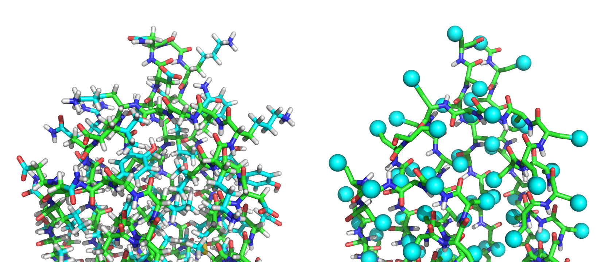

Full Atom Representation vs Centroid Representation
===================================================

KEYWORDS: CORE_CONCEPTS ANALYSIS

Tutorial by Shourya S. Roy Burman (ssrb@jhu.edu) 
Created 20 June 2016

The demos are available at `<path_to_Rosetta_directory>/demos/tutorials/full_atom_vs_centroid`. All demo commands listed in this tutorial should be executed when in this directory. All the demos here use the `linuxgccrelease` binary. You may be required to change it to whatever is appropriate given your operating system and compiler.

[[_TOC_]]

Summary
-------

Rosetta uses two primary representations while working with protein structures — full atom and centroid. By the end of this tutorial, you should understand:

* The need for the centroid representation   
* How centroid representation differs from full atom   
* How to convert your structure from one representation to the other   
* How to identify when a protocol requires a particular representation and you have provided the other one

Need for a reduced representation
--------------------------------

In an ideal world with infinite time and computer power, we could perform all of our simulations with all atoms. In practice, trying to perform extensive backbone sampling while also including all sidechain atoms is impractical at best.

The first problem is that having all atoms is expensive, because calculating interactions between all atom pairs grows rapidly (n<sup>2</sup>) with the number of atoms. The bigger problem is that fully atomic conformational space is _very rugged_, so most moves are rejected by Monte Carlo.

Centroid representation
-----------------------

To get around this problem, poses are often converted into centroid mode for portions of a protocol that require extensive backbone sampling (for example, the initial stages of [[de novo structure prediction|Denovo_structure_prediction]]. In centroid mode, the backbone remains fully atomic, but the representation of each sidechain is simplified to a single _pseudo-atom_ of varying size. For protein backbones, this representation preserves five backbone atoms for each amino acid: nitrogen (N), the alpha carbon (CA), the carbonyl carbon (C), the carbonyl oxygen (O), and the polar hydrogen on nitrogen. The sidechain is replaced by the beta carbon (CB) and a `CEN` atom whose radius and properties (polarity, charge, etc.) are determined by the residue's identity.

Centroid score function
------------------------

Centroid score functions typically have fewer and simpler energy terms than full atom score functions. The following are a list of terms in the optimized _cen\_std\_smooth_ score function:

```
cen_env_smooth      context-dependent one-body energy term that describes the solvation of a particular residue (based on the hydrophobic effect)
cen_pair_smooth     two-body energy term for residue pair interactions (electrostatics and disulfide bonds)
cbeta_smooth        solvation term intended to correct for the excluded volume effect introduced by the simulation and favor compact structures
vdw                 represents only steric repulsion and not attractive van der Waals' forces
```

Owing to the simplified scoring, this has a disadvantage in terms of interpreting results, but a huge advantage in that the energy landscape is not nearly as rugged, and sampling very different conformations is easier.


Returning to the full atom representation
-----------------------------------------

After large-scale sampling in centroid mode, poses are generally converted back to their all-atom representation for refinement. The centroid to full atom conversion involves placing the atoms which are missing in the centroid representation. Simply placing the atoms in a "default" conformation without regards to the residue environment is likely to result in unsatisfactory structures. Therefore, the centroid to full atom conversion generally entails some combination of sidechain repacking and minimization to optimize the locations of the added atoms. This allows Rosetta to more accurately score interactions between sidechains and other finer details of the protein's structure.

Example
-------


The PDB 1QYS in the (L) full atom representation, and (R) the centroid representation

PDB files generated in the centroid format have the sidechain atoms  (C<sub>γ</sub> onwards) replaced by one `CEN` pseudo-atom. For example, the first two residues of the PDB 1QYS in full atom look like:

```
ATOM      1  N   ASP A   3      -4.524  18.589  17.199  1.00  0.00           N     
ATOM      2  CA  ASP A   3      -3.055  18.336  17.160  1.00  0.00           C    
ATOM      3  C   ASP A   3      -2.676  17.087  16.375  1.00  0.00           C    
ATOM      4  O   ASP A   3      -3.539  16.391  15.835  1.00  0.00           O    
ATOM      5  CB  ASP A   3      -2.498  18.208  18.580  1.00  0.00           C    
ATOM      6  CG  ASP A   3      -3.070  17.016  19.336  1.00  0.00           C    
ATOM      7  OD1 ASP A   3      -3.497  16.083  18.699  1.00  0.00           O    
ATOM      8  OD2 ASP A   3      -3.073  17.050  20.543  1.00  0.00           O 
ATOM      9 1H   ASP A   3      -4.705  19.419  17.727  1.00  0.00           H  
ATOM     10 2H   ASP A   3      -4.868  18.706  16.268  1.00  0.00           H  
ATOM     11 3H   ASP A   3      -4.985  17.814  17.630  1.00  0.00           H  
ATOM     12  HA  ASP A   3      -2.571  19.180  16.669  1.00  0.00           H  
ATOM     13 1HB  ASP A   3      -1.413  18.107  18.538  1.00  0.00           H  
ATOM     14 2HB  ASP A   3      -2.720  19.116  19.141  1.00  0.00           H   
...
```

The first two residues of 1QYS in the centroid mode look like:
```html
ATOM      1  N   ASP A   3      -4.524  18.589  17.199  1.00  0.00           N  
ATOM      2  CA  ASP A   3      -3.055  18.336  17.160  1.00  0.00           C  
ATOM      3  C   ASP A   3      -2.676  17.087  16.375  1.00  0.00           C  
ATOM      4  O   ASP A   3      -3.539  16.391  15.835  1.00  0.00           O  
ATOM      5  CB  ASP A   3      -2.496  18.220  18.580  1.00  0.00           C  
ATOM      6  CEN ASP A   3      -2.022  18.783  19.285  1.00  0.00           X  
ATOM      7  H   ASP A   3      -5.003  18.619  18.076  1.00  0.00           H  
...
```

The full PDBs are available at `<path_to_Rosetta_directory>/demos/tutorials/full_atom_vs_centroid/input_files`.

Using the wrong representation
------------------------------

###Centroid input when protocol expects full atom

The following demo runs the [scoring protocol](scoring) (which expects a full atom input) with an centroid PDB as input.

    $> ../../../main/source/bin/score_jd2.linuxgccrelease @flag_cen_for_fa

If we provide a centroid PDB input to a protocol that expects a full atom input, typically, the program does not crash. Instead, Rosetta first discards the centroid pseduo-atoms and displays the following warnings:

```
...
core.io.pose_from_sfr.PoseFromSFRBuilder: [ WARNING ] discarding 1 atoms at position 1 in file input_files/1qys_centroid.pdb. Best match rsd_type:  ASP:NtermProteinFull
core.io.pose_from_sfr.PoseFromSFRBuilder: [ WARNING ] discarding 1 atoms at position 2 in file input_files/1qys_centroid.pdb. Best match rsd_type:  ILE
...
```

Then, Rosetta realizes that the sidechains are missing.

```
...
core.conformation.Conformation: [ WARNING ] missing heavyatom:  CG  on residue ASP:NtermProteinFull 1
core.conformation.Conformation: [ WARNING ] missing heavyatom:  OD1 on residue ASP:NtermProteinFull 1
core.conformation.Conformation: [ WARNING ] missing heavyatom:  OD2 on residue ASP:NtermProteinFull 1
core.conformation.Conformation: [ WARNING ] missing heavyatom:  CG1 on residue ILE 2
core.conformation.Conformation: [ WARNING ] missing heavyatom:  CG2 on residue ILE 2
core.conformation.Conformation: [ WARNING ] missing heavyatom:  CD1 on residue ILE 2
...
```

Finally, Rosetta builds the missing sidechains.

```
...
core.pack.pack_missing_sidechains: packing residue number 1 because of missing atom number 6 atom name  CG 
core.pack.pack_missing_sidechains: packing residue number 2 because of missing atom number 6 atom name  CG
...
```

>**Since there is no information about the conformation of the sidechains in the centroid representation, different runs produce slightly different sidechain conformations.**

###Full atom input when protocol expects centroid

The following demo runs the [[scoring protocol|scoring]] with an option to score the structure assuming it to be in centroid, but the input PDB supplied is full atom:  

``` 
-in:file:centroid
-score:weights cen_std_smooth   
``` 

Run:   

```   
$> $ROSETTA3/bin/score_jd2.linuxgccrelease @flag_fa_for_cen
```


If we provide a full atom PDB input to a protocol that expects a centroid input, typically the program does not stop. Instead, Rosetta first discards all sidechain atoms beyond C<sub>β</sub> and displays the following warnings:

```
...
core.io.pose_from_sfr.PoseFromSFRBuilder: [ WARNING ] discarding 9 atoms at position 1 in file input_files/1qys.pdb. Best match rsd_type:  ASP:NtermProteinFull
core.io.pose_from_sfr.PoseFromSFRBuilder: [ WARNING ] discarding 13 atoms at position 2 in file input_files/1qys.pdb. Best match rsd_type:  ILE
...
```

Then, Rosetta realizes that the centroid pseudo-atoms are missing.

```html
...
core.conformation.Conformation: [ WARNING ] missing heavyatom:  CEN on residue ASP:NtermProteinFull 1
core.conformation.Conformation: [ WARNING ] missing heavyatom:  CEN on residue ILE 2
...
```
Finally, Rosetta builds the missing centroid pseudo-atoms. Since the pseudo-atom can be built deterministically from the existing backbone coordinates, different runs produce the same result.

Converting from one representation to the other
-----------------------------------------------

There is not a dedicated executable to switch one representation to the other. Instead, the conversion is normally a function of Rosetta's structure input mechanism. In this section, we will exploit the automatic residue building functionality of the scoring protocol to convert from centroid to full atom. To convert full atom to centroid, we will write a short XML script using [[RosettaScripts|scripting_with_rosettascripts]].

>**Converting from full atom to centroid and back will not give you back the same structure, as sidechain building in Rosetta is not deterministic. However, centroid->fullatom->centroid should return the original structure.**

There are at least two ways to convert the representation. One is shown above: by using scoring application. To obtain a pdb file, you need to add the output option `-out:output`

A second option that is good to know about is using [[RosettaScripts|scripting_with_rosettascripts]]. This way, converting representations can be part of a larger Rosetta Script. The following section will demonstrate how to do that.

###Converting from centroid to full atom

To convert a full atom PDB to centroid, we need to interface with Rosetta at a level deeper than any executable will allow us to do. The simplest way to do this is to write a script using [[RosettaScripts|scripting_with_rosettascripts]]. The following short XML script calls a *mover* (_SwitchResidueTypeSetMover_) and asks it to convert the centroid structure to full atom: 

```xml
<ROSETTASCRIPTS>
	<SCOREFXNS>
	</SCOREFXNS>
	<FILTERS>
	</FILTERS>
	<MOVERS>
		<SwitchResidueTypeSetMover name="switch_repr" set="fa_standard" />
	</MOVERS>
	<APPLY_TO_POSE>
	</APPLY_TO_POSE>
	<PROTOCOLS>
		<Add mover="switch_repr" />
	</PROTOCOLS>
</ROSETTASCRIPTS>
```

The Rosetta Scripts application is then invoked like:

```
 $> $ROSETTA3/bin/rosetta_scripts.linuxgccrelease @flag_from_cen_to_fa
```

>**NOTE: The file in `output_files/` has the word *centroid* in it because the input file did, not because it is in centroid mode!**

Compare this to the PDB `<path_to_Rosetta_directory>/demos/tutorials/full_atom_vs_centroid/output_files/expected_output/1qys_centroid_0001.pdb`. You will notice that the files have different sidechain orientations, but the same backbone atom positions.


###Converting from full atom to centroid

Almost the same script can do the reverse operation:

```xml
<ROSETTASCRIPTS>
	<SCOREFXNS>
	</SCOREFXNS>
	<FILTERS>
	</FILTERS>
	<MOVERS>
		<SwitchResidueTypeSetMover name="switch_repr" set="centroid" />
	</MOVERS>
	<APPLY_TO_POSE>
	</APPLY_TO_POSE>
	<PROTOCOLS>
		<Add mover="switch_repr" />
	</PROTOCOLS>
</ROSETTASCRIPTS>
```

This can be found at `<path_to_Rosetta_directory>/demos/tutorials/full_atom_vs_centroid/fa_to_cen.xml`.  

Run in the terminal:

    $> ../../../main/source/bin/rosetta_scripts.linuxgccrelease @flag_from_fa_to_cen


This should produce a centroid file  `output_files/1qys_0001.pdb`

Compare this to the PDB `output_files/expected_output/1qys_0001.pdb`. The files should be exactly the same.
