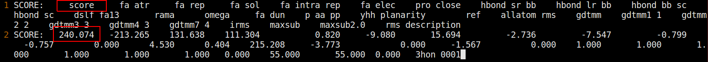
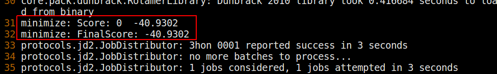
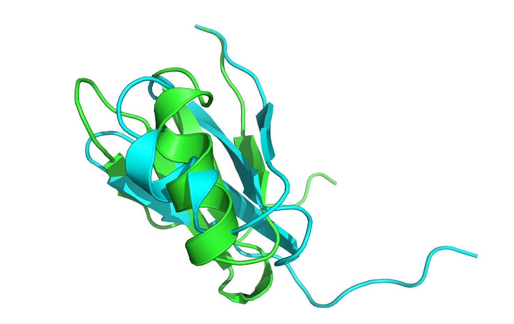
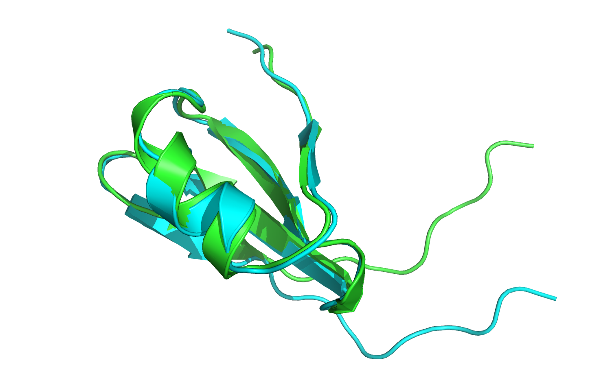
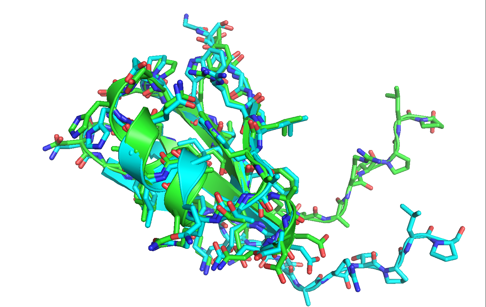
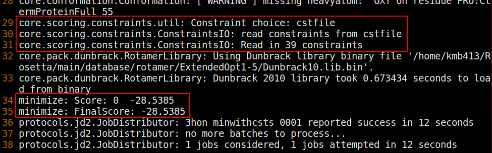
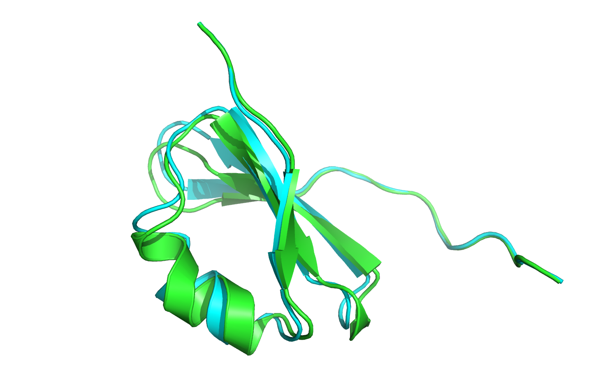
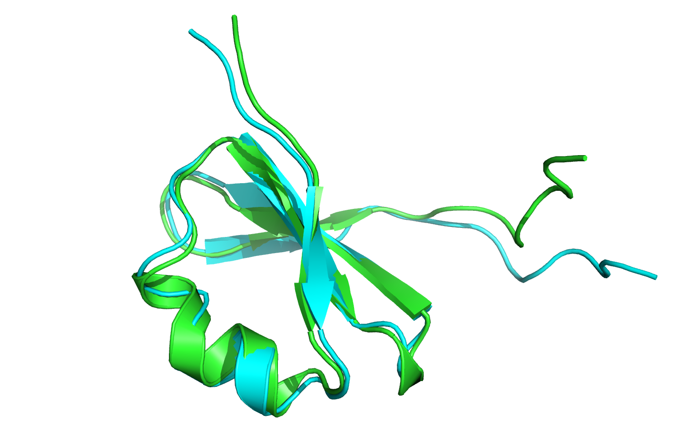
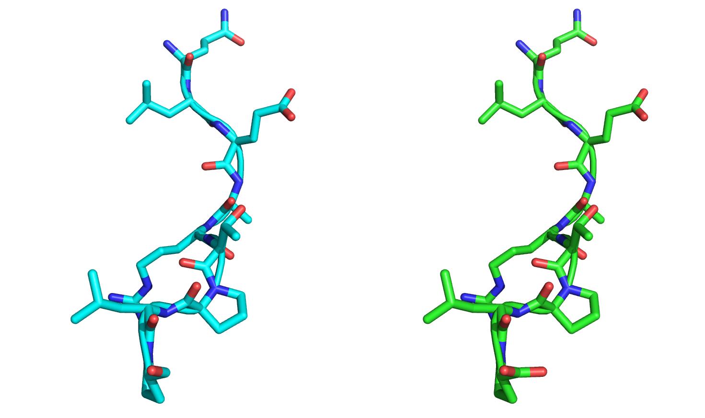

# Finding Local Energy Minima Using the *Minimizer*

KEYWORDS: CORE_CONCEPTS GENERAL

Tutorial by Kristen Blacklock (kristin.blacklock@rutgers.edu).
Edited by Vikram K. Mulligan (vmullig@uw.edu).
Created 20 June 2016.

Updated 29 May 2017 by Vikram K. Mulligan (vmullig@uw.edu) to reflect changes to the default scorefunction.

[[_TOC_]]

## Introduction

Proteins are not static structures, but rather they undergo fluctuations in their conformations and exist as an ensemble of states.

Each snapshot of a protein in its repertoire of conformations can be associated with an energy, where some conformations will have high energies and some will have low energies. In molecular modeling, it is usually desirable to find the global minimum (representing the lowest-energy conformation) of this energy function. This, however, is a very difficult task given the vast energy landscape that needs to be searched, so we'll settle for the next best thing: **a local minimum**.

> **Minimization is a technique for finding the nearest local minimum in the energy function given a starting structure's conformation and energy.**

Rosetta has a core algorithm, called the *minimizer*, which solves the problem of moving a structure to its nearest local energy minimum.  This carries out one of several variations on _gradient-descent minimization_ to find the nearest local minimum in the energy function. There are many different flavours to the [minimization algorithm](https://www.rosettacommons.org/docs/latest/rosetta_basics/structural_concepts/minimization-overview#flavors-of-minimization-in-rosetta) that the minimizer can use, but essentially, all minimization flavours choose a vector as the descent direction, march along that vector until the energy ceases to decrease (a "line search"), then choose a new direction and repeat. In this tutorial, we will use the `lbfgs\_armijo\_nonmonotone` flavour, which is a multi-step algorithm that needs to only be called once to reach the local mimimum of a function (rather than invoking repeated iterations to reach convergence).

> **In general, minimization is deterministic, unlike methods that depend on Monte Carlo searches.  There is generally little advantage to repeating a minimization trajectory many times; there should be no diversity to the ensemble produced.**

This being said, minimization *is* sensitive to small numeric precision differences from platform to platform, or even from compiler to compiler.

Many Rosetta modules invoke the minimizer, but one of the simplest ways to do so is to use the `minimize` executable.

## Goals

In this tutorial, you will learn to use one of the many minimization algorithms in three different ways, first by allowing all residues in the structure to move during the minimization and then by using two methods that allow only a subset of the degrees of freedom (DOFs) to change. Specifically, we will:

* Learn to run the `score` and `minimize` executables via the command line.
* Create and utilize a **constraints file** to prevent the movement of CA atoms from occurring in part of the structure.
* Create and utilize a **movemap** to control the degrees of freedom allowed to move during the minimization.
* Compare and analyze the output files and structures from each type of minimization.

## How-To: Minimize

### Analyzing the input structure

Take a look at the crystal structure file `3hon.pdb` in your favorite PDB Viewer (e.g. PyMOL). This structure was taken directly from the [RCSB PDB](http://www.rcsb.org/pdb/explore.do?structureId=3HON) and contains structural features that - while perhaps insignificant with respect to the experimental X-ray data - Rosetta views as non-optimal. 

Let's get an initial score for this conformation. In your command line, type:

```bash
$> <path_to_Rosetta>/main/source/bin/score.default.linuxgccrelease -s 3hon.pdb
```

This command will output a `default.sc` file, which contains the Rosetta score for this conformation. Inside this file, we see:



The first line of this file is the header line that tells us which columns correspond to which score terms.

On the second line of this file, we see that the crystal conformation has a total Rosetta score of 240.074, and that it has a particularly high repulsive score, _fa\_rep_, which means there are clashes between atoms in the structure, and a high dunbrack score, _fa\_dun_, which means many of the rotamers in this structure are of low probability.

Let's try and fix these issues using the minimizer.

### Setting up the flags file

First, we will need to specify how to run the minimizer. Open the `minimizer\_flags` file and analyze its contents:

```
 -s 3hon.pdb
 -run:min_type lbfgs_armijo_nonmonotone
 -run:min_tolerance 0.001
```

The first flag, `s`, specifies our input file, in this case, the crystal structure of 3hon.

The second flag, `run:min_type`, specifies the type of minimization algorithm to use, in this case, lbfgs\_armijo\_nonmonotone. (The value used here - `lbfgs_armijo_nonmonotone` - is the current default algorithm, so this line can technically be omitted.)

The third flag, `run:min\_tolerance`, specifies the convergence tolerance for the minimization algorithm. Rosetta has at least two kinds of "tolerance" for function minimization, "regular" (for lack of a better name) tolerance and absolute tolerance. "Regular" tolerance is _fractional_ tolerance for the _value_ of the function being minimized; i.e. a tolerance of 0.01 means the minimum function value found will likely be within 1% of the true local minimum value. Absolute tolerance is specified without regard to the current function value; i.e. an absolute tolerance of 0.01 means that the minimum function value found will be at most 0.01 REU from the true local minimum value, period. Minimizers use "regular" fractional tolerance by default. (Click [here](https://www.rosettacommons.org/docs/latest/rosetta_basics/structural_concepts/minimization-overview#the-meaning-of-tolerance) for more information on absolute tolerance). In general, setting the fractional tolerance to 0.01 is very loose, and so it is recommended to specify a tolerance setting of something less than 0.01. Therefore, for this tutorial we have set the tolerance to 0.001.

### Running the minimization command

In your terminal window, run the minimization executable by typing,

```bash
$> <path_to_Rosetta>/main/source/bin/minimize.default.linuxgccrelease @minimizer_flags
```

If this executable runs with no errors and the terminal output ends with something like this,



then you have successfully minimized the input structure. Check to make sure a `score.sc` file and a `3hon_0001.pdb` output structure have also been generated. Now let's analyze the output scores and structure.

### Analyzing the output

The `score.sc` file contains the new scores for the minimized structure. Open this file and compare the initial crystal (xtal) structure scores to the minimized scores:

| Score Term    | Xtal Scores  | Minimized Scores |
| ------------- | -----------: |  -----------:    |
| total\_score   | 240.074      | -40.93           |
| fa\_atr        | -213.265     | -213.025         |
| fa\_rep        | 131.638      | 22.807           |
| fa\_sol        | 111.304      | 105.466          |
| fa\_intra\_rep  | 0.82         | 0.649            |
| fa\_elec       | -9.08        | -11.103          |
| pro\_close     | 15.694       | 0.434            |
| hbond\_sr\_bb   | -2.736       | -7.094           |
| hbond\_lr\_bb   | -7.547       | -13.808          |
| hbond\_sc      | -0.757       | -1.842           |
| rama          | 4.53         | -2.326           |
| omega         | 0.404        | 3.677            |
| fa\_dun        | 215.208      | 91.005           |
| p\_aa\_pp       | -3.773       | -12.833          |

Note that the exact values that you obtain might be slightly different (+/- 0.5 energy units) from what's listed above: tiny numerical precision differences from platform to platform can accumulate over the trajectory to produce noticeable (but still small) differences in the final output.  There may also be some additional score terms, since the scorefunction may be more modern than what existed when this tutorial was written.  What's important is that most of the score terms have gone down in value (which is good!). But how has the minimization affected the structure? Open the `3hon_0001.pdb` to see what has changed.



The minimized structure (in green) has moved out of alignment with the native structure (in cyan), so first let's align the two structures. If you are using PyMOL, type `align 3hon_0001, 3hon` and hit `Enter`.



Now that the structures are aligned, notice that the last nine residues of the loop region have moved quite significantly from their original conformation. Furthermore, most of the minimized rotamers are no longer in their native conformations.



Sometimes it may be undesirable to allow such large movements in the starting conformation. To this end, we can use minimization with constraints to minimize our input structure in which movements of certain atoms will be penalized by the score function.

## How-To: Minimization with Constraints

For this section of the tutorial, we will use the same crystal structure as before, `3hon.pdb`, but this time we will apply harmonic coordinate constraints (csts) on the backbone heavy atoms of the nine C-terminal tail residues.  You can think of these constraints as "elastics" or "rubber bands" that lightly pull each backbone heavy atom back towards its original position during the minimization trajectory.  Practically, constraints are an additional, artificial potential added to the overall energy function (a series of harmonic potentials penalizing deviations from the input coordinates).

### Setting up the flags file and constraints file

We will need to add extra options to our flags file in order to tell Rosetta to read the constraints that specify how to hold the atoms in place. Furthermore, we need to tell Rosetta to add the additional constraints potentials to the energy function that it's using.  We do this by setting non-zero weights for the constraint score terms in the weights file (see the [tutorial on scoring](scoring)). The new flags file, `minwithcsts_flags`, looks like this:

```
-s 3hon.pdb
-run:min_type lbfgs_armijo_nonmonotone
-run:min_toleranace 0.001
-constraints:cst_file cstfile
-score:weights ref2015_cst
-out:suffix _minwithcsts
```

The flag `constraints:cst_file` specifies the name of the constraints file to use.

The flag `score:weights` specifies which set of weights to use for the energy function. In this case, we have specified the ref2015\_cst weights file, a pre-defined weights file in the Rosetta database that is identical to ref2015 (the default scorefunction) except for the addition of the constraint terms _chainbreak_, _coordinate\_constraint_, _atom\_pair\_constraint_, _angle\_constraint_, _dihedral\_constraint_, and _res\_type\_constraint_, each with a weight of 1.0. 

The option `-out:suffix` will prevent us from overwriting our previous output by appending the suffix "_minwithcsts" to the end of our new output file names.

### Running the minimization command

Run the minimization executable in the same way as before, but now with the new flags file:

```bash
$> <path_to_Rosetta>/main/source/bin/minimize.default.linuxgccrelease @minwithcsts_flags
```

This time, look for a few lines coming from the `core.scoring.constraints` tracers in the log output. They should look similar to this (though again, numeric differences are possible from platform to platform):



These lines indicate that our constraints were read and applied to the pose. If the executable ended without errors and generated a `3hon_minwithcsts_0001.pdb` file as well as a `score_minwithcsts.sc` file, then you have successfully run minimization with coordinate constraints.

### Analyzing the output

As before, the `score_minwithcsts.sc` file contains the score of the minimized structure subject to constraints. Open this file and compare its energy to the crystal structure's and the structure generate from constraints-free minimization:

| Score Term      | Xtal Scores | Minimized Scores | Minimized With CST Scores |
| -----------     | ----------: |  --------------: | ------------------------: |
| total\_score     | 240.074     | -40.93           | -28.538                   |
| fa\_atr          | -213.265    | -213.025         | -207.931 |
| fa\_rep          | 131.638     | 22.807           | 21.68    |
| fa\_sol          | 111.304     | 105.466          | 104.359  |
| fa\_intra\_rep    | 0.82        | 0.649            | 0.714    |
| fa\_elec         | -9.08       | -11.103          | -12.245  |
| pro\_close       | 15.694      | 0.434            | 0.781    |
| hbond\_sr\_bb     | -2.736      | -7.094           | -5.19    |
| hbond\_lr\_bb     | -7.547      | -13.808          | -13.425  |
| hbond\_sc        | -0.757      | -1.842           | -1.239   |
| rama            | 4.53        | -2.326           | -3.515   |
| omega           | 0.404       | 3.677            | 3.989    | 
| fa\_dun          | 215.208     | 91.005           | 96.731   |
| p\_aa\_pp         | -3.773      | -12.833          | -10.393  |
| coordinate\_constraint |       |                  | 0.727    |

Again, most of the new scores from the minimized-with-constraints structure are lower than those in the crystal structure. Notice also the addition of the coordinate constraint term to the list of energy terms for the newly minimized structure. 

Comparing the minimized structure to the minimized-with-csts structure, we see an increase in total energy caused predominantly by differences in the fa\_atr and fa\_dun terms. This comes from two sources.  First, we see that the coordinate constraint term itself adds a small positive value to the score, since mainchain heavyatoms have moved slightly from their starting coordinates.  Second, because the structure has not been allowed to move as far this time, minor clashes and imperfections do not resolve themselves as completely, resulting in a slightly higher score than before.  So there is a trade-off between keeping the structure close to the crystal structure and tunnelling down deeply to the nearest local energy minimum. 

Now let's take a look at the minimized-with-csts structure to see how it compares to our previous structures.

Opening the `3hon_minwithcsts_0001.pdb` file and comparing it to the crystal structure,



we immediately see little to no movement in the position of the nine C-terminal CA atoms.

In some cases, the user may want to prevent the internal geometry of certain residues from moving during minimization, rather than the XYZ coordinates of the atoms. To disallow movements in backbone phi/psi angles and/or sidechain chi angles, we can supply the minimizer with a MoveMap that specifies which of these degrees of freedom are allowed to change.

## How-To: Minimization with a MoveMap

#### The MoveMap

The [movemap](https://www.rosettacommons.org/docs/latest/rosetta_basics/structural_concepts/Rosetta-overview#scoring_movemap) is an important concept in Rosetta minimization.  It allows users to control what degrees of freedom can change during minimization, and what degrees of freedom are fixed. For example, one may not want to move highly-conserved sidechains in modeling applications, or one may want to preserve certain interactions in design applications.  Certain protocols that call the Rosetta minimizer accept a user-defined movemap file.

In the context of the minimizer, a movemap allows the user to specify whether the backbone (BB) torsions angles (phi and psi, in the case of α-amino acid residues) and/or the sidechain torsions angles (CHI) are allowed to be moved during the minimization of the energy function. In addition, if the input structure has more than one chain (separated by one or more *JUMPS*, or rigid-body transformations), the movemap can also specify whether rigid-body movements between the different chains are allowed.

> **Caveat: Even if a residue's backbone and sidechain torsion movements are turned off in a movemap, its relative position with respect to other residues may still change depending on the motion of residues upstream in the foldtree.**

#### A note about the FoldTree

The [foldtree](https://www.rosettacommons.org/docs/latest/rosetta_basics/structural_concepts/foldtree-overview) is another important concept relevant to minimization.  Although manipulation of the foldtree will be covered in greater detail in [another tutorial](fold\_tree), we will give a brief overview of the concept here.  When minimizing, degrees of freedom change, and that can have ambiguous consequences for the structure.  For example, if I were to change the phi torsion of residue 5 from -60 to -50, several things could happen: residues 1 through 4 could stay fixed and all residues from 5 onwards could move; residues 1 through 4 could move and 5 onwards could stay fixed; atoms in residue 5 could move, but the rest of the atoms in the protein stay fixed, meaning the bonding geometry of the protein would become severely distorted; or some combination of the three. The foldtree establishes a hierarchical relationship between residues in a pose so that the effects of changing degrees of freedom are well-defined.  Each residue has one unique parent (with the exception of a single root residue), and each residue can have one or more children.  (Cyclic dependencies are prohibited -- for example, residue 4 cannot be the parent of residue 3 if residue 3 is the parent of residue 4.)  Changes in a residue's degrees of freedom propagate to all of the children of a residue, but do not affect parents.  While most residues in a typical pose are related by through-bond connections, two residues can instead be related by a through-space rigid body transform, called a *jump*.  If two separate chains exist (with no bonds linking them), it is necessary to have at least one jump relating residues in the first with residues in the second.

As mentioned in the caveat above, a user invoking the minimizer, particularly with a MoveMap, should be mindful of the foldtree.  The default foldtree has residue 1 of chain A as the root, with residue 2 as a child of 1, residue 3 as a child of 2, *etc.*, and with jumps to the first residue of any additional chain or chains.  Any moveable degree of freedom affects every residue downstream of it in the foldtree, even if that residue's degrees of freedom are fixed by the MoveMap.  As a concrete example, let's consider the case of a 20-residue pose with a default foldtree, with a MoveMap that prevents movement of backbone DoFs for residues 8 through 20.  Energy-minimization would change backbone degrees of freedom for residues 1 through 7, swinging residues 8 through 20 through space in the process (though residues 8 through 20 could not move *relative to one another*, in this case).

#### Description of the movemap file format

Each line in the movemap file identifies a jump, residue, or residue range, followed by the allowed degrees of freedom. These entities may be specified as follows:

```
RESIDUE <#> <BB/CHI/BBCHI/NO>         # a single residue <#> followed by a single option (pick one of the four)
RESIDUE <#1> <#2> <BB/CHI/BBCHI/NO>   # a range of residues from <#1> to <#2> followed by a single option (again, pick one)
JUMP <#> <YES/NO>                     # a jump <#> followed by a single option
```

For example,

```
RESIDUE 28 BB        # allows BB movements at residue 28
RESIDUE 32 48 BBCHI  # allows BB and sidechain CHI movements from residue 32 to residue 48
JUMP 1 YES           # allows rigid-body movements between the structures separated by jump 1
```

Is is also possible to choose all residues or all jumps with the a `*` symbol:

```
RESIDUE *  CHI    # allows sidechain movements at all residues
JUMP * YES        # allows rigid body movements between all structures separated by jumps
```

If a residue appears more than once, the last appearance in the file determines the movement (i.e. movemap lines are NOT commutative, unlike the TaskOperations used to control the packer -- see the [tutorial on packing](Optimizing_Sidechains_The_Packer)). For example, the movemap specified here...

```
RESIDUE * CHI
RESIDUE * BB
```

...will only allow backbone (BB) movements for all residues and will disallow sidechain (CHI) movements for all residues, which is probably not what the user meant.

> **Note: If a residue or jump is not specified in the movemap, it will revert to the default behavior, which is protocol-specific.**  In many but not all cases, the default behaviour is for all torsional degrees of freedom (bb, chi) and all rigid-body degrees of freedom (jumps) to be movable.  When in doubt, it's better to be explicit about the user-requested behaviour.

### Setting up the flagsfile and movemap file

For the next minimization walkthrough, we will need to add one option to our flags file to tell Rosetta to read the movemap file. The contents of the new flags file, `minwithmm_flags`, should look like this:

```
-s 3hon.pdb
-run:min_type lbfgs_armijo_nonmonotone
-run:min_toleranace 0.001
-movemap movemapfile
-out:suffix _minwithmm
```

The flag `movemap` specifies the movemap file to apply to the pose.

Our movemap file `movemapfile` (expanded below) tells the minimizer to first set all backbone (BB) and sidechain (CHI) torsion angles to movable. Then, it reverts residues 47 through 55 (in pose numbering) to be fixed.

```
RESIDUE * BBCHI
RESIDUE 47 55 NO
```

### Running the minimization command

Run the minimization executable in the same way as before, but now with the new flags file:

```bash
$> <path_to_Rosetta>/main/source/bin/minimize.default.linuxgccrelease @minwithmm_flags
```

The log output should be similar to the first minimization protocol except for a difference in score. You should also have a `3hon_minwithmm_0001.pdb` file and a `score_minwithmm.sc` file after running this command.

### Analyzing the output

Let's compare the score of the minimize-with-movemap structure to our previous crystal, minimized, and minimized-with-csts structures:

| Score Term   | Xtal Scores | Minimized Scores | Minimized With CST Scores | Minimized with MoveMap |
| -----------  | ----------: |  --------------: | ------------------------: | ---------------------: |
| total_score  | 240.074     | -40.93           | -28.538                   | -4.217
| fa_atr       | -213.265    | -213.025         | -207.931                  | -212.704
| fa_rep       | 131.638     | 22.807           | 21.68                     | 23.41
| fa_sol       | 111.304     | 105.466          | 104.359                   | 105.753
| fa_intra_rep | 0.82        | 0.649            | 0.714                     | 0.658
| fa_elec      | -9.08       | -11.103          | -12.245                   | -10.932
| pro_close    | 15.694      | 0.434            | 0.781                     | 12.29
| hbond_sr_bb  | -2.736      | -7.094           | -5.19                     | -7.069
| hbond_lr_bb  | -7.547      | -13.808          | -13.425                   | -13.833
| hbond_sc     | -0.757      | -1.842           | -1.239                    | -1.82
| rama         | 4.53        | -2.326           | -3.515                    | -1.645
| omega        | 0.404       | 3.677            | 3.989                     | 3.554
| fa_dun       | 215.208     | 91.005           | 96.731                    | 113.143
| p_aa_pp      | -3.773      | -12.833          | -10.393                   | -11.999
| coordinate_constraint |    |                  | 0.727                     | |

The total score of the minimized-with-movemap structure is lower still than the crystal structure but has the highest energy of the minimized structures, caused primarily by differences in the _pro_close_ term, which is an energy associated with the proline ring closure, and the _fa_dun_ term.

Let's open the minimized-with-movemap structure and compare it visually to the crystal structure.



After aligning the minimized-with-movemap structure to the crystal structure as a whole, it appears that the nine C-terminal residues have moved. However, when we align only the nine C-terminal residues against each other, it becomes clear that the minimizer has not changed the backbone or sidechain angles:



>**This is an important point to reiterate: The movemap can prevent internal geometries from changing, but not necessarily the global position of the residues.**

## More detailed algorithm overview (for advanced users)

This sub-section of this tutorial may be skipped by novice and casual users; it is included to give advanced users greater insight into the way in which the tools work, in the hopes that this will help them to use their tools more effectively.  As mentioned earlier, the minimizer works by variants on gradient-descent minimization.  All energy terms in Rosetta define not only a way to calculate the energy value given the current values of system degrees of freedom, but also define a way to calculate derivatives with respect to spatial degrees of freedom given values of those degrees of freedom.  The minimizer uses these derivative functions to calculate an overall gradient vector, ∇E.  This is a vector of partial derivatives: ∇E = dE/dx<sub>1</sub>, dE/dx<sub>2</sub>, ..., dE/dx<sub>N</sub>, where x<sub>1</sub> ... x<sub>N</sub> are the movable degrees of freedom, evaluated for the current values of the degrees of freedom.  This vector points in the "uphill" direction in conformation space, and its negative points in the "downhill" direction.  The minimizer then "marches" in the "downhill" direction (meaning that it adds -ε∇E to the current vector of degrees of freedom, where ε is some arbitrarily small scalar value), stopping this "line search" only when the energy stops decreasing and starts to increase.  At this point, it recalculates ∇E (which will now point in a slightly different direction) and repeats the search.  This continues until the gradient is sufficiently flat (*i.e.* of sufficiently small magnitude) as defined by the minimization threshold.

There is one slight complication to this.  The method described above is what occurs when the "linmin_iterated" flavour is used.  Unfortunately, this is relatively inefficient: minimization can converge much more quickly if both first and *second* derivative information is used to select the line search direction.  Doing this correctly and exactly (the Newton method) would mean calculating, and inverting, the Hessian matrix, which is an NxN matrix of partial second derivatives given N movable degrees of freedom.  Since calculating, inverting, and updating this large matrix would slow the minimizer down immensely, the compromise is to estimate the inverse of the Hessian matrix using the last several values of the gradient, ∇E, that were calculated.  Many *quasi-Newton* methods for doing this have been put forth, including the Davidon-Fletcher-Powell (DFP) method and the Broyden-Fletcher-Goldfarb-Shanno (BFGS) method.  Rosetta features two flavours of the latter: the standard BFGS method (inaccurately named "dfpmin") and a low-memory, better-performing variant (called "lbfgs").  Variations on each of these also exist, which use different stopping conditions and which carry out their line searches in subtly different ways.  The current default in Rosetta is the "lbfgs_armijo_nonmonotone" flavour, which benchmarks have shown to produce the best performance for large proteins.

Very small systems (*e.g.* small peptides) might show better behaviour with "dfpmin_armijo_nonmonotone".  Certain rare artifacts of the inverse Hessian approximations used might also be avoided with the slower, but more accurate, "linmin_iterated" flavour (which is a good thing to try when debugging an oddly-behaving protocol).

## Summary

In this tutorial, we learned how to run the `minimize` executable in three ways: 
  1. By using the default behavior, which allowed movement in all backbone and chi angles,
  2. By applying coordinate constraints to the input structure, which disallowed global movements a subset of atoms,
  3. And by applying a MoveMap, which disallowed local movements in the backbone and sidechain torsion angles.
