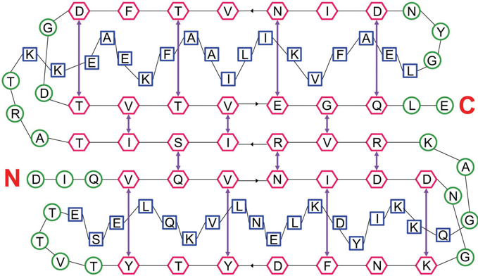
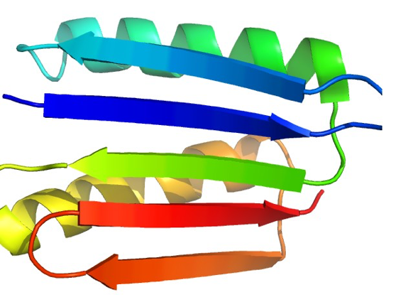
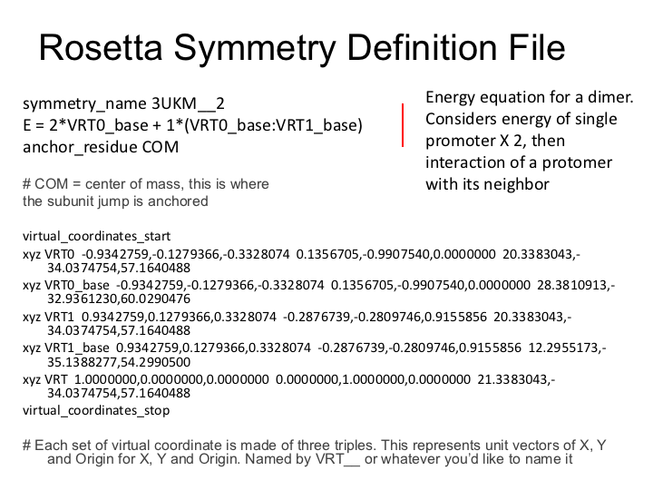
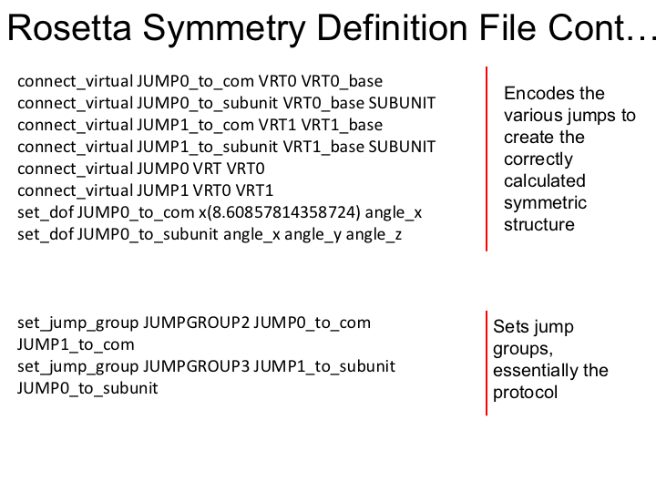
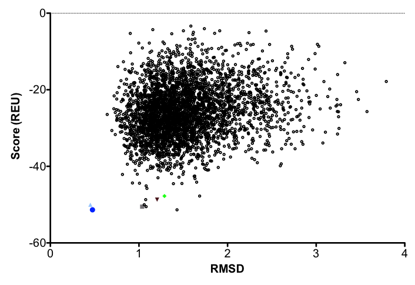

# Protein Design

KEYWORDS: DESIGN GENERAL SYMMETRY MEMBRANES

[[_TOC_]]

**Bold text means that these files and/or this information is provided.**

*Italicized text means that this material will NOT be conducted during the workshop*

    fixed width text means you should type the command into your terminal

If you want to try making files that already exist (e.g., input files), write them to a different directory! (mkdir my_dir)
(NOTE: For many of the commands you will be using for this tutorial, remove \'s before hitting enter. Otherwise you will get an error.)

##Introduction

**Objective:** In this exercise, we will examine the Rosetta design features by mutating user-specified residues. To make it even more interesting, we will use a membrane protein which is a homodimer, so we will employ RosettaMembrane and RosettaSymmetry to model the dimer during design. RosettaScripts will be used to combine the two applications. 

**Rosetta Applications:** RosettaDesign, RosettaMembrane, RosettaSymmetry, RosettaScripts

**Input and Analysis Scripts:** `clean_pdb.py, get_fasta_from_pdb.py `

##Tutorial
Preparation: Locate the necessary input PDB file. 
    
        cd path/to/demos/tutorials/protein_design

   Included in this folder is a PDB file downloaded from the Protein Data Bank (www.rcsb.org ID:3UKM). Open this in pymol to familiarize yourself with the structure:

        pymol 3UKM.pdb         
    
You should notice that this file shows two homo-dimers. We will focus on the dimer made from Chains A and B (lower dimer when loaded). This will be important when setting up the symmetry definition file in the next step. Close pymol and proceed to step 1.

1. Setting up the symmetric PDB - Step1_symm

    1. Rosetta Symmetry. In this step, we will create the proper symmetry definition file for this particular protein structure. We will need the input structure from the preparation step. 

        Next, we will use a perl script in Rosetta to generate a symmetry file from the input crystal structure. First, if you'd like to display the available options for this script, simply enter:

            $ROSETTA3/src/apps/public/symmetry/make_symmdef_file.pl

            $> $ROSETTA3/src/apps/public/symmetry/make_symmdef_file.pl -m NCS -a A -i B -p 3UKM.pdb > 3UKM.symm

        Here we are using symmetry to model an already-symmetric starting protein.  This is called non-crystallographic (NCS) mode. 
        We pass the mode (-m NCS), the chain we want to keep (-a A), the chain we want to base the symmetry off of (-i B), and the input PDB (-p 3UKM.pdb).

        WThe output will be redirected, using the greater than sign, into a new file called 3UKM.symm.

        The perl script will generate a couple of outputs:

        * 3UKM_INPUT.pdb = chain A
        * 3UKM.kin
        * 3UKM`_`model`_`AB.pdb = model generated to show subunit interactions with the input
        * 3UKM_symm.pdb = model generated to show the full point group symmetry
        * 3UKM.symm = symmetry definition file that you just created

        Examine symmetry file equation, '3UKM.symm' in your favorite editor.  Here is an overview of the file:
         
        

    2. Next, we will use clean_pdb.py to prepare the input protomer for setting up symmetry, grabbing only chain A. 
    
            $> $ROSETTA_TOOLS/protein_tools/scripts/clean_pdb.py 3UKM A

        clean_pdb.py strips PDB code that Rosetta can not parse such as comments, anisotropic atom positions, unnatural amino acid types, and waters and renumbers from 1 to match Rosetta numbering. The first argument in the script is the 4-letter PDB code and the second argument is a string containing the chains to return, in this case, only chain A. 
        
    3. Now, we will use the clean input structure to test the symmetry definition file. We will accomplish this through a very basic use of RosettaScripts. While still in the same directory:

            open Step1_symm/setup_symm.xml

        And look at the contents of the file, which should look like this:
    
            <ROSETTASCRIPTS>
                <SCOREFXNS>
                </SCOREFXNS>
                <TASKOPERATIONS>
                </TASKOPERATIONS>
                <FILTERS>
                </FILTERS>
                <MOVERS>
                  <SetupForSymmetry name="setup_symm" definition="3UKM.symm" />
                </MOVERS>
                <APPLY_TO_POSE>
                </APPLY_TO_POSE>
                <PROTOCOLS>
                  <Add mover_name="setup_symm" />
                </PROTOCOLS>
            </ROSETTASCRIPTS>

     Next, run this protocol using RosettaScripts. We will apply the setup for the protocol to the input structure, 3UKM_A.pdb.

            $> rosetta_scripts.default.linuxgccrelease -parser:protocol ./Step1_symm/setup_symm.xml -s 3UKM_A.pdb -out:prefix setupsymm_ 

        When Rosetta is finished, examine the output structure using pymol:

            open setupsymm_3UKM_A_0001.pdb

        Does the resulting structure look as you would expect? Sometimes you have to make manual adjustments to the symmetry definition file by paying careful attention to the jumps. In this case, it looks great. Before we move forward, examine the score file generated from setting up symmetry:

            open setupsymm_score.sc

        The total energy score of the protein is the first number. For this protein, you will probably see a number in the positive 5000s. We know that this is not a good score for a protein. Before moving on to an application such as design, it is recommended to energetically minimize the structure in some way to get rid of imperfections in the crystal structure. 

        Additionally, this score is based on the default Rosetta scoring function. We will need to create a span file and add the membrane high resolution scoring function into our XML script.

    4. Now, we will need to create a span file which will tell Rosetta where the membrane-spanning region is on our protein. Step 1.2 outputs a fasta file. __This file is provided__ `cat 3UKM_A.fasta`

        In a web browser, go to octopus.cbr.su.se and paste the fasta sequence into the form. Then click "Submit OCTOPUS" (There is also an option to use SPOCTOPUS which considers signal peptide sequences).
        
        When it's done running, near the top it will say "A text version of the topology prediciton can be found in the OCTOPUS topology file (txt)" click on that link.

        Select all of the text and copy.
        
        `open 3UKM.topo` [delete any current content] and paste the text into this file and save.
        
        If you just want to copy it:

        A script in Rosetta will take this topo file named 3UKM.topo and create a span file named 3UKM.span:
        
            $> $ROSETTA3/src/apps/public/membrane_abinitio/octopus2span.pl Step1_symm/provided_inputs/3UKM.topo > 3UKM.span

2. Prepare files for protein design at user-specified residues - Step2_design

    1. With an energy minimized input structure (relaxed version of the 3UKM_A pdb), we are almost ready to design our protein! In this step, we will first combine SetupForSymmetry and SymPackRotamers movers in another RosettaScripts protocol.

            cd ./Step2_design
            ls
            cd ..

        You should see several input files ready for you to use. Here you will find the symmetry definition file, an energy minimized input structure named `Best_rlx_3UKM_A.pdb`, and an XML file. 

            open Step2_design/symm_design.xml

            The file should look like this:

            <ROSETTASCRIPTS>               
                <SCOREFXNS>
                  <ScoreFunction name="mem_highres" weights="membrane_highres_Menv_smooth.wts" symmetric="1" />
                </SCOREFXNS>
                <TASKOPERATIONS>
                  <InitializeFromCommandline name="ifcl"/>
                </TASKOPERATIONS>
                <FILTERS>
                </FILTERS>
                <MOVERS>
                  <SetupForSymmetry name="setup_symm" definition="3UKM.symm" />
                  <SymPackRotamersMover name="sym_pack" scorefxn="mem_highres" task_operations="ifcl"/>
                </MOVERS>
                <APPLY_TO_POSE>
                </APPLY_TO_POSE>
                <PROTOCOLS>
                  <Add mover_name="setup_symm" />
                  <Add mover_name="sym_pack" />
                </PROTOCOLS>
            </ROSETTASCRIPTS>

        Notice under SCOREFXN, the membrane high-resolution weights are specified. Read the XML and see if you understand the different sections. Reference the lecture slides if you need to. Exit out of the file when you are done. Then run full design. This step should take about 30 minutes. 

            $> rosetta_scripts.default.linuxgccrelease @Step2_design/flags
        
        In the interest of time, we will only do one full design of the protein. In the output folder, 20 output structures are provided. 
        
    2. Now we will run design again, but this time guide design with a resfile. A resfile is a file that is read by RosettaScripts during design. The file specifies a residue number, chain ID, and a command associated with the particular residue. This command alerts the packer with how to deal with the residue. (see slides on resfile for more examples) 

        Design is done on a fixed backbone. Today we will use a hypothetical situation where a number of residues will be simply re-packed (minimized side-chains) by the command NATAA. A small number of residues will have a specific group of amino acids to chose from during design, and two residues will consider all amino acid rotamers during design. 

            open 3UKM.resfile

        The resfile should resemble this:
    
            
            NATAA
            start

            29 A ALLAA
            30 A PIKAA P
            31 A ALLAA
            39 A PIKAA LIY
            46 A PIKAA FL   
            52 A PIKAA C 
            58 A PIKAA LKIY
            61 A PIKAA FLI
            62 A APOLAR 
            65 A PIKAA VI
            66 A PIKAA LVS
            67 A POLAR
            68 A PIKAA A
            69 A APOLAR  
            70 A PIKAA NRGK
            72 A PIKAA AGV
            80 A ALLAA
            84 A ALLAA
            85 A ALLAA
            86 A APOLAR
            87 A APOLAR
            88 A PIKAA AGVIL
            94 A PIKAA TIV
            95 A PIKAA TIV
            96 A PIKAA AGV 
            97 A PIKAA YFLI
            98 A PIKAA AGV
            99 A PIKAA HNYD
            100 A ALLAA
			
Based on sequence alignments from homologous proteins, we know that these positions prefer a certain type of amino acid. We are going to use a resfile to guide Rosetta during design. Look at your lecture slides and understand which amino acid rotamers will be allowed at each position. When you are comfortable with the format, exit the file. If you have questions about what you would expect-ASK!

        
Now, we will create an XML file that will read in the resfile. First, copy the current XML file and rename it symm_res_design.xml, then open the file
        
            cp Step2_design/symm_design.xml Step2_design/symm_res_design.xml
            open Step2_design/symm_res_design.xml

Next, find the section labeled TASKOPERATIONS. Insert this task operation underneath the `<TASKOPERATION>` line and before the `</TASKOPERATIONS>` line so that it is in line with the <InitializeFromCommandline>: 
            
             <ReadResfile name="rrf" filename= "3UKM.resfile" />

Notice, we gave this task the name "rrf". Find the SymPackRotamersMover under <MOVERS> and add "rrf" after the task operations tag so it resembles this:

            <SymPackRotamersMover name="sym_pack" scorefxn="mem_highres" task_operations="ifcl,rrf"/>
           

1. Design the protein at user-specified residues. We have a relaxed input structure, a symmetry definition file, a resfile to direct design, and an XML protocol to setup symmetry, and design according to a resfile. We are now ready to move forward with design! Run this command:

            $> rosetta_scripts.default.linuxgccrelease @Step2_design/flags2

Again, many, many more structures than just 2 should be made for production runs. In the interest of time, we will just run 2 for today. This should take about 2 minutes. This step will simply ensure that you can successfully run Rosetta Symmetry and Design. Use the output structures provided in the Step3_design/output folder for the analysis step. Note that this folder contains only 20 models. In your own experiments, you will likely want to make more than just 20 models.

3. Analysis of Designs. Now that we have a few design structures, we want to examine one of the regions we designed. First, we must sort the top five structures by score. There are many ways to do this.  Here we will use command-line programs such as grep and awk. You should still be in the Step3_design folder.  

            grep pose Step2_design/resfile_design*.pdb | sort -nk 23 | head
 
This shows you the top 10 structures by best score. We can use awk to store the list of the top 10. 

            $> grep pose Step2_design/resfile_design*.pdb | sort -nk 23 | head | awk '{print(substr($1,1,length($1)-5))}' > best.list

Next, we will use awk to automate generating fastas for each of our top models. In order to run this command, the PDB tools must be installed.  Go to $ROSETTA_TOOLS/protein_tools and follow the instructions to install the python module.

            > cat best.list | awk '{system( "$ROSETTA_TOOLS/protein_tools/scripts/get_fasta_from_pdb.py "$1" A "substr($1,1,length($1)-3)"fasta")}' 

Now we can cat all of the fastas and use WebLogo to generate a figure to show our designed residues.

            > cat *.fasta > all_fasta.txt 

           > cat all_fasta.txt

        (If you are running out of time, you can cd into ../Step4_analysis where the fastas of the top 10 models for each design experiment are included) 
        
Now, copy and paste the text into the WebLogo server [weblogo.berkeley.edu/logo.cgi](http://weblogo.berkeley.edu/logo.cgi)

Under advanced logo options, choose Logo Range to be 80-100. Now Click Create Logo at the Bottom. 

If you need to, you can re-open the resfile you used in the design step to see if Rosetta Design did what you expected. 

For example: Residue 94 should be T, I, or V, and residue 86 could be any apolar residue. 

Since we have restricted design a lot, we expect to see single identities for these positions in this sequence logo.

If you have enough time, you can go back and make a sequence logo over this same range for the full design output. Compare the logos. You should see quite a bit more variation in the full design sequence logo.

## APPENDIX ##

1a. This is the explanation for the minimization of our starting structure (which we skipped in the tutorial session to reduce run-time). You can create relaxed structures, that are embedded into a membrane, in a similar way that we set up symmetry, using RosettaScripts. CD into the directory
    

View this by opening Step0_relax/symm_relax.xml:

<ROSETTASCRIPTS>     <SCOREFXNS>
       <ScoreFunction name="mem_highres" weights="membrane_highres_Menv_smooth.wts" symmetric="1" />
     </SCOREFXNS>
     <TASKOPERATIONS>
       <InitializeFromCommandline name="ifcl"/>
       <RestrictToRepacking name="rtr" />
     </TASKOPERATIONS>
     <FILTERS>
     </FILTERS>
     <MOVERS>
       <SetupForSymmetry name="setup_symm" definition="3UKM.symm" />
       <FastRelax name="fast_rlx" scorefxn="mem_highres" repeats="8" task_operations="ifcl,rtr" />
     </MOVERS>
     <APPLY_TO_POSE>
     </APPLY_TO_POSE>
     <PROTOCOLS>
       <Add mover_name="setup_symm" />
       <Add mover_name="fast_rlx" />
     </PROTOCOLS>
     </ROSETTASCRIPTS>
    
Then, run using the command-line:

    $> rosetta_scripts.default.linuxgccrelease @Step0_relax/flags

  

1b. Analyze the output. There are a few ways of going about this. Some may look at just the best scoring models. Others calculate the RMSD of the relaxed models to the input structure and plot the Score vs. RMSD to find the best (lowest) scoring model that is most similar to the input structure.
        
  
    
   Ideally, the lowest scoring model would also have the lowest RMSD. This model should be used in all subsequent steps in redesign. Generally in design, we use an ensemble of structures accounting for the lowest cluster of RMSD's and scores. (And in 2016, most of us use the Pareto-optimal method of relax in Nivon et al. for starting structures.  This was covered in the relax tutorial.)

Last, a note for Protein Design Analysis. A script named `Deep_Analysis`, written by Jordan Willis is available as an alternative to the WebLogo server. It is in `$ROSETTA_TOOS/protein_tools/scripts/deep_analysis`. There are many options such as using fastas or pdbs as your input. You can also pass a resfile to specify which regions you want to appear on the logo (instead of a single range). 

Check it out with:

    $ROSETTA_TOOS/protein_tools/scripts/deep_analysis --help

2a. Rosetta Design using the Rosetta Membrane Framework. The steps to setup Rosetta to use the Membrane Framework are slightly different than Membrane Mode. To properly use span information throughout the protocol, one must use the movers <AddMembraneMover> and <MembranePositionFromTopologyMover> before setting up <PackRotamersMover>. For simplicity, we will treat the protein as monomeric, which will make this protocol run a bit longer than the previous one.  Expect about 20 minutes per output decoy. In the future, symmetry and the membrane framework will be more compatible.  

From the protein_design directory change directories into mpframework_design

Then open the file mpframework_design/mpf_design.xml
   
     <ROSETTASCRIPTS>
     <SCOREFXNS>
       <memb_hires weights="mpframework_smooth_fa_2012.wts" />
     </SCOREFXNS>
     <TASKOPERATIONS>
       <InitializeFromCommandline name=ifcl/>
     </TASKOPERATIONS>
     <FILTERS>
     </FILTERS>
     <MOVERS>
       <AddMembraneMover name=add_memb />
       <MembranePositionFromTopologyMover name=init_pose />
       <PackRotamersMover name=pack scorefxn=memb_hires task_operations=ifcl />   
     </MOVERS>
     <PROTOCOLS>
       <Add mover=add_memb />
       <Add mover=init_pose />
       <Add mover=pack />
     </PROTOCOLS>
     </ROSETTASCRIPTS>

To run, use the following command-line:

        $> rosetta_scripts.default.linuxgccrelease @mpframework_design/flags

2b. The ./output/ directory will have 25 design structures. You can do a similar analysis as we did above on these to look at the sequence variability. 
